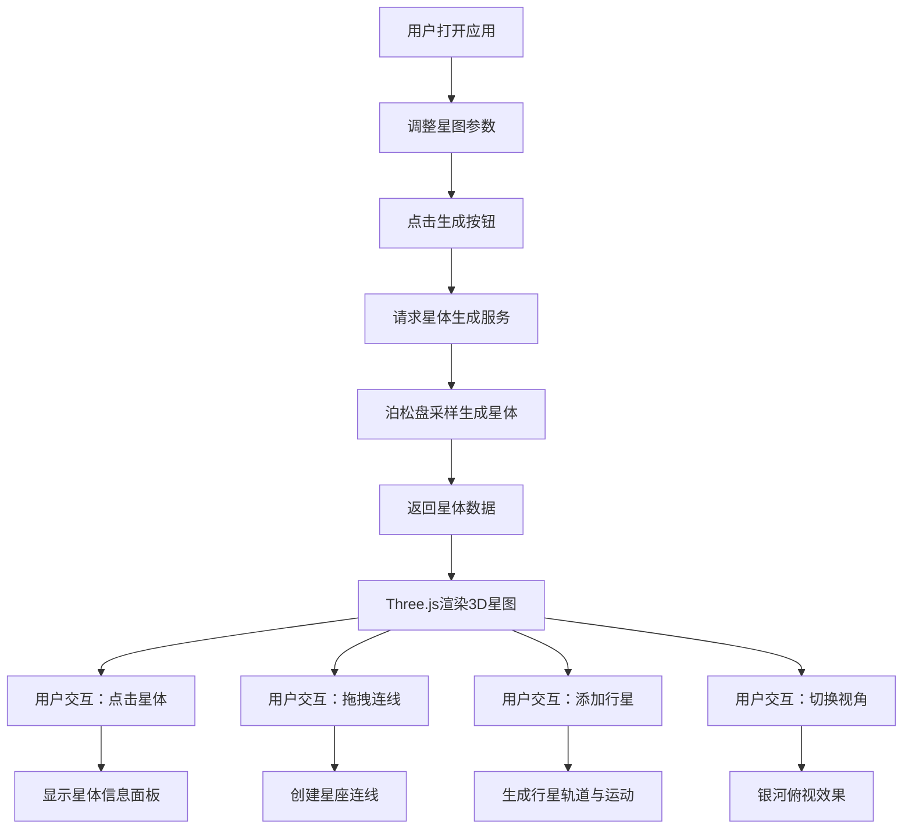

## 1. 产品概述

交互式3D星图可视化应用，让普通用户在浏览器中实时生成和浏览交互式3D星图，支持创建自定义星座与行星轨道。解决现有天文模拟软件过于专业、用户无法在网页中直观探索并创作个性化星空场景的问题。

- 主要用途：天文爱好者、教育展示、创意设计
- 目标用户：普通用户、学生、天文爱好者
- 产品价值：降低天文可视化门槛，提供沉浸式星空创作体验

## 2. 核心功能

### 2.1 用户角色

| 角色 | 注册方式 | 核心权限 |
|------|----------|----------|
| 普通用户 | 无需注册，直接使用 | 生成星图、创建星座、添加行星轨道、切换视角 |

### 2.2 功能模块

1. **星图生成模块**：参数控制面板、星体生成服务、3D渲染展示
2. **星体交互模块**：点击选择、信息展示、高亮动画
3. **星座创建模块**：拖拽连线、右键删除、动态预览
4. **行星轨道模块**：轨道添加、行星运动、尾迹效果
5. **视角控制模块**：自由轨道控制、银河俯视切换

### 2.3 页面详情

| 页面名称 | 模块名称 | 功能描述 |
|-----------|----------|----------|
| 主页面 | 左侧控制面板 | 星体参数设置（数量100-1000、分布范围、随机种子）、生成按钮、视角切换按钮 |
| 主页面 | 中央3D场景 | Three.js渲染星图、星体、星座连线、行星轨道 |
| 主页面 | 右侧信息面板 | 展示选中星体的坐标、亮度、光谱类型 |

## 3. 核心流程

用户打开应用 → 调整星图生成参数 → 点击生成按钮 → 前端请求星体生成服务 → 接收星体数据 → Three.js渲染3D星图 → 用户点击星体查看详情 → 拖拽创建星座连线 → 添加行星轨道 → 切换银河俯视视角

## 4. 用户界面设计

### 4.1 设计风格

- 主色调：深空黑色 #0a0a20
- 主题色1：金黄色 #FFD54F
- 主题色2：淡青色 #80DEEA
- 按钮样式：圆角6px、背景色 #1a237e、悬停 #283593、1px发光边框、0.2s过渡
- 字体：系统字体栈，字号14px，白色细体

### 4.2 页面设计概述

| 页面名称 | 模块名称 | UI元素 |
|-----------|----------|---------|
| 主页面 | 左侧控制面板 | 宽280px、深蓝色半透明背景 rgba(10,10,40,0.85)、圆角10px、发光边框输入框、滑块、按钮 |
| 主页面 | 中央3D场景 | 深空背景、渐变星云纹理、星体、星座连线、行星轨道 |
| 主页面 | 右侧信息面板 | 宽220px、深灰色背景 #1a1a2e、圆角8px、白色细体文本 |

### 4.3 响应式

- 桌面端（≥900px）：三栏布局，左右面板展开
- 移动端（<900px）：左右面板收起到边缘，变为图标按钮，点击展开
- 3D场景始终占满剩余空间

### 4.4 3D场景设计

- 环境：深空黑色背景配合渐变星云纹理
- 光照：环境光 + 点光源模拟星体自发光
- 相机：PerspectiveCamera，默认fov 60度，银河俯视时fov 30度
- 交互：OrbitControls自由控制，1.5s平滑过渡动画
- 动画：星体选中光晕脉冲、行星尾迹渐变、透明度平滑插值
- 性能：1000颗星体帧率≥45 FPS，交互延迟≤30ms
