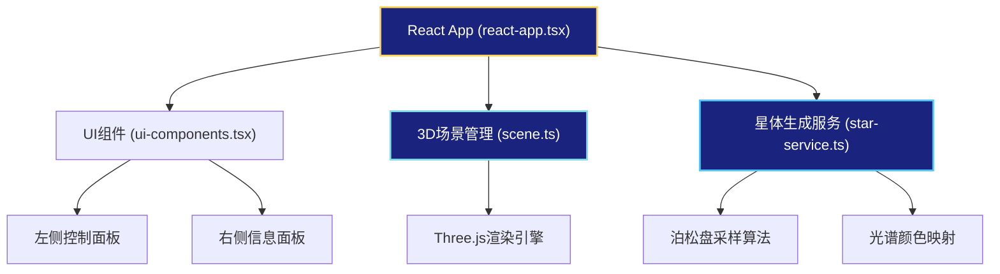

## 1. 架构设计



## 2. 技术描述

- **前端框架**：React 18 + TypeScript 5 + Vite 5
- **3D渲染**：Three.js 0.160 + OrbitControls
- **状态管理**：React useState/useReducer（轻量级场景，无需额外状态库）
- **样式方案**：CSS Modules + CSS Variables（主题色统一管理）
- **项目初始化**：Vite react-ts 模板
- **包管理器**：npm

## 3. 项目结构

```
auto42/
├── .trae/documents/
│   ├── PRD.md
│   └── technical-architecture.md
├── src/
│   ├── react-app.tsx          # React应用入口，全局状态管理
│   ├── scene.ts               # Three.js 3D场景管理
│   ├── star-service.ts        # 星体生成服务模块
│   ├── ui-components.tsx      # UI组件（控制面板、信息面板）
│   └── main.tsx               # React DOM渲染入口
├── index.html                 # HTML入口
├── package.json               # 项目依赖
├── vite.config.js             # Vite配置
└── tsconfig.json              # TypeScript配置
```

## 4. 数据模型

### 4.1 核心数据类型定义

```typescript
// 星体数据
interface Star {
  id: string;
  position: { x: number; y: number; z: number };
  brightness: number;       // 0.1 - 1.0
  color: { r: number; g: number; b: number };
  spectralType: 'O' | 'B' | 'A' | 'F' | 'G' | 'K' | 'M';
  size: number;             // 渲染尺寸
}

// 星图生成参数
interface StarGenerationParams {
  count: number;            // 100 - 1000
  distribution: 'sphere' | 'disk';
  seed: number;
}

// 星座连线
interface ConstellationLine {
  id: string;
  startStarId: string;
  endStarId: string;
}

// 行星轨道
interface PlanetOrbit {
  id: string;
  centerStarId: string;
  semiMajorAxis: number;    // 半长轴
  eccentricity: number;     // 偏心率
  inclination: number;      // 倾角
  speed: number;            // 运动速度
  planetRadius: number;     // 行星半径 0.5-2
  planetColor: string;
}

// 选中星体状态
interface SelectedStar {
  star: Star;
  screenPosition: { x: number; y: number };
}
```

### 4.2 模块接口定义

#### star-service.ts
```typescript
// 异步生成星体数据，模拟500ms网络延迟
export function generateStars(params: StarGenerationParams): Promise<Star[]>;
```

#### scene.ts
```typescript
export class StarScene {
  constructor(container: HTMLElement);
  setStars(stars: Star[]): void;
  addConstellationLine(line: ConstellationLine): void;
  removeConstellationLine(lineId: string): void;
  addPlanetOrbit(orbit: PlanetOrbit): void;
  removePlanetOrbit(orbitId: string): void;
  setSelectedStar(starId: string | null): void;
  setHoveredStar(starId: string | null): void;
  moveToGalacticTopView(): void;
  resetToDefaultView(): void;
  onStarClick(callback: (starId: string) => void): void;
  onStarHover(callback: (starId: string | null) => void): void;
  onLineRightClick(callback: (lineId: string) => void): void;
  dispose(): void;
}
```

## 5. 核心算法说明

### 5.1 泊松盘采样 (Poisson Disk Sampling)
- 用于在3D空间中生成均匀分布的星体位置
- 避免星体过度聚集，保证视觉效果
- 支持球形和圆盘状两种分布模式

### 5.2 光谱类型颜色映射
- O型：蓝色 (155, 176, 255)
- B型：蓝白色 (170, 191, 255)
- A型：白色 (213, 224, 255)
- F型：黄白色 (255, 248, 220)
- G型：黄色 (255, 230, 150)
- K型：橙色 (255, 180, 80)
- M型：红色 (255, 100, 50)

### 5.3 相机平滑过渡
- 使用TWEEN.js或自定义插值实现1.5s缓动动画
- 缓动函数：easeInOutCubic
- 同时过渡位置、朝向和fov

## 6. 性能优化策略

1. **星体渲染**：使用Points + BufferGeometry批量渲染，而非单个Mesh
2. **几何复用**：星座连线和轨道使用LineSegments共享几何体
3. **动画优化**：仅在必要时更新矩阵，禁用自动矩阵更新
4. **帧率控制**：使用requestAnimationFrame，计算deltaTime保证运动平滑
5. **内存管理**：场景清理时正确dispose所有几何体和材质

## 7. 配置文件说明

### package.json 依赖
- react: ^18.2.0
- react-dom: ^18.2.0
- three: ^0.160.0
- @types/three: ^0.160.0
- typescript: ^5.3.0
- vite: ^5.0.0
- @vitejs/plugin-react: ^4.2.0

### vite.config.js
- 端口：3000
- React插件配置

### tsconfig.json
- 严格模式：true
- JSX：react-jsx
- Target：esnext
