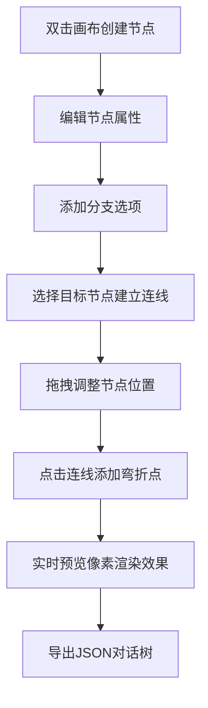

## 1. 产品概述

像素风对话树编辑器是一款面向独立游戏开发者的可视化对话创作工具，让开发者能够在浏览器中通过拖拽方式创建、编辑和预览像素风格游戏的对话系统。

- 核心价值：解决现有对话系统插件过于复杂、无法在浏览器中实时预览的痛点，提供轻量化的对话树设计与预览体验
- 目标用户：独立游戏开发者、像素游戏爱好者、叙事设计师

## 2. 核心功能

### 2.1 用户角色

| 角色 | 注册方式 | 核心权限 |
|------|----------|----------|
| 开发者用户 | 无需注册 | 完整使用编辑器所有功能、导入导出对话数据 |

### 2.2 功能模块

1. **对话树编辑器**：节点创建、拖拽移动、分支连线、属性编辑
2. **像素风预览器**：Canvas像素渲染、对话文本展示、选项交互
3. **数据管理**：JSON导入导出、数据完整性校验
4. **交互系统**：键盘快捷键、节点选中高亮、连线弯折调整

### 2.3 页面详情

| 页面名称 | 模块名称 | 功能描述 |
|---------|----------|----------|
| 主界面 | 顶部工具栏 | 应用标题、导出JSON按钮、导入JSON按钮 |
| 主界面 | 左侧编辑区 | 节点画布、点阵网格、节点拖拽、连线绘制 |
| 主界面 | 属性面板 | 说话者编辑、对话文本编辑、背景选择、分支选项编辑 |
| 主界面 | 右侧预览区 | Canvas像素画布、对话渲染、选项交互、状态栏 |

## 3. 核心流程

用户从创建节点开始，编辑对话内容和分支选项，通过连线建立节点关系，实时在预览区查看像素风格渲染效果，最终导出对话树数据用于游戏开发。

## 4. 用户界面设计

### 4.1 设计风格

- 主色调：深色主题 `#2d2d2d`，主题色 `#00e5ff`（青色发光）
- 点缀色：金色 `#f0c040`（说话者名称高亮），警告红 `#ff4444`（无效引用标记）
- 按钮风格：边框1px，透明背景，hover时半透明填充，点击波纹扩散动画
- 字体：像素风格数字和英文字符，Canvas硬边缘无抗锯齿渲染
- 布局：左右分栏（桌面）/ 上下分栏（响应式），顶部固定工具栏
- 动画：节点创建缩放动画、属性面板滑入动画、按钮点击波纹

### 4.2 页面设计概述

| 页面名称 | 模块名称 | UI元素 |
|---------|----------|--------|
| 主界面 | 顶部工具栏 | 高度50px、背景`#252525`、左侧标题16px青色、右侧功能按钮组 |
| 主界面 | 编辑画布 | 点阵网格20px间距、节点矩形180x100px、箭头连线带三角形 |
| 主界面 | 属性面板 | 宽度240px、背景`#333`、圆角8px、过渡动画0.3s |
| 主界面 | 预览画布 | 400x240px固定比例、像素渲染、底部对话区120px高半透明 |

### 4.3 响应式

- 桌面端（≥900px）：左右布局，编辑器60%宽度，预览区40%宽度，1px竖线分隔
- 移动端（<900px）：上下布局，编辑器70%高度，预览区30%高度，画布等比缩放
- 触摸优化：支持触控拖拽、双击创建、两指滚动

### 4.4 像素渲染规范

- Canvas画布：`imageRendering: pixelated`，禁用抗锯齿
- 像素字体：12px/16px两种字号，按像素网格对齐绘制
- 背景预设：星空`#1a1a2e`、森林`#2d5a27`、城堡`#8b5e3c`、洞穴`#1c1c1c`
- 性能约束：单帧渲染≤16ms，节点切换≤50ms，最多100个节点
