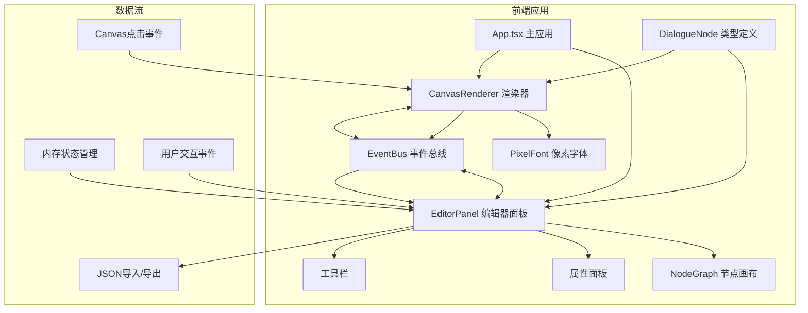
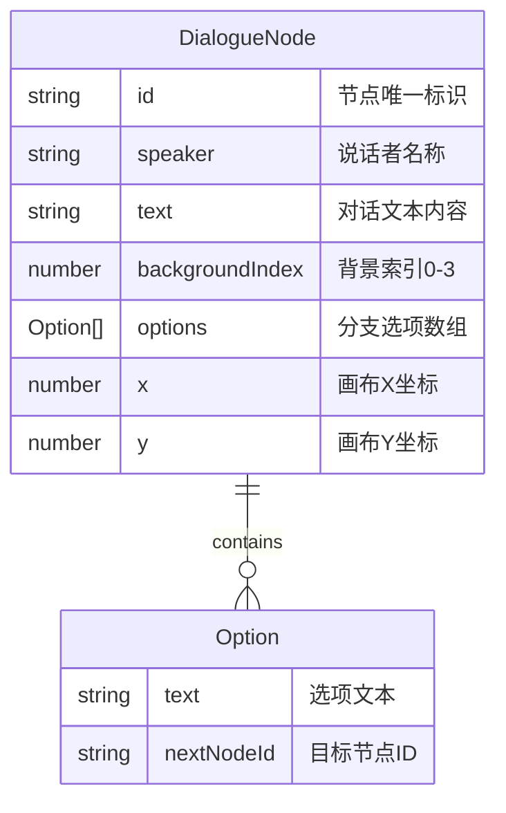

## 1. 架构设计



## 2. 技术描述

- 前端框架：React@18 + TypeScript@5 + Vite@5
- 构建工具：Vite@5 + @vitejs/plugin-react@4
- 状态管理：React useState/useReducer 内存管理
- 渲染技术：原生 Canvas 2D API
- 事件通信：自定义 EventBus 事件总线
- CSS方案：原生CSS + CSS变量 + CSS动画
- 无后端依赖：纯前端应用，数据内存存储

## 3. 文件结构与调用关系

| 文件路径 | 职责 | 依赖 | 被依赖 |
|---------|------|------|--------|
| `src/types/DialogueNode.ts` | 类型定义，对话节点接口 | 无 | EditorPanel, CanvasRenderer |
| `src/eventBus.ts` | 事件总线，emit/on方法 | 无 | EditorPanel, CanvasRenderer |
| `src/renderer/PixelFont.ts` | 像素字体渲染函数 | 无 | CanvasRenderer |
| `src/renderer/CanvasRenderer.ts` | Canvas像素渲染器 | PixelFont, eventBus, DialogueNode | App.tsx |
| `src/editor/NodeGraph.tsx` | 节点画布组件 | DialogueNode | EditorPanel |
| `src/editor/EditorPanel.tsx` | 编辑器主面板 | NodeGraph, eventBus, DialogueNode | App.tsx |
| `src/App.tsx` | 主应用组件 | EditorPanel, CanvasRenderer | main.tsx |
| `src/main.tsx` | React入口 | App.tsx | index.html |

## 4. 事件总线定义

| 事件名称 | 参数 | 发送方 | 接收方 | 用途 |
|---------|------|--------|--------|------|
| `PREVIEW_NODE` | nodeId: string | EditorPanel | CanvasRenderer | 预览指定节点 |
| `UPDATE_TREE` | nodes: DialogueNode[] | EditorPanel | CanvasRenderer | 更新对话树数据 |
| `OPTION_CLICKED` | optionIndex: number | CanvasRenderer | EditorPanel | 选项被点击 |
| `NODE_CLICKED` | nodeId: string | CanvasRenderer | EditorPanel | 预览区节点点击 |

## 5. 数据模型

### 5.1 数据模型定义



### 5.2 TypeScript 类型定义

```typescript
export interface DialogueOption {
  text: string;
  nextNodeId: string;
}

export interface DialogueNode {
  id: string;
  speaker: string;
  text: string;
  backgroundIndex: number;
  options: DialogueOption[];
  x: number;
  y: number;
}

export interface DialogueTree {
  nodes: DialogueNode[];
  rootNodeId: string;
}
```

## 6. 性能优化策略

1. **节点拖拽性能**：使用 requestAnimationFrame 批量更新，避免频繁重渲染
2. **Canvas渲染**：分层绘制（静态背景层 + 动态文本层），脏矩形区域重绘
3. **事件节流**：mousemove 事件使用 throttle 限制30fps
4. **数据缓存**：对话树数据变更时才触发渲染器更新
5. **像素字体**：使用离屏Canvas预渲染字符位图缓存

## 7. 开发与构建脚本

| 脚本 | 用途 |
|------|------|
| `npm run dev` | 启动开发服务器 |
| `npm run build` | 生产构建 |
| `npm run preview` | 预览构建结果 |
| `npm run typecheck` | TypeScript类型检查 |
