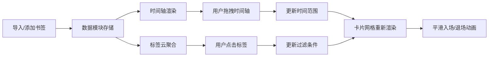

## 1. 产品概述

基于时间轴的网页书签可视化收藏与浏览工具，解决传统书签管理器仅按文件夹分类的局限性，通过时间线可视化和标签关联帮助用户更好地回顾和管理知识收藏。

- **核心问题**：传统书签管理器缺乏时间维度浏览，容易遗忘历史收藏内容
- **目标用户**：个人知识管理爱好者、需要整理大量网页资料的学习者
- **产品价值**：通过时间轴可视化浏览、标签关联过滤，让书签管理更直观高效

## 2. 核心功能

### 2.1 用户角色

| 角色 | 注册方式 | 核心权限 |
|------|----------|----------|
| 普通用户 | 无需注册，本地使用 | 完整使用所有功能，数据本地存储 |

### 2.2 功能模块

1. **书签管理模块**：导入浏览器书签、手动添加书签、删除书签、导出数据
2. **时间轴浏览模块**：横向可拖拽时间轴、时间节点可视化、时间范围筛选
3. **标签过滤模块**：标签云展示、标签高亮筛选、多维度联动
4. **卡片展示模块**：书签卡片网格布局、平滑动画效果、卡片交互

### 2.3 页面详情

| 页面名称 | 模块名称 | 功能描述 |
|---------|---------|----------|
| 主页面 | 顶部功能栏 | 应用标题、导入按钮、导出按钮、标签云过滤 |
| 主页面 | 时间轴区域 | 横向时间轴、书签节点、拖拽交互、Tooltip |
| 主页面 | 卡片网格区域 | 自适应网格布局、书签卡片、入场/退场动画 |

## 3. 核心流程

用户导入或手动添加书签后，所有书签按时间顺序排列在时间轴上。用户可通过拖拽时间轴浏览不同时间段的书签，或点击标签过滤特定主题的书签。时间轴与卡片网格实时联动，过滤时有平滑动画过渡。

## 4. 用户界面设计

### 4.1 设计风格

- **主色调**：紫色 `#6C63FF`、粉紫色 `#E040FB`
- **背景**：深色渐变 `#1E1E2E` 到 `#2A2A3E`
- **文字**：浅灰色 `#E0E0E0`
- **按钮**：圆角 8px，主题色背景，hover 加深 `#5A52D5`，过渡 0.3s
- **字体**：选择现代无衬线字体，标题清晰易读
- **布局**：上下分层结构，顶部固定功能栏，中部时间轴，下部自适应网格
- **动画**：所有交互均带 0.3s ease-out 过渡，卡片入场/退场动画

### 4.2 页面设计概述

| 页面名称 | 模块名称 | UI 元素 |
|---------|---------|---------|
| 主页面 | 顶部功能栏 | 高 60px，左侧导入按钮、中间标题、右侧导出按钮、下方标签云 |
| 主页面 | 时间轴区域 | 高 100px，深灰背景 `#2A2A2E`，横向轴线 `#555`，渐变圆点节点 |
| 主页面 | 卡片网格区域 | padding 24px，CSS Grid 布局，卡片 220×240px，圆角 12px |

### 4.3 响应式

- **桌面优先**，移动端自适应
- **< 768px**：网格单列布局，时间轴高度缩至 80px，功能栏按钮变为图标+Tooltip
- **触摸优化**：拖拽手势支持，触摸反馈

### 4.4 视觉细节

- 时间轴圆点颜色随时间渐变：从 `#6C63FF`（旧）到 `#E040FB`（新）
- 标签气泡使用 HSL 渐变背景，白色文字
- 卡片 hover 上移 4px，紫色阴影 `rgba(108,99,255,0.2)`
- 删除按钮圆形 24px，hover 红色半透明背景
