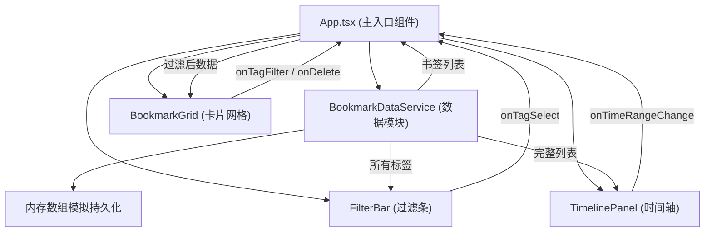
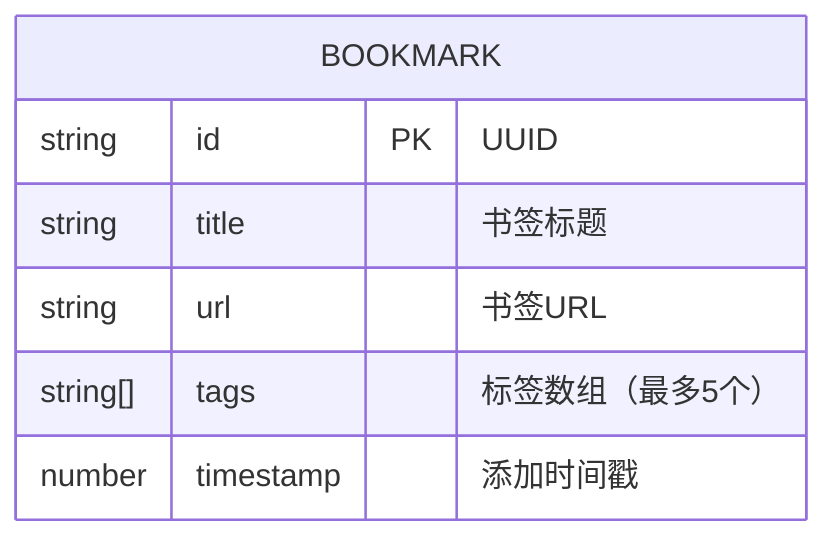

## 1. 架构设计



## 2. 技术描述

- **前端**：React@18 + TypeScript + Vite
- **初始化工具**：Vite (react-ts 模板)
- **状态管理**：React useState/useEffect (局部状态)
- **依赖**：react, react-dom, typescript, vite, @vitejs/plugin-react, uuid
- **数据持久化**：内存数组模拟（BookmarkDataService 内部维护）
- **样式**：CSS Modules / 原生 CSS（包含动画和响应式）
- **图标**：lucide-react

## 3. 项目结构

```
├── index.html                 # 入口页面
├── package.json               # 依赖配置
├── vite.config.js             # Vite 配置
├── tsconfig.json              # TypeScript 配置
└── src/
    ├── main.tsx               # React 入口
    ├── App.tsx                # 主组件
    ├── index.css              # 全局样式
    ├── types/
    │   └── bookmark.ts        # 类型定义
    ├── data/
    │   └── BookmarkDataService.ts  # 数据管理模块
    ├── components/
    │   ├── TimelinePanel.tsx  # 时间轴组件
    │   ├── BookmarkGrid.tsx   # 卡片网格组件
    │   ├── FilterBar.tsx      # 过滤条组件
    │   └── AddBookmarkModal.tsx # 添加书签弹窗
    └── utils/
        └── bookmarkParser.ts  # 书签 HTML 解析工具
```

## 4. 数据模型

### 4.1 数据模型定义



### 4.2 TypeScript 类型定义

```typescript
interface Bookmark {
  id: string;
  title: string;
  url: string;
  tags: string[];
  timestamp: number;
}

interface TimeRange {
  start: number;
  end: number;
}

interface BookmarkDataServiceInterface {
  getAll(): Bookmark[];
  add(bookmark: Omit<Bookmark, 'id'>): Bookmark;
  remove(id: string): boolean;
  getByTimeRange(range: TimeRange): Bookmark[];
  getByTag(tag: string): Bookmark[];
  getAllTags(): string[];
}
```

## 5. 模块调用关系与数据流向

### 5.1 数据流向总览

```
BookmarkDataService
    ↓ (getAll, getAllTags)
App.tsx (状态管理中心)
    ├─→ (bookmarks) → TimelinePanel
    ├─→ (allTags) → FilterBar
    └─→ (filteredBookmarks) → BookmarkGrid

用户交互回调：
    TimelinePanel → onTimeRangeChange → App 更新时间范围
    FilterBar → onTagSelect → App 更新过滤标签
    BookmarkGrid → onTagFilter / onDelete → App 更新状态
```

### 5.2 各模块职责

| 模块 | 输入 | 输出 | 核心职责 |
|-----|------|------|----------|
| BookmarkDataService | 增删查参数 | 书签数据 | 内存数据管理、CRUD 操作 |
| TimelinePanel | bookmarks, timeRange | onTimeRangeChange | 时间轴渲染、拖拽交互 |
| FilterBar | allTags, selectedTag | onTagSelect | 标签云渲染、标签过滤 |
| BookmarkGrid | filteredBookmarks | onTagFilter, onDelete | 卡片网格、动画效果 |
| App.tsx | 所有子组件回调 | 分发状态 | 状态管理、组件协调 |

## 6. 性能优化策略

- **时间轴渲染**：使用 CSS transform 实现拖拽，避免重排
- **卡片动画**：使用 CSS animation 和 opacity/transform 实现硬件加速
- **过滤操作**：O(n) 线性扫描，500 条数据 < 100ms
- **防抖优化**：时间轴拖拽可使用 requestAnimationFrame 节流
- **列表更新**：使用 React key 优化重渲染
