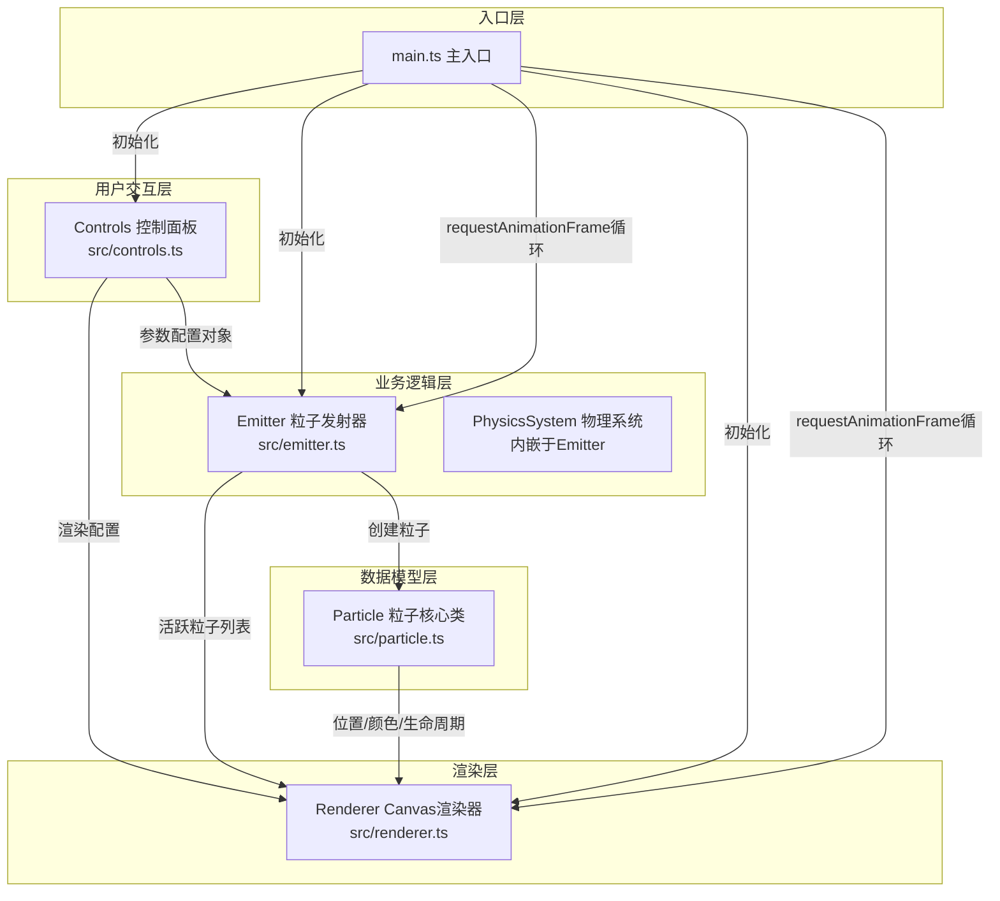
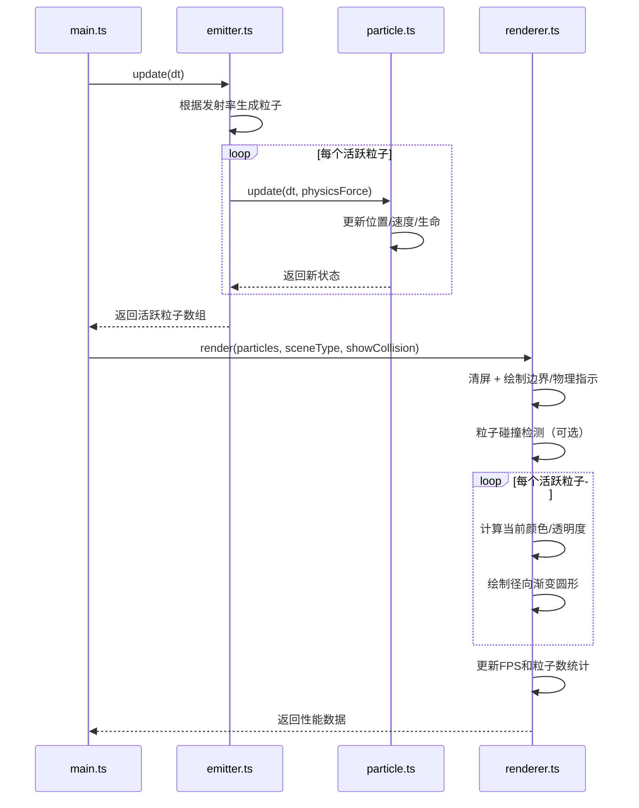

## 1. 架构设计

纯前端架构，所有逻辑在浏览器端运行，采用模块化分层设计，数据单向流动，确保可维护性和扩展性。



## 2. 技术选型

- **前端语言**：TypeScript@5（严格模式，目标ES2020）
- **构建工具**：Vite@5（原生ES模块支持，快速HMR）
- **渲染技术**：Canvas 2D API（原生浏览器支持，无额外依赖）
- **样式方案**：原生CSS（内联于index.html或独立style标签）
- **状态管理**：Emitter内部状态 + Controls回调（无需第三方状态库）

## 3. 文件结构与调用关系

| 文件路径 | 职责 | 输入（调用者/数据） | 输出（被调用/数据流） |
|----------|------|---------------------|----------------------|
| package.json | 依赖声明和启动脚本 | - | `npm run dev` 启动开发服务器 |
| vite.config.js | Vite构建配置 | - | ES模块打包、Canvas支持 |
| tsconfig.json | TypeScript编译配置 | - | 严格类型检查、ES2020目标 |
| index.html | 入口页面，DOM容器 | 用户访问 | 加载main.ts，提供左右布局div |
| src/main.ts | 应用入口，初始化各模块并启动渲染循环 | DOM加载完成 | 实例化Controls/Emitter/Renderer，绑定协作关系 |
| src/particle.ts | 粒子数据模型与状态更新 | Emitter发射指令、物理参数 | update(dt)更新位置速度，回调渲染坐标/颜色/透明度 |
| src/emitter.ts | 粒子池管理、发射率控制、物理场调度 | Controls参数配置、每帧dt | 创建/复用Particle，应用物理加速度，返回活跃粒子数组 |
| src/renderer.ts | Canvas绘制、清屏、边界碰撞、性能统计 | 活跃粒子数组、物理场类型 | 绘制粒子/边界/物理指示，返回FPS和粒子数给UI |
| src/controls.ts | 左侧控制面板UI渲染与事件绑定 | 用户DOM事件 | 配置变更回调→Emitter/Renderer |

## 4. 核心数据结构

### 4.1 ParticleConfig（粒子配置）
```typescript
interface ParticleConfig {
  emissionRate: number;    // 发射率 1-100 粒子/秒
  initialSpeed: number;    // 初始速度 0-500 px/s
  lifetime: number;        // 生命周期 0.5-5 秒
  size: number;            // 粒子大小 2-20 px
  startColor: { r: number; g: number; b: number };  // 起始颜色
  endColor: { r: number; g: number; b: number };    // 结束颜色
}
```

### 4.2 PhysicsScene（物理场景类型）
```typescript
type PhysicsScene = 'gravity' | 'wind' | 'vortex';
// gravity: y方向加速度 300px/s²
// wind: x方向持续加速度 100px/s²
// vortex: 绕中心点圆周运动
```

### 4.3 Particle（粒子实例）
```typescript
interface Particle {
  x: number; y: number;           // 位置
  vx: number; vy: number;         // 速度
  life: number; maxLife: number;  // 当前生命/最大生命
  size: number;                   // 大小
  startColor: RGB; endColor: RGB; // 颜色渐变
  isFlashing: boolean;            // 碰撞闪光状态
  flashTimer: number;             // 闪光剩余时间
  active: boolean;                // 是否活跃
}
```

### 4.4 RendererState（渲染状态）
```typescript
interface RendererState {
  showCollision: boolean;         // 粒子间碰撞开关
  fps: number;                    // 当前FPS
  particleCount: number;          // 活跃粒子数
  warningActive: boolean;         // 是否超过阈值警告
}
```

## 5. 性能优化策略

1. **对象池模式**：Particle预先分配数组池（5000），通过active标记复用，避免频繁GC
2. **降发射率机制**：活跃粒子数 > 阈值（如4500）时，新发射率 = 配置值 / 3
3. **碰撞检测优化**：采用空间网格（Spatial Grid）将Canvas分区，粒子仅与同格及相邻格粒子检测
4. **Canvas渲染优化**：
   - 使用径向渐变createRadialGradient一次创建缓存
   - 粒子透明度通过globalAlpha控制而非重算颜色
   - 批量绘制同色粒子减少状态切换
5. **帧率监控**：使用performance.now()计算FPS，滑动窗口平滑统计

## 6. 渲染流程时序


