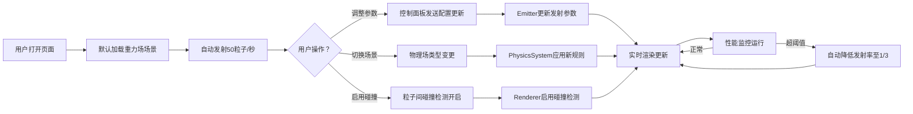

## 1. 产品概述

粒子特效编辑器与实时预览沙盒是一款面向游戏开发者和视觉设计师的专业工具，旨在解决2D平台跳跃游戏中粒子特效库过重、无法与物理系统实时联动的问题。通过提供直观的参数配置界面和即时反馈的Canvas渲染，用户可以快速创建、调试和预览符合物理规则的粒子效果。

- **核心价值**：轻量化、纯前端运行、物理联动、实时预览
- **目标用户**：2D游戏开发者、视觉特效设计师、前端动画工程师
- **市场定位**：填补现有粒子工具与游戏物理引擎之间的脱节空白

## 2. 核心功能

### 2.1 用户角色
| 角色 | 注册方式 | 核心权限 |
|------|----------|----------|
| 普通用户 | 无需注册，直接使用 | 完整的粒子参数配置、物理场景切换、效果预览和导出 |

### 2.2 功能模块
1. **控制面板模块**：粒子参数配置（发射率、速度、生命周期、大小、颜色渐变）、物理场景切换、碰撞控制
2. **实时渲染模块**：Canvas 2D粒子渲染、物理场景可视化、碰撞效果展示
3. **物理引擎模块**：重力场、风场、涡流场三种物理模拟、边界碰撞检测、粒子间碰撞检测
4. **性能监控模块**：FPS计数器、活跃粒子数统计、自动性能优化（降发射率）

### 2.3 页面详情
| 页面名称 | 模块名称 | 功能描述 |
|----------|----------|----------|
| 主编辑器 | 左侧控制面板 | 参数滑块（发射率1-100/s、速度0-500px/s、生命周期0.5-5s、大小2-20px）、颜色选择器（起始色/结束色）、场景切换按钮（重力/风/涡流）、碰撞开关 |
| 主编辑器 | 右侧Canvas预览区 | 粒子实时渲染、物理场可视化（箭头/圆圈）、边界墙显示（深灰色8px）、碰撞闪光效果 |
| 主编辑器 | 性能监控面板 | 右上角FPS显示（白色）、活跃粒子数显示（超阈值红色闪烁）、自动降速提示 |

## 3. 核心流程

用户打开页面 → 默认加载重力场场景 → 自动以50粒子/秒发射 → 用户通过滑块调整参数 → 实时看到效果变化 → 用户切换物理场景 → 粒子立即响应新物理规则 → 用户启用粒子间碰撞 → 观察碰撞反弹效果 → 系统监控性能 → 超过阈值自动降发射率

## 4. 用户界面设计

### 4.1 设计风格
- **主色调**：深色主题，背景#1e1e2e，Canvas区域渐变#2a2a3a→#0f0f1a
- **主题强调色**：#ff6b6b（珊瑚红色，用于滑块高亮、选中按钮）
- **辅助色**：#555（边界墙）、#fff（滑块按钮、文字）、#333（按钮默认）、#444（按钮悬停）
- **按钮风格**：圆角6px，预设按钮80x28px，选中态#ff6b6b，悬停态#444
- **滑块风格**：轨道高6px圆角3px，按钮直径16px圆形白色，点击缩放0.95
- **颜色选择器**：160x160px圆角方形色板，HEX输入框，取色放大镜

### 4.2 页面设计概述
| 页面名称 | 模块名称 | UI元素 |
|----------|----------|--------|
| 主编辑器 | 整体布局 | Flex布局，左侧控制面板320px，右侧Canvas自适应，响应式<768px时上下布局 |
| 主编辑器 | 控制面板 | 圆角12px，背景#1e1e2e，内边距20px，参数分组显示，过渡动画0.2s ease |
| 主编辑器 | Canvas区域 | 深灰到黑色垂直渐变，粒子径向渐变渲染，边界墙8px，物理场指示图形 |
| 主编辑器 | 性能面板 | 右上角绝对定位，白色等宽字体，超阈值红色闪烁（0.5s周期） |

### 4.3 响应式设计
- **桌面端**：左右分栏，控制面板固定320px宽，Canvas占满剩余空间
- **移动端**（<768px）：控制面板移至顶部，宽度100%，高度自适应，Canvas在下方
- **触屏优化**：滑块和按钮增大触摸区域，所有交互元素保持可点击性

## 5. 性能要求

| 指标 | 目标值 | 实现方式 |
|------|--------|----------|
| 粒子池上限 | 5000 | Emitter限制最大活跃数 |
| 3000粒子时FPS | ≥55 | Canvas 2D优化渲染、对象池复用 |
| 5000粒子时FPS | ≥30 | 自动降发射率至1/3、空间分区碰撞检测 |
| 渲染模式 | 径向渐变混合 | Canvas globalCompositeOperation + alpha叠加 |
