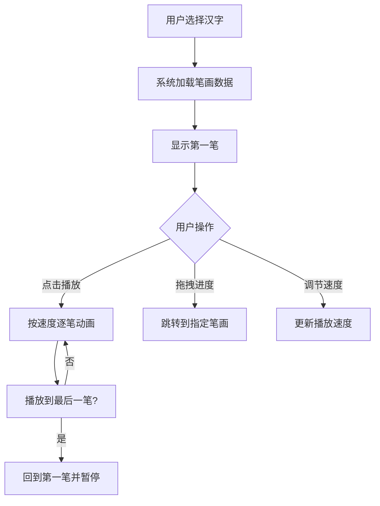

## 1. 产品概述

基于Web的书法字体笔画顺序动画演示应用，让用户可以选择不同汉字、查看其标准笔画顺序的逐笔动画演示，并支持用户手动拖拽调整动画播放进度与速度。

- 目标用户：书法爱好者、汉字学习者、教育工作者
- 核心价值：通过可视化动画帮助用户理解和掌握汉字书写的正确笔顺

## 2. 核心功能

### 2.1 功能模块
1. **主页面**：Canvas画布展示、控制面板、标题区域

### 2.2 页面详情
| 页面名称 | 模块名称 | 功能描述 |
|-----------|-------------|---------------------|
| 主页面 | 标题区域 | 显示"书法笔顺演示"标题，楷体字体 |
| 主页面 | Canvas画布 | 500x500px米黄色背景，逐笔动画渲染，高亮当前笔画，起点/终点标记 |
| 主页面 | 控制面板 | 汉字下拉选择、播放/暂停按钮、进度滑块、速度调节滑块 |

## 3. 核心流程

用户选择汉字 → 系统加载笔画数据 → 显示第一笔 → 用户点击播放 → 按设定速度逐笔动画展示 → 播放到最后一笔后自动回到第一笔并暂停

## 4. 用户界面设计

### 4.1 设计风格
- 主色调：米黄色(#f5e6c8)背景、棕色(#8B4513)滑块、黑色(#000000)笔画、深红(#2c1810)标题
- 字体：楷体('KaiTi', 'STKaiti', serif)标题
- 布局：上下结构，垂直居中
- 交互：按钮和滑块悬停放大(scale 1.05)，点击缩小回弹

### 4.2 页面设计概述
| 页面名称 | 模块名称 | UI元素 |
|-----------|-------------|-------------|
| 主页面 | 标题区域 | 楷体32px，#2c1810，居中 |
| 主页面 | Canvas画布 | 500x500px，米黄色背景，笔画黑色墨迹风格，起点红色圆点，终点绿色圆点 |
| 主页面 | 控制面板 | #fdf5e6背景，圆角8px，内边距16px，水平排列间距20px |

### 4.3 响应式设计
- 桌面优先设计
- 宽度小于600px时：Canvas宽度90vw，保持正方形；控制面板元素垂直排列换行
