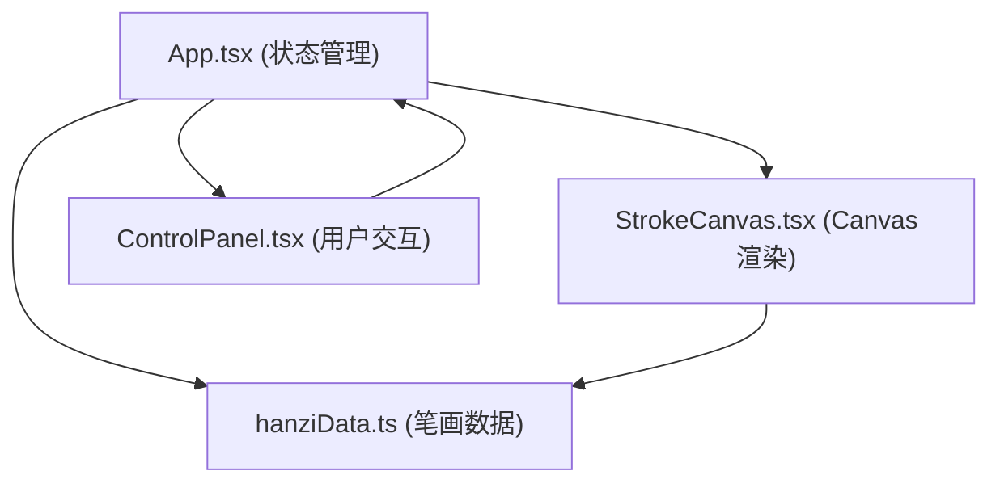

## 1. 架构设计



## 2. 技术栈说明
- 前端框架：React 18 + TypeScript
- 构建工具：Vite
- 状态管理：React useState/useRef（局部状态管理）
- 渲染方式：HTML5 Canvas API
- 无需后端，纯前端应用

## 3. 目录结构
```
e:\solo\SoloAutoDemo\tasks\auto56\
├── package.json
├── vite.config.js
├── tsconfig.json
├── index.html
└── src/
    ├── App.tsx
    ├── main.tsx
    ├── index.css
    ├── data/
    │   └── hanziData.ts
    └── components/
        ├── StrokeCanvas.tsx
        └── ControlPanel.tsx
```

## 4. 数据模型

### 4.1 笔画数据定义
```typescript
interface Stroke {
  startX: number;  // 起点X坐标 (0-100)
  startY: number;  // 起点Y坐标 (0-100)
  endX: number;    // 终点X坐标 (0-100)
  endY: number;    // 终点Y坐标 (0-100)
}

interface HanziData {
  character: string;     // 汉字
  strokeCount: number;   // 笔画数
  strokes: Stroke[];     // 笔画数组
}
```

### 4.2 应用状态
- currentChar: string - 当前选中的汉字
- currentStrokeIndex: number - 当前笔画索引
- isPlaying: boolean - 播放状态
- playSpeed: number - 播放速度 (0.5x - 3x)
- strokeProgress: number - 当前笔画绘制进度 (0-1)

## 5. 核心功能实现要点

### 5.1 Canvas渲染
- 使用 requestAnimationFrame 实现60fps动画
- 已完成笔画：透明度0.4
- 当前笔画：透明度1.0，动态绘制
- 起点标记：红色圆形(r=3px)
- 终点标记：绿色圆形(r=3px)

### 5.2 播放控制
- 速度1x时，每笔间隔1.5秒
- 每笔绘制动画时长固定1秒（不随速度变化）
- 进度滑块范围0至总笔画数-1
- 拖拽进度自动暂停播放

### 5.3 样式与动画
- 控件悬停: transform: scale(1.05), transition 0.2s ease
- 控件点击: scale(0.95) 再回弹, 0.1s
