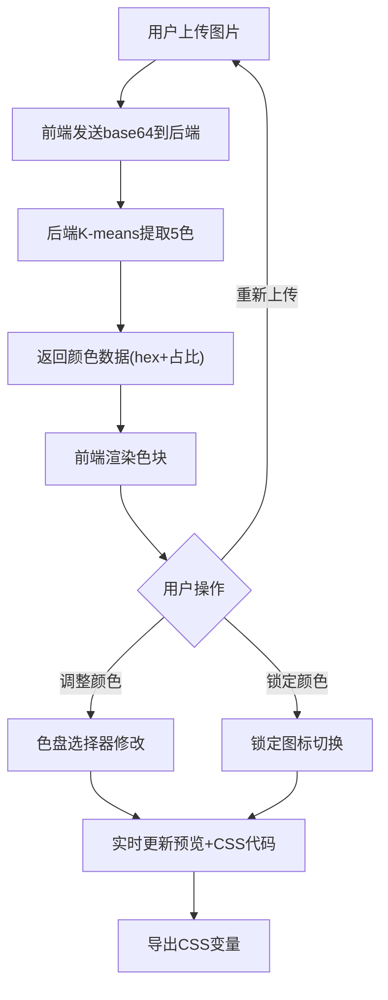

## 1. 产品概述

智能配色方案生成器——基于图片提取色彩的在线工具，帮助设计师和前端开发者在项目早期快速从图片中获取配色方案并实时预览应用效果，解决手动取色和反复修改CSS样式的痛点。

- 目标用户：UI设计师、前端开发者、视觉创作者
- 核心价值：从图片到可用CSS配色方案的端到端自动化，含实时预览和一键导出

## 2. 核心功能

### 2.1 功能模块

1. **主页面**：图片上传区、颜色提取结果区、颜色调整/锁定区、模板预览区、CSS导出区

### 2.2 页面详情

| 页面名称 | 模块名称 | 功能描述 |
|---------|---------|---------|
| 主页面 | 拖拽上传区 | 支持拖拽/点击上传图片(jpg/png/webp, ≤10MB)，拖入时边框变实线+主题色#64ffda |
| 主页面 | 颜色提取结果区 | 展示5个色块(60×60px, 圆角8px, 间距8px, 1px边框#333)，悬停放大1.15倍+显示颜色值tooltip |
| 主页面 | 颜色调整/锁定区 | 每个色块可点击弹出圆形色盘选择器(含吸管+十六进制输入)，锁定按钮(锁图标, 锁定变黄#FFD54F) |
| 主页面 | 模板预览区 | 右侧55%宽度，展示半成品网页模板(标题栏+3卡片+页脚)，颜色实时绑定，0.4s过渡动画 |
| 主页面 | CSS导出区 | 底部只读文本区(100%×120px, monospace, 深色背景#1e1e1e, 绿字#a5d6a7)，复制按钮+2秒"已复制"提示 |

## 3. 核心流程

1. 用户上传图片 → 前端将图片base64发送至后端API
2. 后端使用K-means聚类(k=5)提取5个主色，按占比排序返回
3. 前端展示色块结果，用户可调整/锁定任意颜色
4. 预览区实时渲染绑定当前配色方案的网页模板
5. 用户一键导出CSS变量代码

## 4. 用户界面设计

### 4.1 设计风格

- **主题**：深色科技风 (Dark Techno)
- **主背景**：#121212，卡片背景：#1e1e1e
- **文字主色**：#e0e0e0，次要文字：#9e9e9e
- **主题强调色**：#64ffda (青绿色)
- **布局**：左右两栏(45%/55%)，1px分割线#333
- **字体**：JetBrains Mono (代码区) + DM Sans (UI文字)
- **动画**：色块悬停0.2s放大，预览切换0.4s过渡，弹窗0.2s动画

### 4.2 页面设计概览

| 页面名称 | 模块名称 | UI元素 |
|---------|---------|--------|
| 主页面 | 上传区 | 虚线边框#555, 圆角12px, 拖入变实线#64ffda, 背景变亮 |
| 主页面 | 色块区 | 5个60×60色块, 圆角8px, 间距8px, 1px#333边框, 悬停1.15倍+tooltip |
| 主页面 | 调整区 | 色块下方占比%, 颜色选择器按钮, 锁定按钮(右上角锁图标) |
| 主页面 | 预览区 | 55%宽, 标题栏80px(辅色), 3卡片(圆角12px,白底,#333边框), 页脚60px(主色) |
| 主页面 | 导出区 | 100%×120px文本区, #1e1e1e背景, #a5d6a7文字, 复制按钮 |

### 4.3 响应式设计

- 桌面优先设计，最小宽度1024px
- 左右两栏布局在窄屏下考虑堆叠

### 4.4 性能要求

- 颜色提取+渲染总响应 ≤ 1秒
- 预览切换动画帧率 ≥ 50fps
