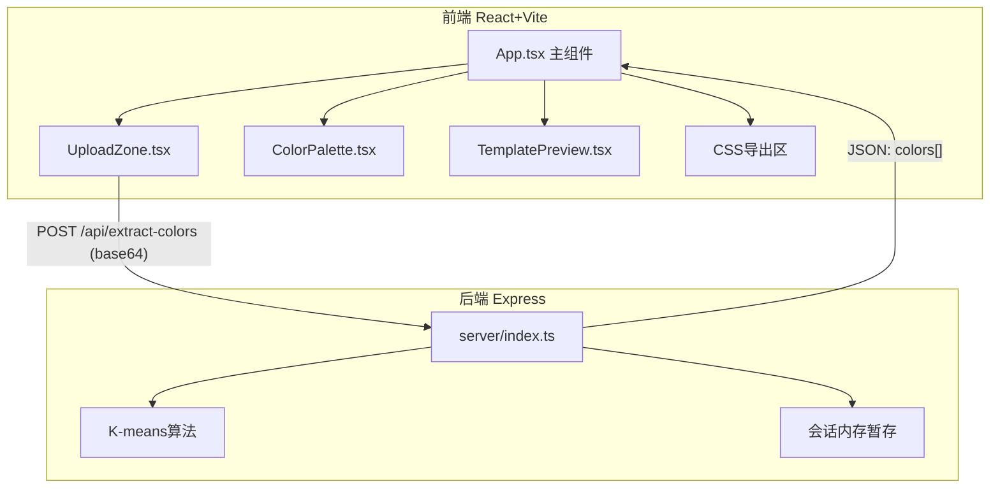
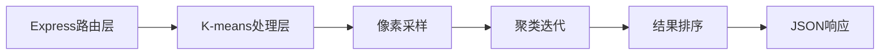

## 1. 架构设计



## 2. 技术说明

- **前端**：React@18 + TypeScript + Vite
- **样式方案**：CSS Modules / 内联样式（深色主题精确控制）
- **状态管理**：React useState/useCallback（组件内状态足够）
- **后端**：Express@4 + TypeScript + cors + body-parser
- **算法**：简化版K-means聚类 (k=5)，采样像素后迭代收敛
- **通信**：REST API，前端通过Vite proxy转发到后端3001端口

## 3. 路由定义

| 路由 | 用途 |
|------|------|
| / | 主页面（单页应用） |

## 4. API定义

### POST /api/extract-colors

**请求体：**
```typescript
interface ExtractColorsRequest {
  image: string;
}
```

**响应体：**
```typescript
interface ColorInfo {
  hex: string;
  percentage: number;
  locked: boolean;
}

interface ExtractColorsResponse {
  colors: ColorInfo[];
}
```

## 5. 服务端架构



## 6. 数据模型

### 6.1 颜色数据模型

```typescript
interface ColorInfo {
  hex: string;
  percentage: number;
  locked: boolean;
}
```

- `hex`: 十六进制颜色值 (如 #FF5722)
- `percentage`: 该颜色在图片中的占比百分比
- `locked`: 用户是否锁定该颜色（前端状态）

### 6.2 文件组织

```
├── package.json
├── index.html
├── vite.config.js
├── tsconfig.json
├── server/
│   └── index.ts          # Express后端 + K-means算法
└── src/
    ├── App.tsx            # 主应用组件
    ├── main.tsx           # 入口
    └── components/
        ├── UploadZone.tsx       # 拖拽上传
        ├── ColorPalette.tsx     # 调色板+锁定
        └── TemplatePreview.tsx  # 模板预览
```
