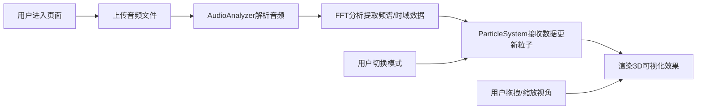

## 1. 产品概述

3D音乐可视化应用，用户上传音频文件后系统实时分析音频频谱，驱动由6000个粒子组成的3D粒子系统产生动态变化。支持多种可视化模式切换、自由视角控制，为音乐欣赏提供沉浸式视觉体验。

- 主要目标：将音乐通过视觉化方式呈现，让用户感受音乐与视觉的融合之美
- 目标用户：音乐爱好者、视觉艺术创作者、VJ表演者

## 2. 核心功能

### 2.1 功能模块

1. **主可视化页面**：3D粒子场景展示、音频上传区域、模式切换栏、标题区域

### 2.2 页面详情

| 页面名称 | 模块名称 | 功能描述 |
|---------|---------|---------|
| 主可视化页面 | 3D粒子场景 | Three.js渲染的6000个粒子系统，根据音频数据动态变化位置、大小、颜色 |
| 主可视化页面 | 音频上传区域 | 支持点击上传或拖拽上传（mp3/wav/ogg，≤30MB），显示文件名和播放控制 |
| 主可视化页面 | 模式切换栏 | 三种可视化模式切换按钮：波形模式、频谱柱模式、脉冲球模式 |
| 主可视化页面 | 标题区域 | 显示应用名称 |
| 主可视化页面 | OrbitControls | 鼠标左键旋转、右键平移、滚轮缩放视角 |

## 3. 核心流程

## 4. 用户界面设计

### 4.1 设计风格
- **主色调**：#0a0a2e（深空蓝）
- **强调色**：#00e5ff（霓虹青）
- **文字颜色**：#cccccc（浅灰）
- **背景色**：#0a0a2e
- **按钮风格**：圆形按钮，直径32px，深灰#2a2a3a背景，选中状态霓虹青背景+发光阴影
- **过渡动画**：所有控件0.3s过渡
- **字体**：现代无衬线字体，letter-spacing: 2px

### 4.2 页面设计概览

| 页面名称 | 模块名称 | UI元素 |
|---------|---------|-------|
| 主可视化页面 | 3D粒子场景 | 6000粒子球状分布，星点背景150个，OrbitControls |
| 主可视化页面 | 上传区域 | 400×200px虚线边框，拖入时实线霓虹青边框，圆角12px，半透明背景条（bottom:20px固定定位） |
| 主可视化页面 | 模式切换栏 | 三个圆形按钮，选中时scale:1.1+box-shadow发光，位于底部控制条 |
| 主可视化页面 | 标题区域 | position:fixed top:20px left:20px，半透明rgba(0,0,0,0.4)背景 |

### 4.3 响应式设计
- 桌面端：底部控制条flex行布局
- 移动端：底部控制条flex列布局，缩小字体和间距
- 3D场景始终占满剩余可视区域

### 4.4 3D场景指导
- **环境**：深空蓝背景#0a0a2e，营造科技感氛围
- **光照**：基础环境光，粒子自发光材质
- **相机**：PerspectiveCamera，初始距离适合观察球体
- **粒子设计**：
  - 初始球状分布（半径5）
  - 蓝紫渐变色（根据位置）
  - 大小随低频变化（0.05-0.3）
  - 亮度随高频变化（HSL L值0.3-0.9）
  - 位置随中频产生径向脉冲（0.5单位偏移）
- **背景星点**：150个白色小点（0.02大小），缓慢旋转
- **三种模式**：
  - 波形模式：Y轴波浪运动
  - 频谱柱模式：Y轴按频率分层柱状效果
  - 脉冲球模式：整体径向缩放心跳效果
