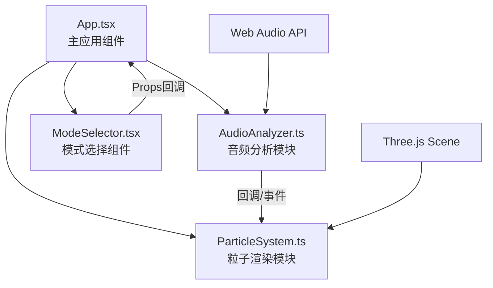

## 1. 架构设计



## 2. 技术说明

- **前端框架**：React 18 + TypeScript
- **构建工具**：Vite 5
- **3D渲染**：Three.js
- **音频处理**：Web Audio API（原生）
- **状态管理**：React Hooks（useState/useRef/useEffect）
- **样式方案**：原生CSS + CSS Modules内联样式

## 3. 文件结构定义

| 文件路径 | 用途 |
|---------|------|
| `package.json` | 项目依赖：react, react-dom, three, typescript, vite, @vitejs/plugin-react |
| `vite.config.js` | Vite基础配置，使用@vitejs/plugin-react |
| `tsconfig.json` | TypeScript严格模式，target ES2020 |
| `index.html` | 入口HTML，id=root的div容器 |
| `src/main.tsx` | React应用入口 |
| `src/App.tsx` | 主应用组件：文件上传、模式切换、场景初始化、模块组合 |
| `src/AudioAnalyzer.ts` | 音频分析模块：File→AudioBuffer→AnalyserNode→FFT→回调输出频谱/时域数据 |
| `src/ParticleSystem.ts` | 粒子渲染模块：6000粒子管理、三种可视化模式、Three.js渲染 |
| `src/ModeSelector.tsx` | 模式选择组件：三个圆形按钮，点击回调通知App |

## 4. 核心模块接口定义

### 4.1 AudioAnalyzer

```typescript
interface AudioAnalysisData {
  frequencyData: Uint8Array;    // 频谱数据（0-255）
  timeDomainData: Uint8Array;   // 时域数据（波形）
  lowFrequency: number;         // 低频分量平均值（0-200Hz） 0-1
  midFrequency: number;         // 中频分量平均值（200-2000Hz） 0-1
  highFrequency: number;        // 高频分量平均值（2000-8000Hz） 0-1
  averageSpectrum: number;      // 整体频谱平均值 0-1
}

type AnalysisCallback = (data: AudioAnalysisData) => void;

class AudioAnalyzer {
  constructor(onAnalysis: AnalysisCallback);
  loadFile(file: File): Promise<void>;
  play(): void;
  pause(): void;
  stop(): void;
  dispose(): void;
  isPlaying: boolean;
  fileName: string;
}
```

### 4.2 ParticleSystem

```typescript
type VisualizationMode = 'waveform' | 'spectrum' | 'pulse';

interface ParticleSystemOptions {
  particleCount: number;        // 6000
  sphereRadius: number;         // 5
}

class ParticleSystem {
  constructor(scene: THREE.Scene, options?: ParticleSystemOptions);
  update(data: AudioAnalysisData, deltaTime: number): void;
  setMode(mode: VisualizationMode): void;
  dispose(): void;
}
```

### 4.3 ModeSelector Props

```typescript
type VisualizationMode = 'waveform' | 'spectrum' | 'pulse';

interface ModeSelectorProps {
  currentMode: VisualizationMode;
  onModeChange: (mode: VisualizationMode) => void;
}
```

## 5. 性能优化策略

- **BufferedGeometry**：粒子使用BufferGeometry减少draw call
- **TypedArray**：使用Float32Array存储粒子位置、颜色数据
- **RAF节流**：使用requestAnimationFrame确保60fps
- **FFT大小**：合理设置AnalyserNode.fftSize（2048）
- **对象复用**：避免每帧创建新对象，重用Vector3/Color等
