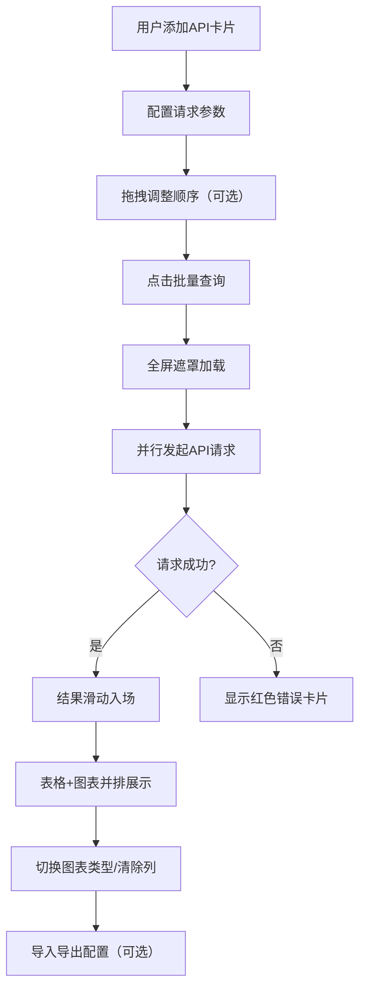

## 1. 产品概述

跨域数据集成仪表盘是一款面向数据分析师和开发者的可视化工具，允许用户同时配置和查询多个不同来源的公开REST API接口，将返回的数据以统一的表格和图表形式并排展示，便于跨源对比分析。目标用户为需要频繁对比不同API数据的开发者和数据工作者。

## 2. 核心功能

### 2.1 功能模块

1. **配置面板**：API卡片列表、折叠/展开表单、拖拽排序、批量查询按钮、导入/导出JSON配置
2. **仪表盘主区域**：两列网格布局、数据表格（斑马纹/悬停高亮）、图表（柱状图/折线图/饼图切换）、清除按钮

### 2.2 页面详情

| 页面名称 | 模块名称 | 功能描述 |
|----------|----------|----------|
| 主页面 | 配置面板 | 左侧固定380px宽面板，深灰蓝背景，包含API卡片列表、批量查询按钮、导入导出功能 |
| 主页面 | 仪表盘 | 右侧主区域，白色背景，展示查询结果的两列网格（表格+图表），支持图表类型切换和列清除 |

## 3. 核心流程

1. 用户在左侧配置面板添加API卡片，配置请求URL、方法、请求头和查询参数
2. 用户可拖拽API卡片调整查询顺序
3. 点击批量查询按钮，全屏半透明遮罩显示加载状态
4. 所有API并行请求，每个请求完成后逐步显示结果（滑动入场动画）
5. 结果以两列网格展示：左侧数据表格，右侧图表
6. 用户可切换图表类型、清除单列结果、导入导出配置

## 4. 用户界面设计

### 4.1 设计风格

- **主色调**：主题色 #00adb5（青色），深色背景 #1a1a2e / #16213e
- **按钮风格**：圆角渐变按钮，悬停缩放+阴影
- **字体**：-apple-system, BlinkMacSystemFont, 'Segoe UI' 无衬线字体
- **布局风格**：左右分栏，左侧固定宽度配置面板，右侧弹性仪表盘区域
- **动画**：卡片悬停偏移+装饰条、结果滑动入场、图表切换过渡

### 4.2 页面设计概述

| 页面名称 | 模块名称 | UI元素 |
|----------|----------|--------|
| 主页面 | 配置面板 | 380px宽，#1a1a2e背景，24px内边距，16px圆角，输入框#e6e6e6背景，聚焦#00adb5边框 |
| 主页面 | API卡片 | 120px高，#16213e背景，12px圆角，底部2px主题色装饰条，悬停左侧3px竖条+右移4px |
| 主页面 | 批量查询按钮 | 180x48px，#00adb5→#0a9396渐变，24px圆角，16px白色文字，点击缩放0.95 |
| 主页面 | 仪表盘区域 | 剩余宽度，#f5f7fa背景，两列网格 |
| 主页面 | 数据表格 | 表头固定，48px行高，斑马纹#ffffff/#f0f0f0，悬停#e0f7fa |
| 主页面 | 图表区域 | 白色#fff背景，12px圆角，阴影，支持柱状/折线/饼图切换（0.4s动画） |
| 主页面 | 清除按钮 | 24px圆形，#ff4d4d背景，白色X图标，悬停放大1.1倍 |
| 主页面 | 错误卡片 | #ffe0e0背景，深红文字，8px圆角，居中错误信息 |

### 4.3 响应式设计

- 桌面优先设计，最小宽度1024px
- 配置面板固定宽度，仪表盘区域弹性伸缩
- 当屏幕宽度不足时，结果区域可水平滚动
