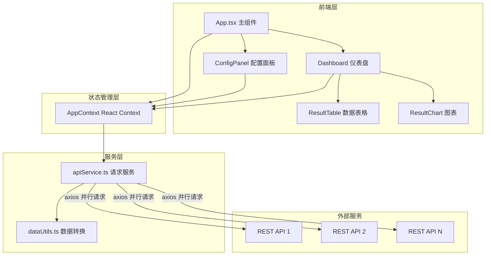

## 1. 架构设计



## 2. 技术说明

- **前端**：React 18 + TypeScript + Vite
- **样式方案**：全局CSS + CSS变量（无Tailwind，按用户要求使用自定义CSS）
- **图表库**：react-chartjs-2 + chart.js
- **HTTP客户端**：axios
- **ID生成**：uuid
- **状态管理**：React Context
- **初始化工具**：vite-init (react-ts模板)
- **后端**：无（纯前端应用）
- **数据库**：无

## 3. 路由定义

| 路由 | 用途 |
|------|------|
| / | 主页面，包含配置面板和仪表盘 |

## 4. 数据模型

### 4.1 核心类型定义

```typescript
interface ApiConfig {
  id: string;
  name: string;
  url: string;
  method: 'GET' | 'POST';
  headers: Record<string, string>;
  params: Record<string, string>;
  collapsed: boolean;
}

interface ApiResult {
  configId: string;
  status: 'loading' | 'success' | 'error';
  data: Record<string, unknown>[] | null;
  error: string | null;
  chartType: 'bar' | 'line' | 'pie';
}

interface AppState {
  configs: ApiConfig[];
  results: ApiResult[];
  isQuerying: boolean;
}
```

## 5. 文件结构

```
├── index.html
├── package.json
├── vite.config.js
├── tsconfig.json
├── src/
│   ├── App.tsx
│   ├── main.tsx
│   ├── components/
│   │   ├── ConfigPanel.tsx
│   │   ├── Dashboard.tsx
│   │   ├── ResultTable.tsx
│   │   └── ResultChart.tsx
│   ├── services/
│   │   └── apiService.ts
│   ├── utils/
│   │   └── dataUtils.ts
│   ├── context/
│   │   └── AppContext.tsx
│   └── styles/
│       └── global.css
```
