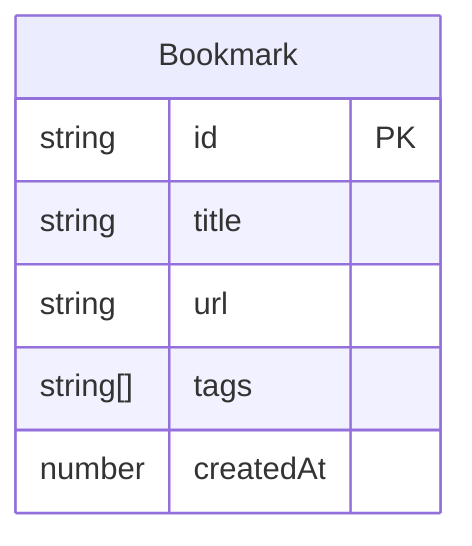

## 1. 架构设计

```mermaid
flowchart TB
    subgraph "前端层"
        App["App.tsx 主控制器"]
        TP["TimelinePanel.tsx"]
        BG["BookmarkGrid.tsx"]
        FB["FilterBar.tsx"]
    end

    subgraph "数据层"
        BDS["BookmarkDataService.ts"]
    end

    App --> "getAll / getByTimeRange / getByTag" --> BDS
    App --> "bookmarks + timeRange" --> TP
    App --> "filteredBookmarks" --> BG
    App --> "allTags" --> FB
    TP --> "onTimeRangeChange" --> App
    FB --> "onTagSelect" --> App
    BG --> "onTagFilter / onDelete" --> App
    App --> "add / remove" --> BDS
```

数据流向：
1. App从BookmarkDataService获取初始数据 → 分发给TimelinePanel、FilterBar、BookmarkGrid
2. 用户拖拽时间轴 → onTimeRangeChange回调 → App更新时间范围状态 → 重新查询 → 更新子组件
3. 用户点击标签 → onTagSelect回调 → App更新过滤标签状态 → 重新查询 → 更新子组件
4. 用户删除书签 → onDelete回调 → App调用BookmarkDataService.remove → 重新获取数据 → 更新所有子组件

## 2. 技术说明

- 前端：React 18 + TypeScript + Vite
- 初始化工具：vite-init
- 后端：无
- 数据库：内存数组模拟持久化（BookmarkDataService.ts）
- 状态管理：React useState/useCallback，无需额外状态库
- 样式：CSS Modules / 内联样式，不使用Tailwind（用户指定了详细样式规范）

## 3. 路由定义

| 路由 | 用途 |
|------|------|
| / | 主页面，包含时间轴、标签过滤、卡片网格 |

## 4. API定义

无后端API，所有数据操作通过BookmarkDataService模块完成。

### 数据接口定义

```typescript
interface Bookmark {
  id: string;
  title: string;
  url: string;
  tags: string[];
  createdAt: number;
}

interface TimeRange {
  start: number;
  end: number;
}

interface BookmarkDataServiceType {
  getAll(): Bookmark[];
  add(bookmark: Omit<Bookmark, 'id' | 'createdAt'>): Bookmark;
  remove(id: string): void;
  getByTimeRange(range: TimeRange): Bookmark[];
  getByTag(tag: string): Bookmark[];
  getAllTags(): string[];
  importFromHtml(html: string): Bookmark[];
}
```

## 5. 服务器架构图

无后端服务。

## 6. 数据模型

### 6.1 数据模型定义



### 6.2 数据定义

Bookmark存储在内存数组中，使用uuid生成唯一ID，createdAt为时间戳。标签存储为字符串数组，最多5个。导入HTML书签文件时解析H3和A标签提取标题与URL。
