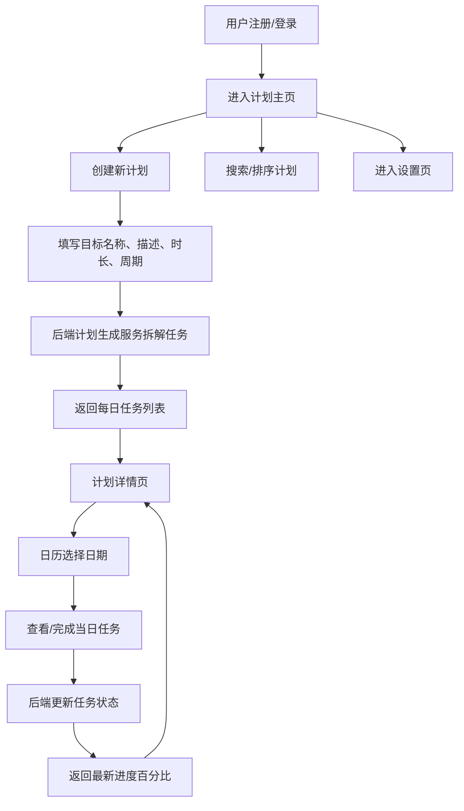

## 1. 产品概述

学习导航是一款面向自学者个性化学习计划管理应用，解决自学过程中缺乏系统规划和进度可见性的问题。通过自动拆解学习目标为每日任务，配合日历视图和打卡机制，帮助用户建立持续的学习节奏和清晰的进度感知。

## 2. 核心功能

### 2.1 用户角色

| 角色 | 注册方式 | 核心权限 |
|------|----------|----------|
| 普通用户 | 用户名+密码注册 | 创建计划、查看任务、打卡、管理个人资料 |

### 2.2 功能模块

1. **注册/登录页**：用户注册与登录，登录后进入主页
2. **计划主页**：整体进度条、计划卡片网格、搜索排序
3. **创建计划页**：填写学习目标、每日时长、计划周期，自动生成每日任务
4. **计划详情页**：日历组件+任务列表，支持打卡和进度追踪
5. **设置页**：个人资料编辑、每日学习提醒开关

### 2.3 页面详情

| 页面名称 | 模块名称 | 功能描述 |
|----------|----------|----------|
| 注册/登录页 | 注册表单 | 用户名、密码输入，注册按钮，切换到登录 |
| 注册/登录页 | 登录表单 | 用户名、密码输入，登录按钮，切换到注册 |
| 计划主页 | 进度条 | 显示所有计划的整体完成度，100%宽，24px高，圆角12px |
| 计划主页 | 计划卡片网格 | 280x200px卡片，显示名称/日期/进度/详情按钮，悬停上移6px+阴影 |
| 计划主页 | 搜索框 | 实时过滤，placeholder浅灰色，聚焦边框变#00BFA5 |
| 计划主页 | 排序按钮 | 按名称或创建时间排序 |
| 创建计划页 | 表单 | 目标名称、描述、每日时长滑块(1-8h)、周期选择(7/14/30天) |
| 创建计划页 | 生成逻辑 | 提交后调用计划生成服务，自动拆解为每日任务 |
| 计划详情页 | 日历组件 | 左侧，高亮有任务日期，点击切换查看 |
| 计划详情页 | 任务列表 | 右侧，标题/预计耗时/完成复选框，打卡更新进度 |
| 设置页 | 个人资料 | 头像、昵称编辑 |
| 设置页 | 学习提醒 | 每日提醒开关，模拟弹窗通知 |

## 3. 核心流程

用户注册登录 → 创建学习计划（填写目标参数）→ 后端自动生成每日任务 → 查看计划详情（日历+任务列表）→ 逐日完成打卡 → 进度实时更新 → 返回主页查看整体进度

## 4. 用户界面设计

### 4.1 设计风格

- 主色调：#00BFA5（薄荷绿），辅助色：#FAFAFA（浅灰白）
- 深色导航栏：#263238，选中项：#37474F，左侧3px主色调边框
- 按钮样式：主色调背景、白色文字、圆角8px，悬停亮度+10%、0.2s过渡
- 字体：-apple-system, BlinkMacSystemFont, 系统默认无衬线
- 布局：左右结构，左侧固定220px导航栏，右侧内容区
- 卡片/输入框：1px #E0E0E0边框，8px圆角，输入框聚焦边框2px主色
- 进度条：已完成#4CAF50，未完成#E0E0E0，白色粗体14px居中数字
- 页面切换：0.3s opacity淡入动画
- 响应式：<768px导航栏折叠为顶部汉堡菜单

### 4.2 页面设计概览

| 页面名称 | 模块名称 | UI元素 |
|----------|----------|--------|
| 注册/登录页 | 表单区域 | 居中卡片式表单，薄荷绿按钮，输入框聚焦主色边框 |
| 计划主页 | 进度条 | 顶部全宽进度条，#4CAF50/#E0E0E0渐变 |
| 计划主页 | 卡片网格 | 3列网格，280x200白底圆角卡片，悬停上移+阴影 |
| 计划主页 | 搜索/排序 | 搜索框+排序按钮行，实时过滤 |
| 创建计划页 | 表单 | 输入框+滑块+周期选择，薄荷绿提交按钮 |
| 计划详情页 | 左右布局 | 左侧日历网格，右侧任务清单，复选框打卡 |
| 设置页 | 资料编辑 | 头像上传区，昵称输入框，提醒开关 |

### 4.3 响应式适配

- 桌面端（≥768px）：左右布局，固定导航栏
- 移动端（<768px）：导航栏折叠为顶部汉堡菜单，卡片网格单列
