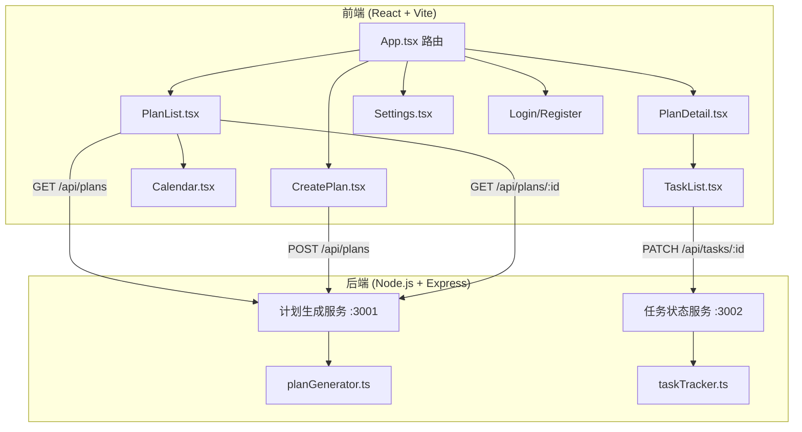
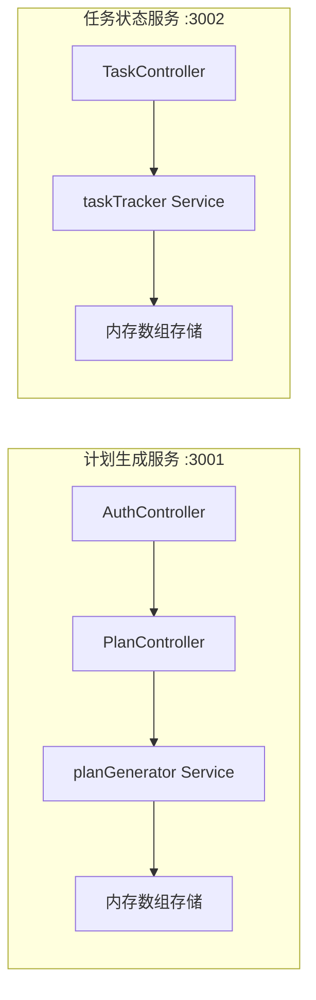
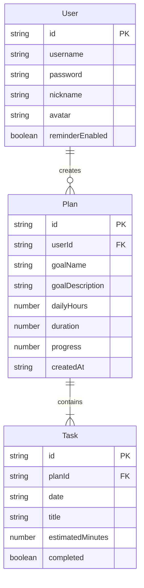

## 1. 架构设计



## 2. 技术说明

- 前端：React@18 + TypeScript + Vite，状态管理使用 zustand
- 后端：Express@4 + TypeScript，tsx 运行
- 数据存储：后端内存数组，会话内数据保留
- 前后端通信：REST API，Vite 代理转发到后端
- 计划生成服务：监听 3001 端口
- 任务状态服务：监听 3002 端口

## 3. 路由定义

| 路由 | 用途 |
|------|------|
| /login | 登录/注册页面 |
| / | 计划主页（卡片网格+搜索排序） |
| /create | 创建新学习计划 |
| /plan/:id | 计划详情页（日历+任务列表） |
| /settings | 个人设置页面 |

## 4. API 定义

### 4.1 计划生成服务 (端口 3001)

```typescript
interface CreatePlanRequest {
  goalName: string;
  goalDescription: string;
  dailyHours: number;
  duration: 7 | 14 | 30;
  userId: string;
}

interface Task {
  id: string;
  date: string;
  title: string;
  estimatedMinutes: number;
  completed: boolean;
}

interface Plan {
  id: string;
  userId: string;
  goalName: string;
  goalDescription: string;
  dailyHours: number;
  duration: number;
  tasks: Task[];
  createdAt: string;
  progress: number;
}

// POST /api/plans - 创建计划并生成任务
// Request: CreatePlanRequest
// Response: Plan

// GET /api/plans - 获取用户所有计划
// Query: userId
// Response: Plan[]

// GET /api/plans/:id - 获取单个计划详情
// Response: Plan
```

### 4.2 任务状态服务 (端口 3002)

```typescript
// PATCH /api/tasks/:id - 更新任务完成状态
// Request: { completed: boolean; planId: string }
// Response: { progress: number }

// GET /api/tasks/plan/:planId - 获取计划下所有任务
// Response: Task[]
```

### 4.3 用户服务 (端口 3001)

```typescript
interface User {
  id: string;
  username: string;
  password: string;
  nickname: string;
  avatar: string;
  reminderEnabled: boolean;
}

// POST /api/auth/register - 用户注册
// Request: { username: string; password: string }
// Response: { user: User; token: string }

// POST /api/auth/login - 用户登录
// Request: { username: string; password: string }
// Response: { user: User; token: string }

// PUT /api/users/:id - 更新用户资料
// Request: { nickname?: string; avatar?: string; reminderEnabled?: boolean }
// Response: User
```

## 5. 服务架构图



## 6. 数据模型

### 6.1 数据模型定义



### 6.2 数据存储

使用后端内存数组存储所有数据，页面刷新后数据保留（仅限当前Node.js进程生命周期内）。
