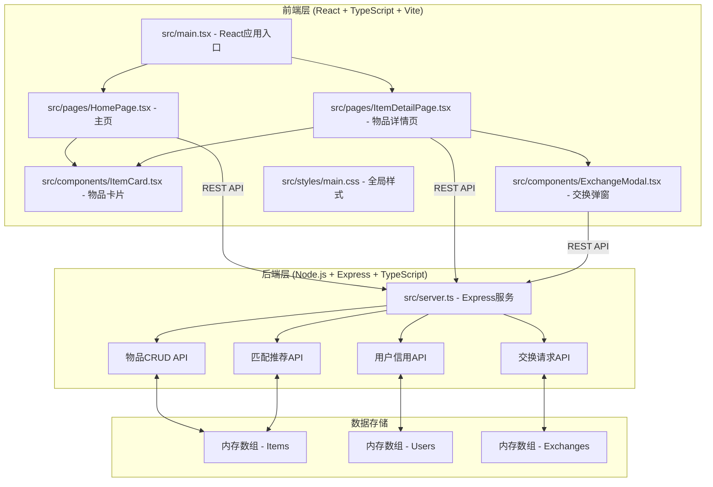
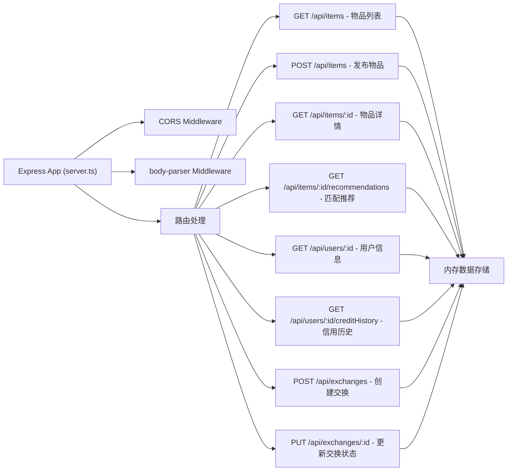
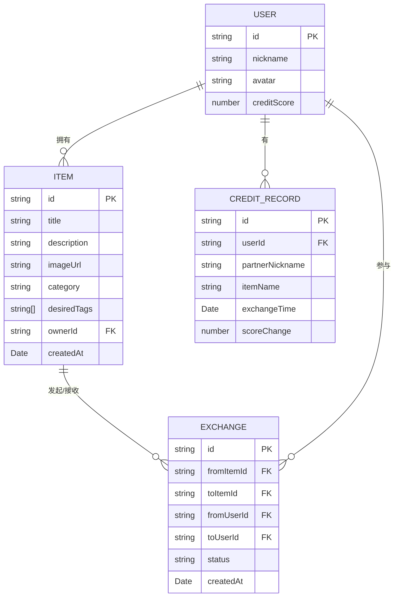

## 1. 架构设计



## 2. 技术描述

- **前端**：React@18 + React DOM + TypeScript + Vite
- **初始化工具**：vite-init（react-express-ts模板）
- **后端**：Express@4 + TypeScript + ts-node
- **数据库**：内存数组模拟（items, users, exchanges）
- **状态管理**：React内置useState + Context
- **路由**：React Router DOM
- **图标**：lucide-react

## 3. 路由定义

| 路由 | 用途 |
|------|------|
| / | 主页 - 物品列表、搜索、筛选 |
| /items/:id | 物品详情页 - 物品信息、发起交换 |

## 4. API定义

### 4.1 通用响应格式
```typescript
interface ApiResponse<T> {
  success: boolean;
  data: T;
  message: string;
}
```

### 4.2 物品相关API

**GET /api/items** - 获取物品列表（支持搜索和分类筛选，分页20条）
- Query参数：query（搜索关键词）、category（分类）、page（页码）
- 响应：`ApiResponse<{ items: Item[], total: number }>`

**POST /api/items** - 发布新物品
- 请求体：`{ title, description, imageUrl, category, desiredTags: string[], ownerId }`
- 响应：`ApiResponse<{ item: Item, recommendations: Item[] }>`（返回最多5个匹配推荐）

**GET /api/items/:id** - 获取单个物品详情
- 响应：`ApiResponse<Item>`

### 4.3 匹配推荐API

**GET /api/items/:id/recommendations** - 获取物品匹配推荐
- 响应：`ApiResponse<Item[]>`（最多5个推荐物品）

### 4.4 用户信用API

**GET /api/users/:id/creditHistory** - 获取用户信用历史（最近5条）
- 响应：`ApiResponse<CreditRecord[]>`

**GET /api/users/:id** - 获取用户信息
- 响应：`ApiResponse<User>`

### 4.5 交换请求API

**POST /api/exchanges** - 创建交换请求
- 请求体：`{ fromItemId, toItemId, fromUserId, toUserId }`
- 响应：`ApiResponse<Exchange>`

**PUT /api/exchanges/:id** - 更新交换状态
- 请求体：`{ status: 'accepted' | 'rejected' }`
- 响应：`ApiResponse<Exchange>`（accepted时双方信用各+5）

### 4.6 数据模型

```typescript
interface Item {
  id: string;
  title: string;
  description: string;
  imageUrl: string;
  category: 'electronics' | 'books' | 'home' | 'clothing' | 'other';
  desiredTags: string[];
  ownerId: string;
  createdAt: Date;
}

interface User {
  id: string;
  nickname: string;
  avatar: string;
  creditScore: number; // 0-100
}

interface Exchange {
  id: string;
  fromItemId: string;
  toItemId: string;
  fromUserId: string;
  toUserId: string;
  status: 'pending' | 'accepted' | 'rejected';
  createdAt: Date;
}

interface CreditRecord {
  id: string;
  userId: string;
  partnerNickname: string;
  itemName: string;
  exchangeTime: Date;
  scoreChange: number;
}
```

## 5. 服务器架构图



## 6. 数据模型

### 6.1 数据模型定义



### 6.2 初始数据

后端启动时初始化以下模拟数据：
- 3个用户（信用分分别为92、65、45）
- 6-8个物品，覆盖不同分类和期望标签
- 3条信用历史记录

## 7. 文件结构与调用关系

```
auto77/
├── package.json                 # 项目依赖和脚本配置
├── vite.config.js               # Vite配置：React支持 + 代理到3001端口
├── tsconfig.json                # TypeScript配置：严格模式，ES2020
├── index.html                   # 入口HTML
├── src/
│   ├── server.ts                # Express后端：所有API路由和内存数据
│   │   ├── items[]              # 内存存储：物品数组
│   │   ├── users[]              # 内存存储：用户数组
│   │   ├── exchanges[]          # 内存存储：交换请求数组
│   │   ├── creditRecords[]      # 内存存储：信用记录数组
│   │   ├── matchItems()         # 匹配算法：根据期望标签匹配
│   │   └── updateCreditScore()  # 更新用户信用分
│   ├── main.tsx                 # React入口：路由注册、App渲染
│   │   └── <BrowserRouter> → <Routes>
│   │       ├── / → HomePage
│   │       └── /items/:id → ItemDetailPage
│   ├── pages/
│   │   ├── HomePage.tsx         # 主页
│   │   │   ├── useState: items, query, category
│   │   │   ├── useEffect: fetch('/api/items?query=&category=')
│   │   │   ├── → ItemCard[]（循环渲染）
│   │   │   └── → 红点通知（匹配推荐）
│   │   └── ItemDetailPage.tsx   # 物品详情页
│   │       ├── useState: item, showModal, showCreditHistory
│   │       ├── useEffect: fetch('/api/items/:id')
│   │       ├── → 信用历史列表
│   │       └── → ExchangeModal
│   ├── components/
│   │   ├── ItemCard.tsx         # 物品卡片组件（接收item props）
│   │   │   ├── 信用徽章（颜色根据分数）
│   │   │   └── hover浮层（期望标签列表）
│   │   └── ExchangeModal.tsx    # 交换确认弹窗（接收exchangeRequest props）
│   │       ├── PUT /api/exchanges/:id
│   │       └── 双向箭头脉冲动画
│   └── styles/
│       └── main.css             # 全局样式
```

**数据流向说明**：
1. 用户操作 → 前端组件 → fetch API → Express路由 → 内存数组操作 → 返回响应 → 更新React state → 重新渲染UI
2. 发布物品时：POST /api/items → 后端执行匹配算法 → 返回推荐物品 → 前端显示红点提示
3. 确认交换时：PUT /api/exchanges/:id → 更新status=accepted → 双方信用各+5 → 添加信用记录
