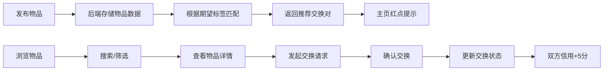

## 1. 产品概述

闲置物品交换管理与社交匹配应用，帮助用户在线发布闲置物品、自动匹配交换需求、管理交换流程并建立用户信用体系。解决线下闲置物品交换市集依赖手工表格、效率低下、易出错的问题。

- 目标用户：参与闲置物品交换的普通用户
- 核心价值：通过智能匹配和信用体系，提升交换效率和用户信任度

## 2. 核心功能

### 2.1 用户角色

| 角色 | 注册方式 | 核心权限 |
|------|----------|----------|
| 普通用户 | 无需注册（演示模式） | 发布物品、浏览物品、发起交换、查看信用 |

### 2.2 功能模块

1. **主页（HomePage）**：搜索栏、分类筛选器、物品卡片网格、匹配推荐红点提示
2. **物品详情页（ItemDetailPage）**：大图展示、物品信息、期望标签、发布者信用、发起交换
3. **物品卡片组件（ItemCard）**：缩略图、标题、期望标签、信用徽章、hover浮层
4. **交换确认弹窗（ExchangeModal）**：双方物品对比、信用分展示、确认/拒绝交换
5. **信用历史展示**：最近5条交换记录列表

### 2.3 页面详情

| 页面名称 | 模块名称 | 功能描述 |
|----------|----------|----------|
| 主页 | 搜索栏 | 按标题、描述全文搜索，实时搜索建议下拉（前5条） |
| 主页 | 分类筛选器 | 横向滚动标签条，支持电子产品/书籍/家居/服饰/其他分类 |
| 主页 | 物品卡片网格 | 三列自适应布局，卡片淡入动画，hover上浮效果 |
| 主页 | 匹配推荐红点 | 发布新物品后显示，提示匹配结果 |
| 物品详情页 | 大图展示 | 全宽400px高，object-fit:cover |
| 物品详情页 | 期望标签 | 药丸形状，背景#e1f7d5，文字#2e7d32，缩放动画 |
| 物品详情页 | 信用分进度条 | 圆形进度条，颜色随分数变化 |
| 物品详情页 | 发起交换按钮 | 点击弹出交换确认弹窗 |
| 交换弹窗 | 双方物品对比 | 左右两栏展示，中间双向箭头脉冲动画 |
| 交换弹窗 | 确认/取消 | 确认交换后双方信用各+5分 |
| 信用历史 | 记录列表 | 最近5条记录，滑入动画 |

## 3. 核心流程

### 3.1 发布物品与自动匹配流程
用户填写物品信息（标题、描述、图片URL、期望标签1-3个）→ 提交后物品存入后端 → 后端根据期望标签匹配其他物品 → 返回最多5个推荐交换对 → 主页右上角显示红点提示

### 3.2 搜索与筛选流程
用户输入搜索关键词或选择分类 → 前端发送GET /api/items?query=...&category=... → 后端返回匹配结果 → 前端更新卡片列表（带淡入动画）

### 3.3 交换流程
用户点击物品卡片进入详情页 → 点击"发起交换" → 弹出交换确认弹窗 → 确认后调用PUT /api/exchanges/:id设置status='accepted' → 双方信用分各+5分

## 4. 用户界面设计

### 4.1 设计风格
- **主色调**：浅灰绿色调，主背景#f0f4f0，卡片背景白色#ffffff，强调色#4caf50
- **按钮样式**：圆角8px，文字白色，背景#4caf50，hover时变深#388e3c，按下时缩放0.95
- **字体**：使用系统默认无衬线字体，层级清晰
- **布局风格**：卡片式布局，顶部搜索导航，响应式网格
- **图标风格**：使用lucide-react图标库

### 4.2 页面设计概述

| 页面名称 | 模块名称 | UI元素 |
|----------|----------|--------|
| 主页 | 搜索栏 | 居中600px宽，圆角24px，左侧放大镜图标，实时下拉建议 |
| 主页 | 分类筛选器 | 横向滚动标签条，圆角20px，选中态背景#4caf50文字白色，0.2s过渡 |
| 主页 | 物品卡片网格 | 三列自适应（300-350px），间距20px，圆角12px，阴影hover加深，上移4px |
| 物品详情页 | 两栏布局 | 左栏图片60%，右栏详情40%，移动端堆叠 |
| 物品详情页 | 圆形信用进度条 | 50以下#d32f2f红，50-80#f9a825黄，80以上#388e3c绿 |
| 交换弹窗 | 弹性动画 | 遮罩rgba(0,0,0,0.5)，弹窗圆角16px，从0.8弹性缩放到1 |

### 4.3 响应式设计
- Desktop优先设计
- 移动端（宽度<768px）：物品网格变两列，搜索栏100%宽度，分类标签可左右滑动
- 所有布局使用弹性布局和自适应尺寸

### 4.4 动画效果
- 卡片淡入：0.4s ease-out
- 标签缩放：0.2s
- 按钮缩放：按下时0.95
- 双向箭头脉冲：1s呼吸效果
- 弹窗弹性缩放：0.8→1，over-shoot 0.1s
- 信用记录滑入：0.3s
