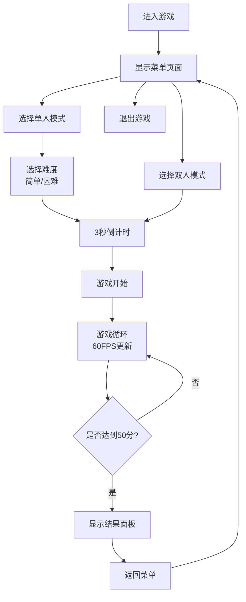

## 1. 产品概述

星域对决是一款基于浏览器的太空战机射击游戏，无需后端支持即可运行。玩家可以选择单人模式与AI对战，或本地双人模式与好友同屏对战。游戏采用Canvas 2D技术实现流畅的60FPS渲染，包含完整的碰撞检测系统、AI行为树决策、粒子特效系统，为玩家提供紧张刺激的太空对战体验。

- **核心价值**：在纯前端环境下实现完整的多人对战射击游戏体验
- **目标用户**：休闲游戏爱好者、喜欢本地对战的玩家
- **市场定位**：轻量级浏览器游戏，无需安装，打开即玩

## 2. 核心功能

### 2.1 用户角色

| 角色 | 注册方式 | 核心权限 |
|------|----------|----------|
| 玩家 | 无需注册，直接进入 | 选择游戏模式、控制战机、调整难度 |

### 2.2 功能模块

1. **菜单页面**：游戏标题、模式选择、难度选择
2. **单人对战模式**：玩家VS AI，AI采用行为树决策
3. **双人对战模式**：玩家1 VS 玩家2，同屏对战
4. **游戏核心系统**：碰撞检测、子弹管理、得分系统、游戏状态管理
5. **渲染系统**：星空背景、战机绘制、粒子特效、UI叠加层

### 2.3 页面详情

| 页面名称 | 模块名称 | 功能描述 |
|----------|----------|----------|
| 菜单页面 | 标题区域 | 显示"星域对决"标题，带呼吸光效动画 |
| 菜单页面 | 按钮区域 | 单人模式、双人模式、退出三个按钮，带悬停效果 |
| 菜单页面 | 难度选择模态框 | 简单/困难难度选择，缩放弹出动画 |
| 游戏页面 | 游戏画布 | 900x600px Canvas绘制区域 |
| 游戏页面 | 倒计时模块 | 3秒倒计时，缩放出场淡出效果 |
| 游戏页面 | FPS计数器 | 右上角显示实时帧率 |
| 游戏页面 | 得分显示 | 显示双方当前得分 |
| 结果页面 | 结果面板 | 显示获胜者、最终比分、返回菜单按钮 |

## 3. 核心流程

游戏主循环流程：
1. 计算delta time，限制最大50ms防止掉帧跳变
2. 更新玩家战机位置和射击状态
3. 更新AI战机行为树决策（巡逻/攻击/躲避）
4. 更新子弹位置和生命周期
5. 更新粒子特效生命周期
6. 执行碰撞检测（战机-子弹、战机-战机）
7. 处理碰撞回调，更新得分
8. 渲染所有游戏对象和UI元素
9. 统计并显示FPS

## 4. 用户界面设计

### 4.1 设计风格

- **主色调**：#00e5ff（青色）作为主题色，#ffeb3b（黄色）作为子弹色，#ff5722（橙色）作为爆炸粒子色
- **背景色**：深蓝到黑色垂直渐变 #0a0a2e → #000011，营造太空氛围
- **按钮风格**：圆角矩形（12px圆角），背景#1a1a3e，悬停#2a2a5e，0.2s过渡动画
- **字体**：无衬线字体，标题48px加粗，按钮文字白色，UI文字14px白色半透明
- **布局风格**：居中布局，游戏画布四周无边距，模态框居中显示
- **动画风格**：呼吸光效（2s周期）、缩放弹出（0.3s ease-out）、淡出（0.5s）

### 4.2 页面设计概述

| 页面名称 | 模块名称 | UI元素 |
|----------|----------|--------|
| 菜单页面 | 标题 | 48px加粗，#00e5ff，2px白色文字阴影，2s周期呼吸光效 |
| 菜单页面 | 按钮 | 12px圆角，#1a1a3e背景，悬停#2a2a5e，0.2s过渡，白色文字 |
| 菜单页面 | 难度模态框 | 320x180px，16px圆角，深灰半透明遮罩，0.3s缩放弹出 |
| 游戏页面 | 背景 | 900x600px渐变背景，120颗随机星星向下流动 |
| 游戏页面 | 战机 | 三角形，#00e5ff主体，2px白色描边，40px长，动态引擎尾焰 |
| 游戏页面 | 子弹 | 6px发光圆点，#ffeb3b填充，2px #ff9800外发光 |
| 游戏页面 | 爆炸粒子 | 8个#ff5722粒子，0.4秒生命周期，随机方向扩散 |
| 游戏页面 | 倒计时 | 120px白色数字，缩放出场，0.5s淡出 |
| 游戏页面 | FPS显示 | 右上角，14px白色半透明 |
| 结果页面 | 结果面板 | #1a1a2e背景，20px圆角，32px内边距，0.5s淡入 |

### 4.3 响应性

- **桌面优先设计**：游戏画布固定900x600px，居中显示
- **浏览器适配**：页面背景自动扩展填充浏览器窗口
- **输入设备**：仅支持键盘输入（WASD/方向键），针对桌面端优化

## 5. 操作说明

### 5.1 控制方式

| 玩家 | 移动 | 射击 |
|------|------|------|
| 玩家1 | W上 A左 S下 D右 | 空格键 |
| 玩家2 | ↑上 ←左 ↓下 →右 | 数字键1 |

### 5.2 游戏规则

- 每击中对方战机得10分
- 先达到50分者获胜
- AI难度：
  - 简单：反应延迟300ms，命中率40%
  - 困难：反应延迟100ms，命中率70%

### 5.3 AI行为

- **巡逻**：沿随机路径飞行
- **攻击**：玩家进入200px范围内时朝玩家开火
- **躲避**：检测到子弹接近时进行侧向闪避
