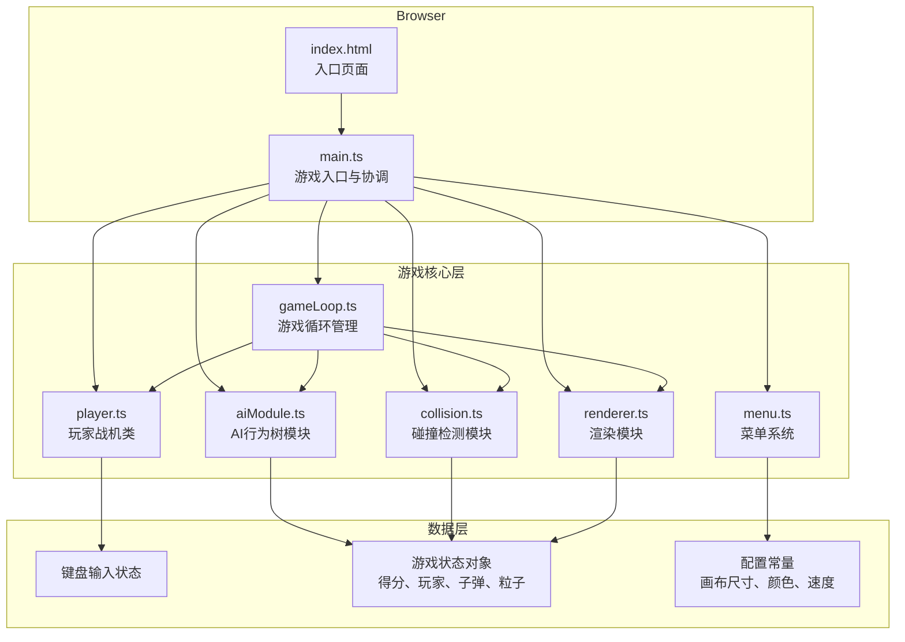

## 1. 架构设计



## 2. 技术描述

- **前端框架**：原生 TypeScript + Canvas 2D API（无UI框架）
- **构建工具**：Vite 5.x
- **编程语言**：TypeScript 5.x（严格模式）
- **目标环境**：现代浏览器（ES2020+）
- **后端服务**：无，纯前端运行

### 项目初始化方式
使用 Vite 原生模板初始化：
```bash
npm create vite@latest . -- --template vanilla-ts
```

## 3. 项目结构

```
auto90/
├── index.html              # 入口HTML页面
├── package.json            # 项目依赖配置
├── vite.config.js          # Vite构建配置
├── tsconfig.json           # TypeScript配置
└── src/
    ├── main.ts             # 游戏主入口，模块协调
    ├── gameLoop.ts         # 游戏循环、delta time、FPS统计
    ├── player.ts           # 玩家战机类（位置、速度、射击、输入）
    ├── aiModule.ts         # AI行为树（巡逻、攻击、躲避）
    ├── collision.ts        # 碰撞检测（AABB+圆）
    ├── renderer.ts         # Canvas渲染（背景、战机、子弹、粒子、UI）
    └── menu.ts             # 菜单系统（模式选择、难度选择、结果面板）
```

## 4. 核心数据结构

### 4.1 类型定义

```typescript
// 游戏模式
type GameMode = 'menu' | 'single' | 'dual' | 'gameover';

// AI难度
type Difficulty = 'easy' | 'hard';

// AI行为状态
type AIState = 'patrol' | 'attack' | 'dodge';

// 位置接口
interface Position {
  x: number;
  y: number;
}

// 速度接口
interface Velocity {
  vx: number;
  vy: number;
}

// 战机类
class Player {
  x: number;
  y: number;
  vx: number;
  vy: number;
  angle: number;
  width: number;
  height: number;
  color: string;
  health: number;
  score: number;
  shootCooldown: number;
  lastShootTime: number;
  isAI: boolean;
  aiState?: AIState;
  patrolTarget?: Position;
  engineParticles: Particle[];
}

// 子弹类
class Bullet {
  x: number;
  y: number;
  vx: number;
  vy: number;
  radius: number;
  color: string;
  ownerId: number;
  life: number;
}

// 粒子类
class Particle {
  x: number;
  y: number;
  vx: number;
  vy: number;
  radius: number;
  color: string;
  life: number;
  maxLife: number;
}

// 星星类
class Star {
  x: number;
  y: number;
  size: number;
  brightness: number;
  speed: number;
}

// 游戏状态
interface GameState {
  mode: GameMode;
  difficulty: Difficulty;
  players: Player[];
  bullets: Bullet[];
  particles: Particle[];
  stars: Star[];
  countdown: number;
  winner: number | null;
  finalScore: number[];
}
```

### 4.2 配置常量

```typescript
// 画布配置
const CANVAS_WIDTH = 900;
const CANVAS_HEIGHT = 600;

// 战机配置
const PLAYER_SIZE = 40;
const PLAYER_SPEED = 5;
const PLAYER_SHOOT_COOLDOWN = 250;
const BULLET_SPEED = 10;
const BULLET_RADIUS = 3;

// AI配置
const AI_REACTION_DELAY = { easy: 300, hard: 100 };
const AI_HIT_RATE = { easy: 0.4, hard: 0.7 };
const AI_ATTACK_RANGE = 200;
const AI_DODGE_RANGE = 80;

// 粒子配置
const EXPLOSION_PARTICLES = 8;
const PARTICLE_LIFETIME = 400;
const ENGINE_PARTICLE_COUNT = 3;

// 游戏规则
const WIN_SCORE = 50;
const HIT_SCORE = 10;
const MAX_DELTA_TIME = 50;

// 颜色配置
const COLORS = {
  primary: '#00e5ff',
  secondary: '#ffeb3b',
  accent: '#ff5722',
  bulletGlow: '#ff9800',
  backgroundTop: '#0a0a2e',
  backgroundBottom: '#000011',
  buttonBg: '#1a1a3e',
  buttonHover: '#2a2a5e',
  white: '#ffffff'
};
```

## 5. 核心模块设计

### 5.1 gameLoop.ts - 游戏循环模块

```typescript
class GameLoop {
  private lastTime: number = 0;
  private frameCount: number = 0;
  private fpsTime: number = 0;
  private currentFps: number = 60;
  private animationId: number | null = null;
  private isRunning: boolean = false;
  
  // 更新回调顺序：玩家 → AI → 子弹 → 粒子 → 碰撞 → 渲染
  private updateCallbacks: Array<(deltaTime: number) => void> = [];
  private renderCallbacks: Array<(ctx: CanvasRenderingContext2D) => void> = [];
  
  start(): void
  stop(): void
  addUpdateCallback(callback: (deltaTime: number) => void): void
  addRenderCallback(callback: (ctx: CanvasRenderingContext2D) => void): void
  getFps(): number
  
  private loop(currentTime: number): void
  private calculateDeltaTime(currentTime: number): number
  private updateFps(deltaTime: number): void
}
```

**关键特性**：
- 使用 `requestAnimationFrame` 驱动
- Delta time 限制最大 50ms 防止掉帧跳变
- FPS 统计每秒更新一次
- 回调队列确保更新顺序正确

### 5.2 player.ts - 玩家战机模块

```typescript
class Player {
  constructor(id: number, x: number, y: number, isAI: boolean = false)
  
  update(deltaTime: number, inputState: InputState): void
  shoot(): Bullet | null
  takeDamage(): void
  addScore(points: number): void
  draw(ctx: CanvasRenderingContext2D): void
  
  // 引擎尾焰粒子
  private updateEngineParticles(): void
  private drawTriangle(ctx: CanvasRenderingContext2D): void
  private drawEngineFlame(ctx: CanvasRenderingContext2D): void
}
```

**输入处理**：
- 玩家1：WASD移动，空格射击
- 玩家2：方向键移动，数字键1射击
- 键盘状态使用 `keydown`/`keyup` 事件维护

### 5.3 aiModule.ts - AI行为树模块

```typescript
class AIModule {
  private difficulty: Difficulty;
  private lastDecisionTime: number = 0;
  private currentDecision: AIState = 'patrol';
  
  constructor(difficulty: Difficulty)
  
  // 每帧更新AI决策
  update(
    aiPlayer: Player,
    target: Player,
    bullets: Bullet[],
    currentTime: number
  ): { vx: number; vy: number; shouldShoot: boolean }
  
  // 行为树决策
  private makeDecision(
    aiPlayer: Player,
    target: Player,
    bullets: Bullet[],
    currentTime: number
  ): AIState
  
  // 巡逻行为：沿随机路径飞行
  private patrol(aiPlayer: Player): { vx: number; vy: number }
  
  // 攻击行为：朝玩家方向移动并射击
  private attack(aiPlayer: Player, target: Player): { vx: number; vy: number; shouldShoot: boolean }
  
  // 躲避行为：侧向闪避来袭子弹
  private dodge(aiPlayer: Player, bullets: Bullet[]): { vx: number; vy: number }
  
  // 计算命中率
  private calculateHitChance(): boolean
  
  // 计算距离
  private getDistance(p1: Position, p2: Position): number
  
  // 检测威胁子弹
  private detectThreateningBullets(
    aiPlayer: Player,
    bullets: Bullet[]
  ): Bullet[]
}
```

**行为树逻辑**：
1. 优先级：躲避 > 攻击 > 巡逻
2. 检测范围内是否有威胁子弹 → 躲避
3. 检测玩家是否在攻击范围内 → 攻击
4. 否则 → 巡逻

### 5.4 collision.ts - 碰撞检测模块

```typescript
class CollisionDetector {
  // AABB矩形与圆形碰撞检测
  static checkRectCircleCollision(
    rect: { x: number; y: number; width: number; height: number },
    circle: { x: number; y: number; radius: number }
  ): boolean
  
  // AABB矩形间碰撞检测
  static checkRectRectCollision(
    rect1: { x: number; y: number; width: number; height: number },
    rect2: { x: number; y: number; width: number; height: number }
  ): boolean
  
  // 检测所有子弹与玩家的碰撞
  static detectBulletPlayerCollisions(
    bullets: Bullet[],
    players: Player[],
    onHit: (bullet: Bullet, player: Player) => void
  ): void
  
  // 检测玩家之间的碰撞
  static detectPlayerPlayerCollisions(
    players: Player[],
    onCollide: (p1: Player, p2: Player) => void
  ): void
  
  // 点到矩形最近点计算（AABB+圆算法核心）
  private static closestPointOnRect(
    px: number,
    py: number,
    rect: { x: number; y: number; width: number; height: number }
  ): Position
}
```

**AABB+圆算法原理**：
1. 找到圆心在AABB上的最近点
2. 计算圆心到最近点的距离平方
3. 比较距离平方与半径平方

### 5.5 renderer.ts - 渲染模块

```typescript
class Renderer {
  private canvas: HTMLCanvasElement;
  private ctx: CanvasRenderingContext2D;
  private offscreenCanvas: HTMLCanvasElement;
  private offscreenCtx: CanvasRenderingContext2D;
  private stars: Star[];
  
  constructor(canvas: HTMLCanvasElement)
  
  // 渲染主入口
  render(state: GameState): void
  
  // 背景渲染
  private drawBackground(): void
  private drawStars(): void
  
  // 游戏对象渲染
  private drawPlayer(player: Player): void
  private drawBullet(bullet: Bullet): void
  private drawParticle(particle: Particle): void
  
  // UI渲染
  private drawFps(fps: number): void
  private drawScores(players: Player[]): void
  private drawCountdown(count: number): void
  private drawGameOver(winner: string, scores: number[]): void
  
  // 双缓冲实现
  private swapBuffers(): void
}
```

**渲染优化**：
- 使用离屏Canvas实现双缓冲
- 星空预渲染到背景层
- 发光效果使用 `shadowBlur` 属性
- 粒子透明度随生命周期渐变

### 5.6 menu.ts - 菜单系统模块

```typescript
class MenuSystem {
  private container: HTMLElement;
  private canvas: HTMLCanvasElement;
  private onStartSingle: (difficulty: Difficulty) => void;
  private onStartDual: () => void;
  private onReturnToMenu: () => void;
  
  constructor(container: HTMLElement, canvas: HTMLCanvasElement)
  
  // 显示主菜单
  showMainMenu(): void
  
  // 隐藏主菜单
  hideMainMenu(): void
  
  // 显示难度选择
  showDifficultySelect(): void
  
  // 隐藏难度选择
  hideDifficultySelect(): void
  
  // 显示游戏结束面板
  showGameOver(winner: string, score1: number, score2: number): void
  
  // 隐藏游戏结束面板
  hideGameOver(): void
  
  // 设置回调
  setCallbacks(callbacks: MenuCallbacks): void
  
  // 创建按钮
  private createButton(text: string, onClick: () => void): HTMLElement
}
```

## 6. 性能优化策略

### 6.1 渲染优化
- **双缓冲技术**：使用离屏Canvas避免闪烁
- **对象池**：子弹和粒子对象复用，减少GC
- **分层渲染**：背景静态层预渲染，动态层每帧更新
- **裁剪绘制**：只绘制画布范围内的对象

### 6.2 计算优化
- **空间分区**：碰撞检测使用简单网格分区
- **距离平方比较**：避免开方运算
- **delta time 限制**：最大50ms防止掉帧时物理跳变
- **AI决策节流**：根据难度设置决策间隔

### 6.3 内存优化
- **对象池模式**：子弹和粒子复用
- **数组原地修改**：避免频繁创建新数组
- **及时清理**：生命周期结束的对象立即移除

## 7. 构建配置

### 7.1 package.json
```json
{
  "name": "star-duel",
  "private": true,
  "version": "1.0.0",
  "type": "module",
  "scripts": {
    "dev": "vite",
    "build": "tsc && vite build",
    "preview": "vite preview"
  },
  "devDependencies": {
    "typescript": "^5.4.0",
    "vite": "^5.2.0"
  }
}
```

### 7.2 vite.config.js
```javascript
import { defineConfig } from 'vite';

export default defineConfig({
  root: '.',
  base: './',
  server: {
    port: 5173,
    open: true
  },
  build: {
    target: 'es2020',
    outDir: 'dist',
    sourcemap: true
  }
});
```

### 7.3 tsconfig.json
```json
{
  "compilerOptions": {
    "target": "ES2020",
    "module": "ESNext",
    "lib": ["ES2020", "DOM"],
    "strict": true,
    "noImplicitAny": true,
    "strictNullChecks": true,
    "strictFunctionTypes": true,
    "strictBindCallApply": true,
    "strictPropertyInitialization": true,
    "noImplicitThis": true,
    "exactOptionalPropertyTypes": true,
    "noImplicitReturns": true,
    "noFallthroughCasesInSwitch": true,
    "moduleResolution": "bundler",
    "esModuleInterop": true,
    "skipLibCheck": true,
    "forceConsistentCasingInFileNames": true,
    "isolatedModules": true,
    "noEmit": true
  },
  "include": ["src/**/*"],
  "exclude": ["node_modules", "dist"]
}
```

## 8. 运行方式

```bash
# 安装依赖
npm install

# 启动开发服务器
npm run dev

# 构建生产版本
npm run build

# 预览生产构建
npm run preview
```
