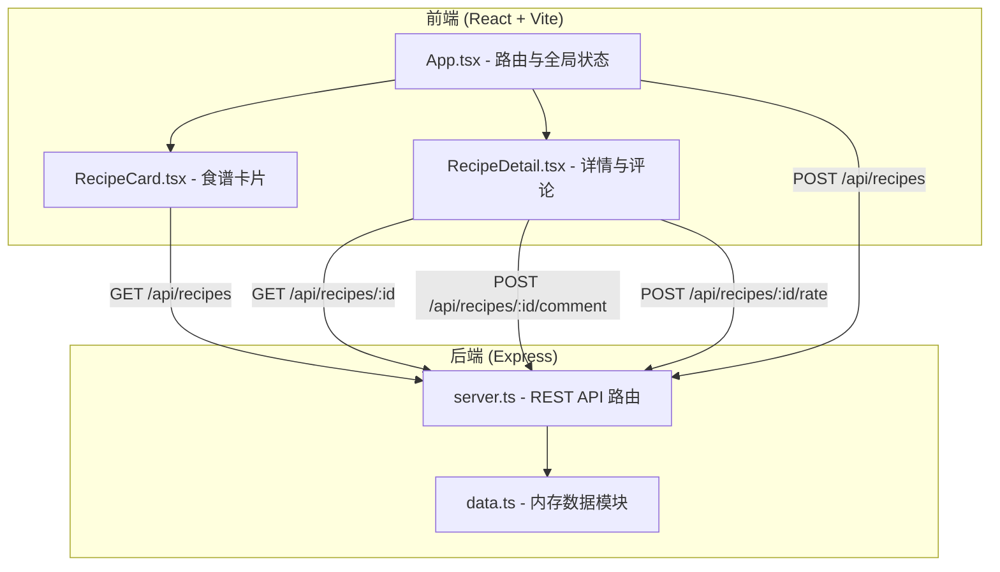
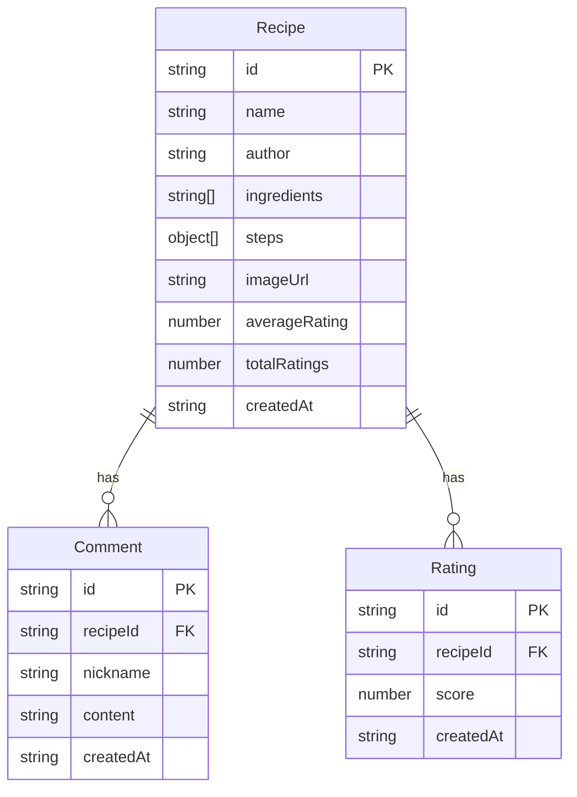

## 1. 架构设计



## 2. 技术说明

- 前端：React 18 + TypeScript + Vite
- 后端：Express 4 + TypeScript（ESM格式）
- 数据库：无，使用后端内存数组模拟持久化
- 状态管理：React useState + useEffect（轻量级，无需外部状态库）
- 通信方式：REST API（前端通过Vite代理转发到后端3001端口）

## 3. 路由定义

| 路由 | 用途 |
|------|------|
| / | 首页，展示食谱卡片网格 |
| /recipe/:id | 食谱详情页，展示完整信息、评论和评分 |

## 4. API 定义

### 4.1 TypeScript 类型定义

```typescript
interface Recipe {
  id: string;
  name: string;
  author: string;
  ingredients: string[];
  steps: { text: string; imageUrl?: string }[];
  imageUrl?: string;
  averageRating: number;
  totalRatings: number;
  createdAt: string;
}

interface Comment {
  id: string;
  recipeId: string;
  nickname: string;
  content: string;
  createdAt: string;
}

interface Rating {
  id: string;
  recipeId: string;
  score: number;
  createdAt: string;
}
```

### 4.2 API 端点

| 方法 | 路径 | 请求体 | 响应 |
|------|------|--------|------|
| GET | /api/recipes | - | Recipe[] |
| GET | /api/recipes/:id | - | Recipe + Comment[] + 平均评分 |
| POST | /api/recipes | { name, author, ingredients, steps, imageUrl? } | Recipe |
| POST | /api/recipes/:id/comment | { nickname, content } | Comment |
| POST | /api/recipes/:id/rate | { score } | { averageRating, totalRatings } |

## 5. 服务器架构图


## 6. 数据模型

### 6.1 数据模型定义



### 6.2 数据存储

使用内存数组存储，模块提供CRUD方法：
- `getAllRecipes()` - 获取所有食谱
- `getRecipeById(id)` - 根据ID获取食谱详情
- `addRecipe(recipe)` - 添加新食谱
- `getCommentsByRecipeId(recipeId)` - 获取食谱评论
- `addComment(recipeId, comment)` - 添加评论
- `addRating(recipeId, score)` - 添加评分并更新平均分
