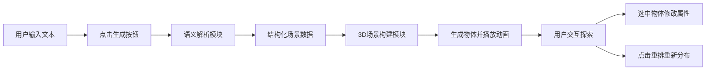

## 1. 产品概述

TextTo3D 是一个将自然语言文本描述自动转化为交互式三维场景的Web应用，帮助作家、设计师和游戏策划快速将场景构思具象化，解决从文字想象到可视化预览之间的认知鸿沟。

- 核心价值：3秒内将文字描述转化为可交互的3D场景，降低创意可视化门槛
- 目标用户：作家、游戏设计师、场景策划、创意工作者

## 2. 核心特征

### 2.1 功能模块
1. **文本输入模块**：左侧400px宽输入面板，支持自然语言场景描述输入
2. **语义解析模块**：基于词汇-模型映射规则解析文本为结构化场景数据
3. **3D场景构建模块**：Three.js渲染引擎，动态生成物体、处理动画与交互
4. **物体详情面板**：选中物体后显示属性，支持实时修改颜色和坐标
5. **重排功能**：一键随机重新分布所有物体位置

### 2.3 页面详情

| 页面名称 | 模块名称 | 功能描述 |
|-----------|-------------|---------------------|
| 主页面 | 顶部标题栏 | 显示应用名称，青色水印光泽字体效果 |
| 主页面 | 左侧输入面板 | 文本输入区、生成按钮、重排按钮、详情面板 |
| 主页面 | 右侧3D场景区 | Three.js渲染画布，8x8网格地面，支持鼠标交互 |
| 主页面 | 移动端侧边栏 | <1024px时折叠为可展开侧边栏，宽度320px |

## 3. 核心流程

用户在左侧输入区输入场景描述 → 点击生成按钮 → 语义解析模块将文本映射为结构化物体数据 → 场景构建模块生成3D物体并播放掉落动画 → 用户可拖拽旋转/滚轮缩放查看场景 → 点击物体查看/修改属性 → 点击重排按钮随机分布物体

## 4. 用户界面设计

### 4.1 设计风格

- **配色方案**：深色太空主题
  - 背景渐变：`#0a0a1a` → `#000011`
  - 面板背景：`#1a1a2e`
  - 网格线：`#555555`
  - 主色调渐变：`#00d4aa` → `#00aaff`（青色渐变）
  - 选中光晕：淡蓝色

- **按钮样式**：圆角8px，渐变青色，hover时亮度提升10%，上浮2px（0.2s动画）
- **输入框**：半透明 `rgba(255,255,255,0.1)` 背景
- **面板**：圆角12px，400px宽度（移动端320px）
- **字体效果**：顶部标题使用高亮青色水印光泽字体效果

### 4.2 页面设计概览

| 页面名称 | 模块名称 | UI 元素 |
|-----------|-------------|-------------|
| 主页面 | 顶部标题栏 | 青色光泽字体、居中、动态光效 |
| 主页面 | 输入面板 | 半透明输入框、渐变生成按钮、重排按钮 |
| 主页面 | 详情面板 | 物体名称、颜色选择器、XYZ坐标输入框 |
| 主页面 | 3D场景 | 8x8半透明网格地面、动态生成的几何体、光晕选中效果 |
| 主页面 | 动画效果 | 物体掉落弹跳（0.8s ease-out）、重排移动（0.5s平滑过渡）、颜色修改（0.3s过渡）、坐标飞行（1s缓动）、元素淡入（0.5s） |

### 4.3 响应式设计

- **桌面端**（≥1024px）：左侧固定400px面板，右侧自适应3D场景
- **移动端**（<1024px）：左侧面板折叠为侧边栏，触发按钮固定在屏幕左边缘，展开后宽度320px
- **触摸优化**：支持触摸拖拽旋转、双指缩放

### 4.4 3D场景指引

- **环境**：深色太空背景，无HDRI，使用渐变背景色
- **光照**：环境光 + 方向光 + 点光源组合，确保物体可见且有层次感
- **相机**：初始俯视45度，OrbitControls控制（仅Y轴旋转、缩放范围3-20单位）
- **构图**：8x8网格地面为参照，物体分布在网格范围内
- **交互**：鼠标拖拽旋转、滚轮缩放、点击选中物体
- **动画**：物体生成掉落弹跳、重排平滑移动、属性修改过渡
- **后处理**：物体选中时使用发光效果（glow）
- **资源**：仅使用Three.js内置基本几何体（立方体、球体、圆柱体、锥体），禁用纹理，物体上限30个，目标帧率50FPS+

## 5. 性能约束

- 场景物体数量上限：30个
- 模型：仅使用基本几何体组合，禁用纹理
- 帧率：60Hz刷新率下稳定50FPS以上
- 生成耗时：从请求发送到首次渲染完成≤3秒
