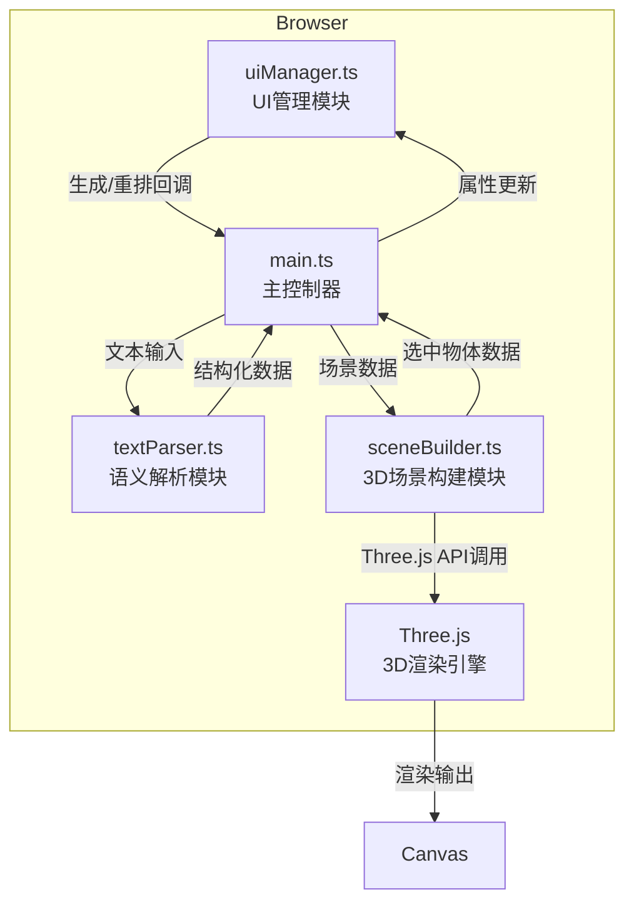

## 1. 架构设计



## 2. 技术描述

- **前端框架**：原生 TypeScript + Three.js（无React/Vue框架，符合用户明确指定的架构）
- **构建工具**：Vite 5.x
- **3D引擎**：Three.js 0.160.x + @types/three
- **编程语言**：TypeScript 5.x（严格模式，ES2020目标）
- **样式方案**：原生CSS（CSS变量、CSS动画）
- **状态管理**：模块内部状态，通过回调函数通信

### 项目初始化方案

根据用户明确指定的文件结构，不使用Vite脚手架模板，手动创建项目文件：
- `npm init -y` 初始化 package.json
- 手动创建所有源代码文件
- 安装依赖：three、typescript、vite、@types/three

## 3. 核心数据结构

### 3.1 场景物体数据结构

```typescript
interface SceneObject {
  id: string;
  type: 'tree' | 'bigTree' | 'firefly' | 'rock' | 'house' | 'mountain' | 
        'river' | 'cloud' | 'pillar' | 'sphere' | 'cube' | 'cylinder' | 'cone';
  name: string;
  position: { x: number; y: number; z: number };
  rotation: { x: number; y: number; z: number };
  scale: { x: number; y: number; z: number };
  color: string;
  emissive?: string;
  emissiveIntensity?: number;
}

interface SceneData {
  objects: SceneObject[];
  environment?: {
    fogColor?: string;
    fogDensity?: number;
    ambientIntensity?: number;
  };
}
```

### 3.2 词汇映射规则

```typescript
interface WordMapping {
  keywords: string[];
  objectType: SceneObject['type'];
  count: number | [number, number];
  defaultColor: string;
  defaultScale: { x: number; y: number; z: number };
  emissive?: string;
  emissiveIntensity?: number;
}
```

## 4. 模块接口定义

### 4.1 textParser.ts

```typescript
export function parseText(text: string): SceneData;
```

- **输入**：自然语言文本字符串
- **输出**：结构化场景数据 `SceneData`
- **实现**：关键词匹配 → 映射规则查询 → 随机位置生成 → 数据组装

### 4.2 sceneBuilder.ts

```typescript
export function buildScene(sceneData: SceneData): Promise<void>;
export function reshuffle(): Promise<void>;
export function getSelectedObject(): SceneObject | null;
export function updateObjectColor(id: string, color: string): void;
export function updateObjectPosition(id: string, position: {x: number; y: number; z: number}): void;
export function setOnObjectSelect(callback: (obj: SceneObject | null) => void): void;
export function init(container: HTMLElement): void;
export function dispose(): void;
```

### 4.3 uiManager.ts

```typescript
export interface UIManagerCallbacks {
  onGenerate: (text: string) => void;
  onReshuffle: () => void;
  onColorChange: (id: string, color: string) => void;
  onPositionChange: (id: string, position: {x: number; y: number; z: number}) => void;
}

export function initUI(callbacks: UIManagerCallbacks): void;
export function updateSelectedObject(obj: SceneObject | null): void;
export function showLoading(): void;
export function hideLoading(): void;
export function toggleSidebar(): void;
```

## 5. 文件组织结构

```
auto94/
├── package.json              # 依赖配置与启动脚本
├── vite.config.js            # Vite构建配置
├── tsconfig.json             # TypeScript配置（严格模式）
├── index.html                # 入口HTML页面
├── .trae/
│   └── documents/
│       ├── PRD.md            # 产品需求文档
│       └── TECHNICAL_ARCHITECTURE.md  # 技术架构文档
└── src/
    ├── main.ts               # 主入口，模块协调器
    ├── textParser.ts         # 语义解析模块
    ├── sceneBuilder.ts       # 3D场景构建与管理
    └── uiManager.ts          # UI管理与事件绑定
```

## 6. 关键技术实现点

### 6.1 性能优化
- **几何体复用**：相同类型物体共享几何体（BufferGeometry）
- **材质复用**：相同颜色物体共享材质（MeshStandardMaterial）
- **帧率监控**：使用Three.js Clock监控帧率，必要时降级渲染
- **对象池**：物体重排时复用已有Mesh，避免频繁创建销毁

### 6.2 动画系统
- **掉落动画**：自定义Tween系统，ease-out缓动，0.8秒完成
- **平滑移动**：使用Vector3.lerp进行位置插值，0.5秒过渡
- **颜色过渡**：Material.color.lerpColors，0.3秒过渡
- **光晕效果**：使用两个Mesh叠加（外层半透明放大实现glow）

### 6.3 交互系统
- **射线检测**：Raycaster进行物体拾取
- **相机控制**：OrbitControls，限制旋转轴和缩放范围
- **响应式布局**：ResizeObserver监听容器尺寸变化

## 7. 构建与部署

- **开发命令**：`npm run dev`（Vite开发服务器）
- **构建命令**：`npm run build`（生产构建）
- **代码检查**：`npx tsc --noEmit`（TypeScript类型检查）
