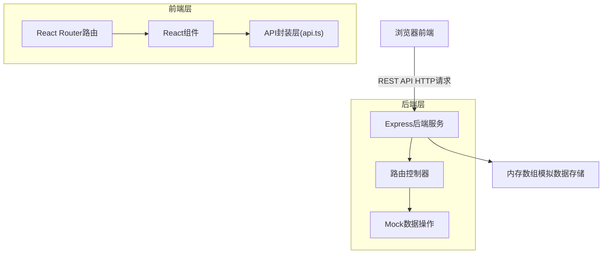
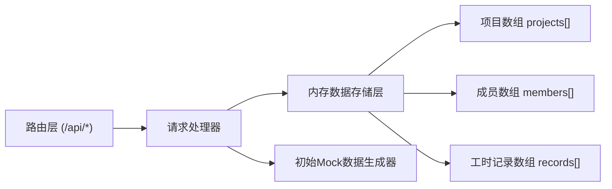
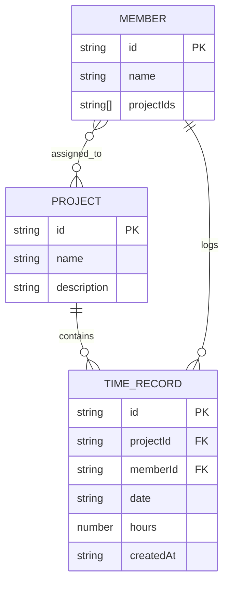

## 1. 架构设计



## 2. 技术描述
- 前端：React@18 + TypeScript + Vite + React Router DOM
- 后端：Express@4 + TypeScript + CORS + UUID
- 状态管理：React Hooks + Zustand
- 数据存储：后端内存数组模拟持久化（服务重启后重置）
- 样式方案：Tailwind CSS + 内联样式

## 3. 路由定义

| 路由路径 | 页面组件 | 功能说明 |
|---------|---------|---------|
| / | Dashboard | 首页仪表板 |
| /time-entry | TimeEntry | 工时录入页 |
| /members/:id | MemberDetail | 成员个人详情页 |

## 4. API 定义

```typescript
// 数据模型类型定义
interface Project {
  id: string;
  name: string;
  description?: string;
}

interface Member {
  id: string;
  name: string;
  projectIds: string[];
}

interface TimeRecord {
  id: string;
  projectId: string;
  memberId: string;
  date: string;       // YYYY-MM-DD
  hours: number;      // 0-24，0.5步进
  createdAt: string;
}

interface MemberDetail {
  member: Member;
  dailyRecords: { date: string; hours: number }[];
  anomalies: { date: string; hours: number; reason: string }[];
}

// API接口定义
// GET /api/projects → Project[]
// GET /api/members?projectId=x → Member[]
// GET /api/records?memberId=x&startDate=YYYY-MM-DD&endDate=YYYY-MM-DD → TimeRecord[]
// POST /api/records (body: {projectId, memberId, date, hours}) → TimeRecord
// GET /api/members/:id/detail → MemberDetail
// GET /api/dashboard/stats → { totalProjects, totalMembers, last7DaysHours, changePercent }
// GET /api/dashboard/ranking → { memberId, name, weeklyHours }[]
// GET /api/dashboard/trend → { date: string; totalHours: number }[]
```

## 5. 服务器架构图



## 6. 数据模型

### 6.1 数据模型定义



### 6.2 初始Mock数据

```typescript
// 初始项目（3个）
projects = [
  { id: 'p1', name: '智能电商平台', description: '核心业务系统重构' },
  { id: 'p2', name: '数据分析中台', description: 'BI报表与数据可视化' },
  { id: 'p3', name: '移动客户端', description: 'iOS/Android双端开发' },
]

// 初始成员（6名）
members = [
  { id: 'm1', name: '张伟', projectIds: ['p1', 'p2'] },
  { id: 'm2', name: '李娜', projectIds: ['p1', 'p3'] },
  { id: 'm3', name: '王强', projectIds: ['p2', 'p3'] },
  { id: 'm4', name: '刘洋', projectIds: ['p1'] },
  { id: 'm5', name: '陈静', projectIds: ['p2', 'p3'] },
  { id: 'm6', name: '赵磊', projectIds: ['p1', 'p2', 'p3'] },
]

// 工时记录自动生成近30天随机数据，每日每人2-3条记录，工时范围0.5-14小时
```
