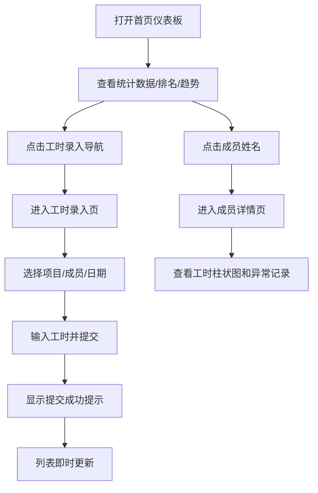

## 1. 产品概述

项目工时与绩效仪表板是一款面向项目经理的团队工时管理工具，支持工时录入、数据汇总统计、异常监控等功能。
- 核心目的：帮助项目经理直观掌握团队成员在各项目上的人力投入情况，及时发现工时异常
- 目标用户：项目经理、团队负责人
- 产品价值：通过可视化数据驱动人力效率优化，降低管理成本

## 2. 核心功能

### 2.1 功能模块
1. **首页仪表板**：统计卡片、个人工时排名榜、项目工时趋势图
2. **工时录入页**：可折叠项目成员列表、快速录入表单
3. **成员详情页**：近30天工时柱状图、异常记录列表

### 2.2 页面详情

| 页面名称 | 模块名称 | 功能描述 |
|---------|---------|---------|
| 首页仪表板 | 统计卡片 | 三个卡片分别展示总项目数、总成员数、最近7天总工时，含环比变动百分比箭头 |
| 首页仪表板 | 个人工时排名榜 | 展示前5名成员本周累计工时，头像+进度条形式 |
| 首页仪表板 | 项目工时趋势图 | 近30天总工时折线图，悬停显示详情 |
| 工时录入页 | 项目成员列表 | 按项目分组可折叠，显示成员当天已填工时 |
| 工时录入页 | 快速录入表单 | 下拉选择项目/成员、日期选择器、工时输入框、提交按钮带加载动画 |
| 成员详情页 | 工时柱状图 | 近30天每日工时柱状图，按工时分段着色 |
| 成员详情页 | 异常记录列表 | 列出超过12小时或周末加班的异常记录，红色高亮 |

## 3. 核心流程

项目经理登录后，首页仪表板展示整体数据概览。点击"工时录入"进入录入页，选择项目、成员、日期并输入工时后提交，数据即时更新。点击成员姓名跳转至个人详情页，查看该成员详细工时分布和异常记录。

## 4. 用户界面设计

### 4.1 设计风格
- 主色调：浅蓝到浅紫渐变（#e0f2fe 至 #ede9fe）、蓝色#3b82f6、绿色#22c55e
- 辅助色：红色#ef4444（异常/下降）、橙色#fcd34d（警告）
- 中性色：#1f2937（深色文字）、#6b7280（灰色辅助文字）
- 按钮样式：圆角设计，含悬停和点击过渡效果
- 字体：现代无衬线字体，14px辅助文字/32px大数字
- 布局：卡片式布局，顶部导航栏
- 图标风格：简洁线性图标

### 4.2 页面设计概览

| 页面名称 | 模块名称 | UI元素 |
|---------|---------|---------|
| 首页仪表板 | 统计卡片 | 220x120px、圆角16px、渐变背景、箭头+百分比过渡动画0.3s |
| 首页仪表板 | 排名榜 | 圆形头像36px、进度条渐变#86efac→#22c55e、满量程60小时 |
| 首页仪表板 | 趋势图 | 400x250px、蓝色折线、圆点标记、悬停提示 |
| 工时录入页 | 列表 | 可折叠分组、展开动画、已填工时标注 |
| 工时录入页 | 表单 | 联动下拉框、日期选择器、数字输入0.5步进、加载旋转动画0.8s、成功对勾1.5s |
| 成员详情页 | 柱状图 | 柱宽20px、圆角4px、按工时分段着色 |
| 成员详情页 | 异常列表 | 4px红色左边框、浅红背景#fef2f2 |

### 4.3 响应式
- 桌面优先设计，最小支持宽度1024px
- 中等屏幕（平板）自适应调整布局
- 顶部导航栏固定，内容区域滚动
