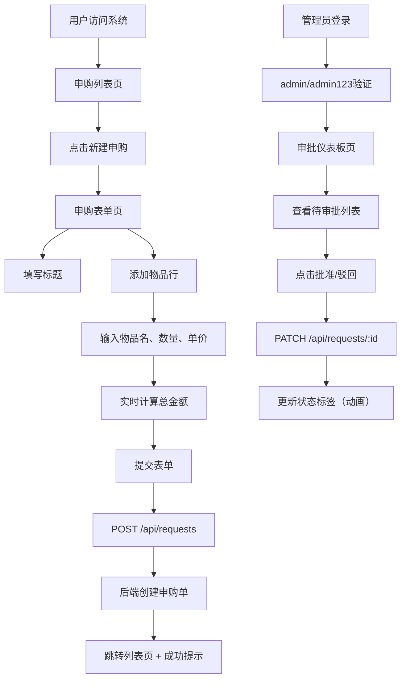

## 1. 产品概述

本系统为在线团队办公用品申购与审批跟踪系统，解决传统纸质清单或Excel传递方式容易漏单、采购进度不透明的问题。目标用户为公司或学校团队成员及管理员，提供申购单提交、审批、进度跟踪的全流程数字化管理。

产品价值：实现申购流程透明化，减少漏单率，提升采购效率，让团队成员实时查看申购状态。

## 2. 核心功能

### 2.1 用户角色

| 角色 | 注册方式 | 核心权限 |
|------|----------|----------|
| 普通用户 | 无需注册（匿名使用） | 提交申购单、查看所有申购单列表及详情 |
| 管理员 | 硬编码账号（admin/admin123） | 审批申购单（批准/驳回）、标记采购进度、查看所有申购单 |

### 2.2 功能模块

1. **申购表单页**：动态添加物品行、自动计算总金额、提交申购单
2. **申购列表页**：卡片网格展示、悬停动画、展开详情面板
3. **审批仪表板页**：待审批表格、批准/驳回操作、状态实时更新

### 2.3 页面详情

| 页面名称 | 模块名称 | 功能描述 |
|----------|----------|----------|
| 申购表单页 | 动态物品行 | 可添加/删除物品行，每行包含物品名、数量、单价 |
| 申购表单页 | 金额计算 | 实时计算总金额，变化时有0.3s渐变动画 |
| 申购表单页 | 表单提交 | 发送POST请求到后端，成功后跳转并显示toast提示 |
| 申购列表页 | 卡片网格 | 响应式卡片布局，卡片宽340px，圆角14px |
| 申购列表页 | 状态标签 | 不同状态显示不同颜色标签（待审批/已批准/已驳回/已送达） |
| 申购列表页 | 展开详情 | 点击卡片展开物品清单、创建时间等详情，带0.4s展开动画 |
| 申购列表页 | 虚拟滚动 | 超过20条记录时使用虚拟滚动优化性能 |
| 审批仪表板页 | 登录验证 | 管理员登录（admin/admin123） |
| 审批仪表板页 | 审批表格 | 待审批申购单列表，交替行背景，悬停高亮 |
| 审批仪表板页 | 审批操作 | 批准/驳回按钮，点击发送PATCH请求更新状态 |
| 导航栏 | 统一导航 | 高56px深灰背景，移动端汉堡菜单，登录状态显示 |

## 3. 核心流程

### 3.1 用户申购流程

用户在首页选择"新建申购"，进入申购表单页，填写标题，动态添加物品行（物品名、数量、单价），系统实时计算总金额，用户确认后提交表单，后端创建申购单并返回成功，前端跳转到申购列表页并显示绿色成功提示（3秒自动消失）。

### 3.2 管理员审批流程

管理员点击导航栏"登录"按钮，输入账号admin/admin123登录成功后进入审批仪表板，查看所有待审批申购单，点击"批准"或"驳回"按钮，发送PATCH请求更新状态，表格行状态标签实时更新并有0.3s颜色过渡动画。

### 3.3 流程图

## 4. 用户界面设计

### 4.1 设计风格

- **主色调**：深灰#1f2937（导航栏）、蓝灰渐变、白色背景
- **页面背景**：浅灰#f3f4f6
- **辅助色**：
  - 待审批：黄色#f59e0b
  - 已批准：绿色#22c55e
  - 已驳回：红色#ef4444
  - 已送达：蓝色#3b82f6
- **按钮风格**：圆角8px，聚焦边框蓝色#3b82f6，0.2s过渡
- **卡片风格**：圆角12px-16px，白色背景，浅灰#e5e7eb 1px边框，轻柔阴影0 2px 8px rgba(0,0,0,0.06)
- **字体**：系统无衬线字体，标题16px粗体，正文14px，辅助文字12px
- **动画**：所有交互0.2s-0.4s ease-out平滑过渡

### 4.2 页面设计概览

| 页面名称 | 模块名称 | UI元素 |
|----------|----------|--------|
| 申购列表页 | 卡片网格 | 桌面端两栏、平板/移动端单栏，卡片悬停上移4px+阴影，0.3s过渡 |
| 申购列表页 | 状态标签 | 圆角6px，内边距4px 8px，白色文字，语义化颜色 |
| 申购列表页 | 详情面板 | 卡片底部向下展开，最大高度200px，0.4s ease-out动画 |
| 申购表单页 | 输入框 | 圆角8px，聚焦边框蓝色，0.2s过渡 |
| 申购表单页 | 金额显示 | 底部显示总金额，变化时0.3s渐变动画 |
| 申购表单页 | Toast提示 | 绿色背景，3秒自动消失 |
| 审批仪表板页 | 审批表格 | 行高48px，交替背景#f9fafb/白色，悬停高亮#e5e7eb |
| 审批仪表板页 | 状态动画 | 状态切换时0.3s颜色过渡 |
| 导航栏 | 顶部导航 | 高56px，深灰背景，半透明效果，左端应用名18px粗体 |
| 导航栏 | 移动端菜单 | 汉堡菜单，点击展开下拉，0.3s ease-out动画 |

### 4.3 响应式设计

- **桌面端（>1024px）**：卡片网格两栏布局，每列宽自动
- **平板端（768px-1024px）**：卡片网格单栏布局
- **手机端（<768px）**：卡片宽度自适应100%，导航栏折叠为汉堡菜单

### 4.4 性能优化

- 虚拟滚动：列表渲染超过20条记录时使用react-window
- 构建产物：gzip后总大小<500KB
- 交互响应：<100ms（排除网络延迟）
