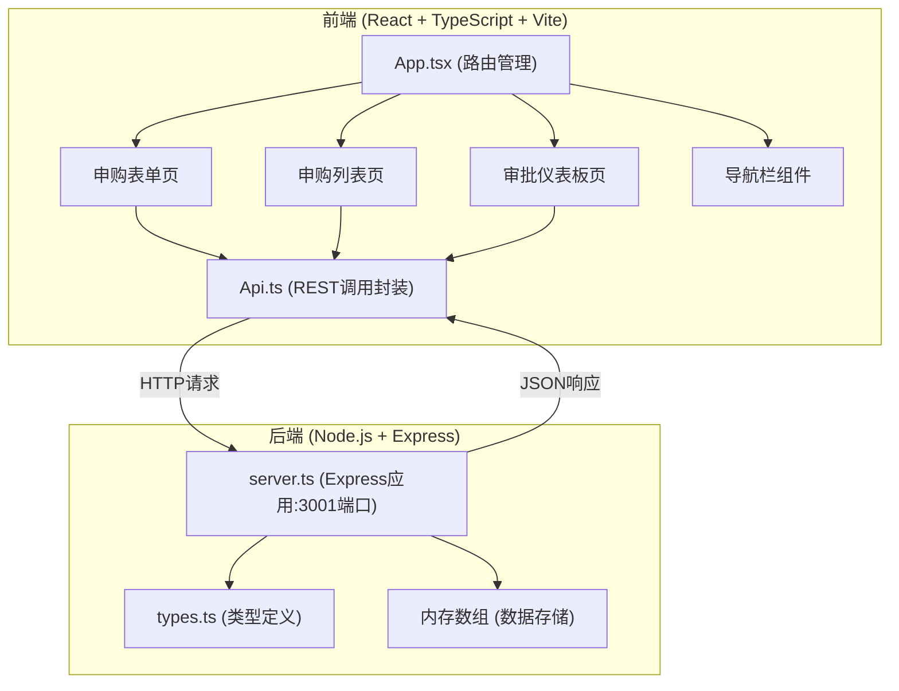
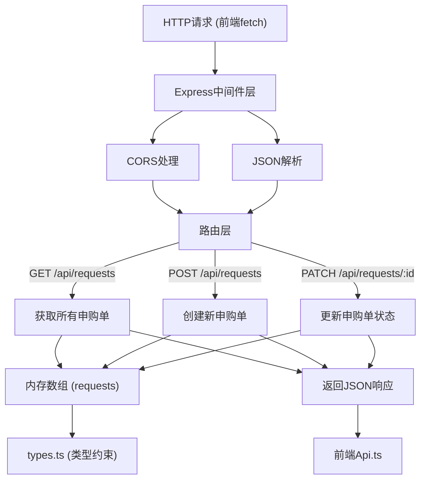
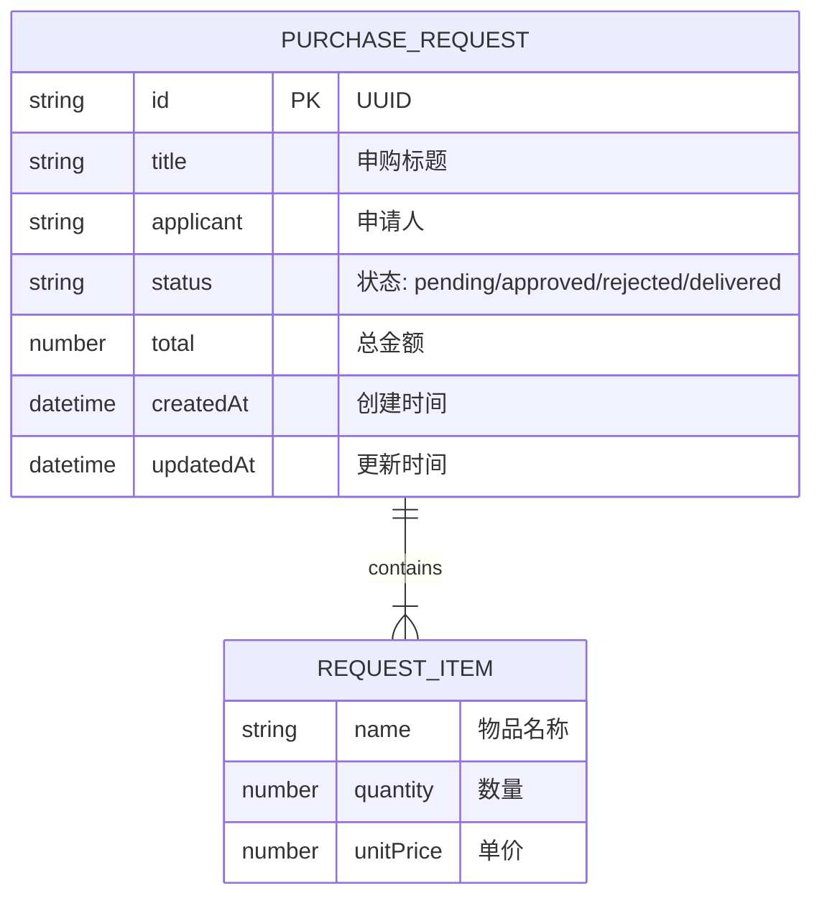
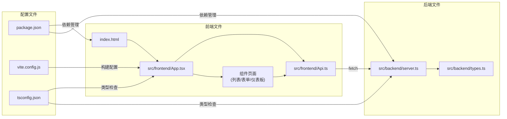

## 1. 架构设计



## 2. 技术描述

### 2.1 前端技术栈
- **框架**: React 18 + TypeScript
- **构建工具**: Vite 5
- **路由**: React Router v6
- **虚拟滚动**: react-window
- **样式**: CSS Modules + 内联样式
- **HTTP客户端**: 原生 fetch API

### 2.2 后端技术栈
- **框架**: Express 4
- **运行时**: Node.js
- **类型支持**: TypeScript
- **跨域**: cors
- **ID生成**: uuid

### 2.3 开发工具
- **包管理器**: npm
- **TypeScript严格模式**: 启用
- **代理配置**: Vite proxy 代理到后端3001端口

## 3. 路由定义

| 路由路径 | 页面/组件 | 功能描述 |
|----------|-----------|----------|
| `/` | 申购列表页 | 显示所有申购单卡片网格 |
| `/create` | 申购表单页 | 创建新的申购单 |
| `/admin` | 审批仪表板页 | 管理员审批申购单（需登录） |
| `/login` | 登录页 | 管理员登录 |

**数据流向说明**:
- `App.tsx` 根据 URL 路径加载对应页面组件
- 所有页面组件通过 `Api.ts` 调用后端 REST API
- `Api.ts` 发送 HTTP 请求到 `server.ts`
- `server.ts` 操作内存数组并返回 JSON 响应

## 4. API 定义

### 4.1 类型定义 (TypeScript)

```typescript
// src/backend/types.ts
interface RequestItem {
  name: string;
  quantity: number;
  unitPrice: number;
}

interface PurchaseRequest {
  id: string;
  title: string;
  items: RequestItem[];
  applicant: string;
  status: 'pending' | 'approved' | 'rejected' | 'delivered';
  total: number;
  createdAt: string;
  updatedAt: string;
}

interface CreateRequestDto {
  title: string;
  items: RequestItem[];
  applicant: string;
  total: number;
}

interface UpdateStatusDto {
  status: 'approved' | 'rejected' | 'delivered';
}
```

### 4.2 REST API 接口

| 方法 | 路径 | 请求体 | 响应 | 描述 |
|------|------|--------|------|------|
| GET | `/api/requests` | 无 | `PurchaseRequest[]` | 返回所有申购单（按时间倒序） |
| POST | `/api/requests` | `CreateRequestDto` | `PurchaseRequest` | 创建新申购单 |
| PATCH | `/api/requests/:id` | `UpdateStatusDto` | `PurchaseRequest` | 更新申购单状态 |

**API调用关系**:
- `Api.fetchRequests()` → `GET /api/requests`
- `Api.createRequest(data)` → `POST /api/requests`
- `Api.updateStatus(id, status)` → `PATCH /api/requests/:id`

## 5. 服务端架构图



## 6. 数据模型

### 6.1 数据模型定义



### 6.2 数据结构说明

**内存数组结构** (存储于 `server.ts`):
```typescript
const requests: PurchaseRequest[] = [
  {
    id: 'uuid-123',
    title: '2024年Q1办公文具采购',
    items: [
      { name: 'A4打印纸', quantity: 10, unitPrice: 25 },
      { name: '中性笔', quantity: 50, unitPrice: 2 }
    ],
    applicant: '张三',
    status: 'pending',
    total: 350,
    createdAt: '2024-01-15T10:30:00Z',
    updatedAt: '2024-01-15T10:30:00Z'
  }
];
```

**状态流转**:
- `pending` (待审批) → `approved` (已批准) / `rejected` (已驳回)
- `approved` (已批准) → `delivered` (已送达)

### 6.3 文件调用关系图



## 7. 性能优化方案

1. **虚拟滚动**: 使用 `react-window` 处理超过20条记录的列表渲染
2. **React优化**: 使用 `useMemo`、`useCallback` 避免不必要的重渲染
3. **组件懒加载**: 路由级别的代码分割
4. **构建优化**: Vite 内置 tree-shaking、代码压缩
5. **CSS优化**: 使用 CSS 变量，避免内联样式重计算

## 8. 项目启动命令

```bash
# 安装依赖
npm install

# 同时启动前端(5173)和后端(3001)
npm run dev

# 仅启动后端
npm run server

# 仅启动前端
npm run client

# 构建生产版本
npm run build
```
