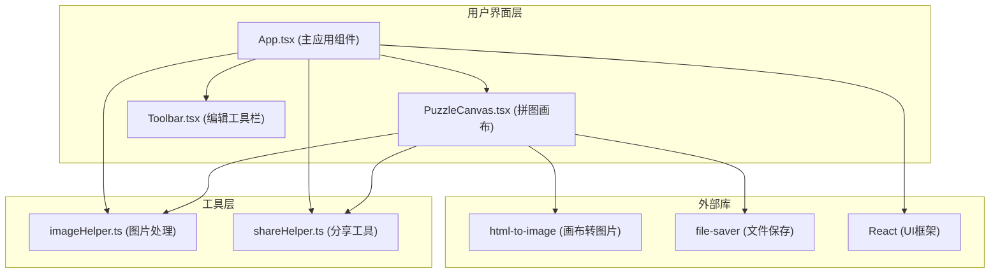

## 1. 架构设计



## 2. 技术描述

- 前端框架：React 18 + TypeScript
- 构建工具：Vite 5
- 状态管理：React Hooks (useState, useCallback, useRef)
- 图片处理：Canvas API + html-to-image
- 图标库：lucide-react
- 样式方案：原生 CSS (配合 CSS Variables)
- 初始化方式：npm init vite-init

## 3. 项目文件结构

| 路径 | 用途 |
|-------|---------|
| package.json | 项目依赖与脚本配置 |
| index.html | 入口HTML文件 |
| tsconfig.json | TypeScript配置（严格模式，target ES2020） |
| vite.config.js | Vite构建配置（支持React） |
| src/main.tsx | React入口文件 |
| src/App.tsx | 主应用组件（状态管理） |
| src/components/PuzzleCanvas.tsx | 拼图画布组件 |
| src/components/Toolbar.tsx | 编辑工具栏组件 |
| src/utils/imageHelper.ts | 图片处理工具模块 |
| src/utils/shareHelper.ts | 分享工具模块 |

## 4. 核心数据类型

```typescript
interface ImageItem {
  id: string;
  original: string;      // 原图base64
  thumbnail: string;     // 缩略图base64 (200x200)
  file: File;            // 原始文件
}

type BorderStyle = 'none' | 'white-solid' | 'gray-dashed';
type LayoutMode = 'compact' | 'loose';

interface CanvasConfig {
  backgroundColor: string;
  borderStyle: BorderStyle;
  layoutMode: LayoutMode;
}
```

## 5. 状态管理数据流

```
用户交互 (上传/拖拽/配置)
    ↓
App.tsx (useState 管理全局状态)
    ↓
Props 向下传递
    ↓
PuzzleCanvas / Toolbar 渲染
    ↓
回调函数触发状态更新
```

## 6. 性能优化策略

1. 图片缩略图预生成：上传时即时生成200x200缩略图用于渲染
2. CSS Transform优先：拖拽使用transform而非top/left，启用GPU加速
3. requestAnimationFrame：拖拽计算使用RAF保证帧率
4. 批量状态更新：避免频繁重渲染
5. 事件委托：优化拖拽事件监听
