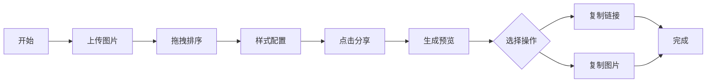

## 1. 产品概述

在线图片拼贴与社交分享板，用于在活动或旅行后与朋友一起将多张照片拼成创意长图并分享到社交平台。

- 核心目的：提供简单易用的网格拼贴工具，支持自由拖拽排序、多种样式配置和一键分享
- 目标用户：活动参与者、旅行者、社交媒体爱好者
- 市场价值：解决现有工具复杂、需要专业技能的痛点，满足用户快速创意拼贴需求

## 2. 核心功能

### 2.1 功能模块
1. **拼图画布区**：网格画布、图片上传、拖拽排序、动画过渡
2. **编辑工具栏**：背景色选择、边框样式、布局模式切换
3. **分享区**：预览卡片生成、复制链接、复制图片

### 2.2 页面详情

| 页面名称 | 模块名称 | 功能描述 |
|-----------|-------------|---------------------|
| 主页面 | 拼图画布区 | 1000px宽自适应高度网格画布，浅灰背景#f3f4f6，100x100px网格单元，支持jpg/png上传（单张≤5MB），上传后自动生成缩略图，拖拽时半透明跟随鼠标，松开后插入目标位置，带动画过渡 |
| 主页面 | 编辑工具栏 | 240px宽工具栏，包含12种预设柔和背景色块（20x20px）、3种边框样式（无边框/白色2px圆角/灰色虚线1px圆角）、2种布局模式（紧凑8px间距/宽松20px间距），所有切换带动画过渡 |
| 主页面 | 分享区 | 分享按钮生成1200px宽预览卡片，复制链接/图片按钮，复制成功后显示绿色对勾，1.5秒恢复 |

## 3. 核心流程

用户上传图片 → 拖拽调整顺序 → 配置背景色/边框/布局 → 点击分享 → 预览拼图 → 复制链接或图片 → 分享到社交平台

## 4. 用户界面设计

### 4.1 设计风格
- 主色调：浅蓝色系 #3b82f6，悬停变深 #2563eb
- 按钮样式：圆角8px，带悬停微动画
- 字体：现代无衬线字体，清晰易读
- 布局：三栏布局（画布区+工具栏+分享区），桌面优先，适配平板
- 图标：简洁线性风格，lucide-react图标库

### 4.2 页面设计概览

| 页面名称 | 模块名称 | UI元素 |
|-----------|-------------|-------------|
| 主页面 | 拼图画布区 | 浅灰背景、网格排列图片、拖拽半透明效果、0.3s ease-out过渡 |
| 主页面 | 编辑工具栏 | 240px宽度、色块选择器、边框样式切换、布局模式按钮组、0.4-0.5s ease-out过渡 |
| 主页面 | 分享区 | 预览卡片、操作按钮、成功状态绿色对勾、1.5s反馈动画 |

### 4.3 响应式设计
- 桌面视图：画布区1000px + 工具栏240px + 适当间距
- 平板视图：自适应宽度，画布区缩小，工具栏可折叠或垂直排列
- 触摸优化：支持触摸拖拽，增大可点击区域

### 4.4 性能要求
- 拼图区域交互 FPS ≥ 50
- 单张图片加载及缩略图生成 ≤ 500ms
- 动画流畅，无卡顿
