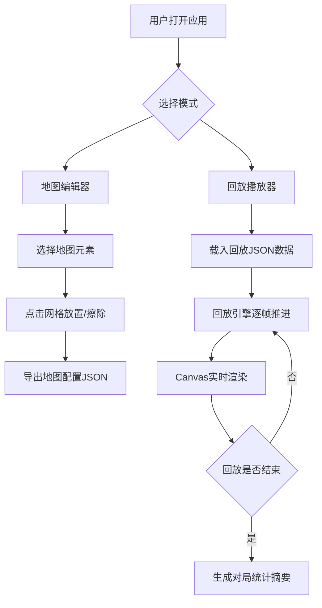

## 1. 产品概述

炸弹人对战回放系统是一款面向本地多人炸弹人对战玩家的浏览器端复盘工具，解决玩家对战后无法保存、回看和复盘精彩操作的问题，提供从地图编辑、回放播放到对局统计的完整闭环体验。

- 目标用户：炸弹人休闲/竞技玩家、游戏复盘爱好者
- 核心价值：通过可视化回放和数据统计帮助玩家理解对局节奏、优化策略

## 2. 核心功能

### 2.1 功能模块

1. **地图编辑器页面**：13×11网格编辑器，支持放置/擦除可破坏砖块、不可破坏钢墙、玩家出生点、道具掉落点
2. **回放播放器页面**：Canvas实时渲染回放画面，支持速度切换(0.5x/1x/2x)、进度条拖拽、帧跳转
3. **对局统计面板**：回放结束后展示双方存活时间、击杀数、爆炸覆盖格数、总步数

### 2.2 页面详情

| 页面名称 | 模块名称 | 功能描述 |
|----------|----------|----------|
| 地图编辑器 | 网格画布 | 13×11网格，点击放置/擦除元素，选中元素高亮蓝色边框#3b82f6 |
| 地图编辑器 | 元素选择栏 | 可破坏砖块、不可破坏钢墙、玩家出生点、道具掉落点四种元素切换 |
| 回放播放器 | Canvas渲染区 | 左栏70%宽度，实时渲染角色、炸弹、火焰、道具 |
| 回放播放器 | 控制面板 | 右栏30%宽度，播放/暂停、速度切换、进度条、帧跳转输入框 |
| 回放播放器 | 统计面板 | 圆角8px白底深灰边框表格，展示双方对局数据 |

## 3. 核心流程



## 4. 用户界面设计

### 4.1 设计风格

- 主背景色：深灰 #1e1e1e
- 文字颜色：白色 #ffffff
- 网格背景：浅灰 #e5e7eb，网格线 #d1d5db
- 选中元素高亮：蓝色 #3b82f6
- 播放按钮：绿色 #22c55e 圆角矩形
- 进度条滑块：#6b7280
- 统计表格：圆角8px白底深灰边框
- 字体：等宽字体用于数据展示，无衬线字体用于UI
- 布局：左右分栏（70%/30%），1200px以下上下排列

### 4.2 页面设计概览

| 页面名称 | 模块名称 | UI元素 |
|----------|----------|--------|
| 地图编辑器 | 网格画布 | 13×11格子，每格40×40px，浅灰背景，点击交互 |
| 地图编辑器 | 工具栏 | 四种元素按钮，选中态蓝色边框 |
| 回放播放器 | 渲染区 | Canvas 520×440px，角色32×32px，炸弹16×16px |
| 回放播放器 | 控制面板 | 绿色播放按钮，三档速度切换，自定义进度条，帧输入框 |
| 回放播放器 | 统计面板 | 表格四行两列，圆角8px白底 |

### 4.3 响应式设计

- 桌面端（≥1200px）：左右分栏布局，左70%右30%
- 移动/窄屏（<1200px）：上下排列，Canvas区在上，控制面板在下

## 5. 数据格式定义

### 5.1 地图配置JSON

```json
{
  "width": 13,
  "height": 11,
  "cells": [
    {"x": 0, "y": 0, "type": "steel"},
    {"x": 3, "y": 2, "type": "brick"},
    {"x": 1, "y": 1, "type": "spawn", "player": 1}
  ]
}
```

### 5.2 回放数据JSON

```json
{
  "mapConfig": { ... },
  "totalFrames": 3600,
  "fps": 60,
  "frames": [
    {
      "frameIndex": 0,
      "players": [
        {"id": 1, "x": 1, "y": 1, "alive": true},
        {"id": 2, "x": 11, "y": 9, "alive": true}
      ],
      "bombs": [],
      "explosions": [],
      "items": []
    }
  ]
}
```
