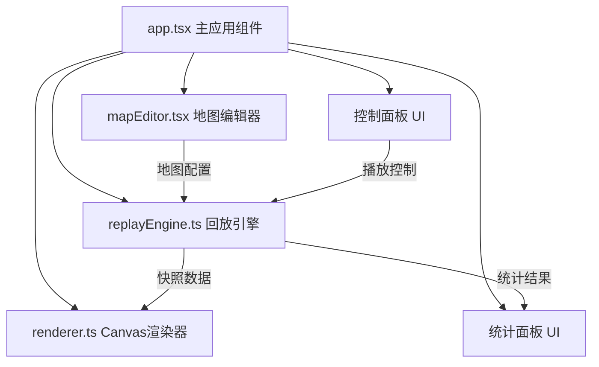

## 1. 架构设计



## 2. 技术说明

- 前端：React 18 + TypeScript + Vite
- 状态管理：React useState/useRef（无需引入zustand，状态局部化）
- 渲染：Canvas 2D API + requestAnimationFrame
- 初始化工具：vite-init (react-ts模板)
- 后端：无
- 数据库：无（使用本地JSON数据）

## 3. 路由定义

| 路由 | 用途 |
|------|------|
| / | 主页面，包含地图编辑器和回放播放器（Tab切换） |

## 4. 文件结构

```
├── package.json
├── vite.config.js
├── tsconfig.json
├── index.html
└── src/
    ├── app.tsx          # 主应用组件
    ├── mapEditor.tsx    # 地图编辑器
    ├── replayEngine.ts  # 回放引擎核心
    ├── renderer.ts      # Canvas渲染器
    └── main.tsx         # 入口文件
```

## 5. 核心模块接口

### 5.1 replayEngine.ts

```typescript
interface ReplayEngine {
  loadReplayData(data: ReplayData): void;
  play(): void;
  pause(): void;
  setSpeed(speed: 0.5 | 1 | 2): void;
  seekToFrame(frameIndex: number): void;
  getCurrentSnapshot(): FrameSnapshot;
  onUpdate(callback: (snapshot: FrameSnapshot) => void): void;
  onComplete(callback: (stats: GameStats) => void): void;
}
```

### 5.2 renderer.ts

```typescript
interface Renderer {
  init(canvas: HTMLCanvasElement): void;
  render(snapshot: FrameSnapshot, mapConfig: MapConfig): void;
  destroy(): void;
}
```

### 5.3 数据类型

```typescript
type CellType = 'empty' | 'brick' | 'steel' | 'spawn' | 'item';
type ItemType = 'shield' | 'speed' | 'bomb+1';

interface MapConfig {
  width: number;
  height: number;
  cells: Array<{ x: number; y: number; type: CellType; player?: number; itemType?: ItemType }>;
}

interface FrameSnapshot {
  frameIndex: number;
  players: Array<{ id: number; x: number; y: number; alive: boolean; items?: ItemType[] }>;
  bombs: Array<{ x: number; y: number; timer: number; range: number }>;
  explosions: Array<{ x: number; y: number; progress: number; directions: boolean[] }>;
  items: Array<{ x: number; y: number; type: ItemType }>;
}

interface GameStats {
  player1: { survivalTime: number; kills: number; explosionCells: number; totalSteps: number };
  player2: { survivalTime: number; kills: number; explosionCells: number; totalSteps: number };
}
```

## 6. 性能策略

- Canvas渲染使用requestAnimationFrame驱动，确保60fps
- 爆炸火焰渲染使用对象池复用，避免GC压力
- 帧状态计算与渲染解耦，引擎按速度推进帧索引，渲染器独立采样
- 30+爆炸火焰场景下，使用批量绘制（单次beginPath）减少draw call
