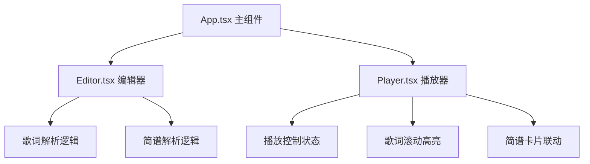

## 1. 架构设计



## 2. 技术描述

- 前端框架：React 18 + TypeScript
- 构建工具：Vite
- 状态管理：React useState/useRef（轻量级场景）
- 样式方案：原生 CSS + CSS Variables（无 Tailwind，按用户需求）
- 动画方案：CSS transitions + transforms
- 性能优化：requestAnimationFrame、CSS 硬件加速

## 3. 路由定义

| 路由 | 用途 |
|------|------|
| / | 主页（编辑器+预览器） |

## 4. 数据模型

### 4.1 类型定义

```typescript
interface LyricLine {
  time: number;
  text: string;
  index: number;
}

interface NoteData {
  value: string;
  lyricIndex: number;
}

interface PlayerState {
  isPlaying: boolean;
  currentTime: number;
  duration: number;
  activeLyricIndex: number;
}
```

### 4.2 数据结构

- 歌词数据：`LyricLine[]` - 每行包含时间（秒）、文本、索引
- 简谱数据：`string[][]` - 二维数组，每行歌词对应一组简谱数字
- 播放状态：`PlayerState` - 控制播放进度和当前高亮行

## 5. 文件结构

```
.
├── index.html
├── package.json
├── tsconfig.json
├── vite.config.js
└── src/
    ├── App.tsx          # 主组件，布局与状态管理
    ├── Editor.tsx       # 编辑器组件，歌词与简谱输入
    ├── Player.tsx       # 播放器组件，预览与联动
    └── main.tsx         # 入口文件
```

## 6. 核心实现要点

1. **歌词解析**：正则匹配 `[mm:ss.xx]` 格式，转换为秒数
2. **播放循环**：requestAnimationFrame 实现 60fps 更新
3. **高亮定位**：二分查找当前时间对应的歌词行
4. **滚动同步**：activeElement.scrollIntoView({ behavior: 'smooth', block: 'center' })
5. **点击跳转**：根据歌词行时间设置 currentTime 并更新播放状态
6. **性能优化**：使用 CSS transform 实现高亮动画，避免重排
