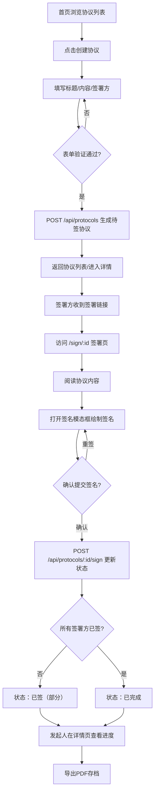

## 1. 产品概述

轻量级电子协议签署与管理系统，面向跨部门协作场景，帮助团队快速创建、签署和管理电子协议（保密协议、任务委托书等），解决传统邮件确认效率低、易出错的问题。

- **核心目标**：将协议签署流程从"邮件来回确认"缩短为"在线即时签署"，提升跨部门协作效率
- **目标用户**：企业跨部门项目成员、项目经理、法务人员
- **市场价值**：无需复杂部署的SaaS级轻量签署工具，即开即用，适合中小企业内部协作

---

## 2. 核心功能

### 2.1 用户角色

| 角色 | 注册方式 | 核心权限 |
|------|----------|----------|
| 协议发起人 | 系统内置（模拟） | 创建协议模板、发起签署请求、查看所有协议状态、导出PDF |
| 签署方 | 通过链接访问 | 查看协议内容、在线签名、提交签署 |

### 2.2 功能模块

1. **协议列表页（首页）**：卡片网格展示所有协议、状态筛选器（全部/待签/已签/已完成）、点击卡片进入详情
2. **创建协议页**：标题输入、Markdown内容编辑、多签署方邮箱添加、实时预览、表单验证提交
3. **签署页**：协议完整内容展示、数字签名板绘制、签名确认提交
4. **协议详情页**：协议内容展示、签署方签名状态面板、导出PDF按钮、待签提醒链接

### 2.3 页面详情

| 页面名称 | 模块名称 | 功能描述 |
|----------|----------|----------|
| 协议列表页 | 导航栏 | Logo展示、页面导航跳转（首页/创建协议） |
| 协议列表页 | 状态筛选器 | 三个圆角按钮，选中高亮，按状态过滤协议卡片 |
| 协议列表页 | 协议卡片网格 | 响应式三列/两列/单列布局，展示标题、发起人、状态标签、创建时间 |
| 协议列表页 | 空状态提示 | 无协议时显示引导提示，引导用户创建首个协议 |
| 创建协议页 | 表单区 | 标题输入框（聚焦蓝边阴影）、内容textarea（Markdown支持）、动态邮箱添加 |
| 创建协议页 | 预览区 | 实时渲染协议最终样式，Markdown转HTML显示 |
| 创建协议页 | 表单验证 | 非空校验、邮箱格式校验、错误提示弹窗 |
| 签署页 | 协议内容区 | 完整展示协议标题、内容、签署方列表及当前状态 |
| 签署页 | 签名模态框 | 半透明遮罩+白色圆角弹窗，居中300x150签名画布 |
| 签署页 | 签名交互 | 鼠标/触控笔绘制、深蓝笔触、重签清空、确认提交 |
| 详情页 | 协议内容面板 | 左侧2/3宽度展示完整协议内容，Markdown渲染 |
| 详情页 | 签署方状态面板 | 右侧1/3宽度，已签显示签名缩略图+签署时间，未签显示待签按钮+链接 |
| 详情页 | PDF导出 | 将协议内容+签名信息格式化为PDF文件下载 |

---

## 3. 核心流程

### 主流程描述

用户在首页点击"创建协议"进入创建页，填写标题、内容、添加签署方邮箱后提交生成待签协议。签署方通过专属链接进入签署页，阅读协议后在签名板绘制签名并提交，系统更新签署状态。所有签署方完成签署后协议自动变为"已完成"状态。发起人可在详情页随时查看签署进度并导出PDF存档。

---

## 4. 用户界面设计

### 4.1 设计风格

- **主色调**：深蓝 `#1e3a5f`（品牌/导航/签名笔触），配合蓝灰 `#3b82f6`（强调/链接/聚焦边框）
- **状态色**：待签橙 `#f59e0b`、已签绿 `#22c55e`、已完成蓝 `#3b82f6`
- **背景系统**：页面背景浅灰 `#f5f5f5`，卡片纯白 `#ffffff`，边框浅灰 `#e5e7eb`
- **字体体系**：标题使用现代无衬线粗体，正文使用清晰易读的系统字体栈（优先"PingFang SC"/"Microsoft YaHei"）
- **按钮风格**：圆角胶囊状，主按钮深蓝填充+白字，次按钮浅灰底+深灰字，悬停有0.2s颜色过渡
- **布局风格**：顶部固定导航栏+内容区居中最大1200px，卡片式网格布局，充足留白呼吸感
- **动效原则**：所有交互采用0.2s~0.3s ease-out缓动，卡片悬停上移4px+投影增强，模态框淡入淡出

### 4.2 页面设计概览

| 页面名称 | 模块名称 | UI元素 |
|----------|----------|--------|
| 协议列表页 | 导航栏 | 60px高深蓝背景，左侧白粗体Logo，右侧导航链接半透明白→悬停不透明0.2s过渡 |
| 协议列表页 | 筛选器行 | 三个圆角胶囊按钮横向排列，选中态深蓝底白字，未选中灰底深灰字，间距12px |
| 协议列表页 | 卡片网格 | gap-24px，300x180px卡片，16px圆角，1px#e5e7eb边框，悬停translateY(-4px)+0 6px 18px rgba(0,0,0,0.08)阴影，0.3s ease-out |
| 协议列表页 | 卡片内部 | 标题18px粗体居上，发起人小字中部，状态标签圆角色块靠右，创建时间居底 |
| 创建协议页 | 表单区 | 左半幅，输入框聚焦时边框变#3b82f6并带淡入阴影0.2s，邮箱列表支持动态增删 |
| 创建协议页 | 预览区 | 右半幅白底卡片，12px圆角，模拟纸质协议排版，带微妙内边距 |
| 签署页 | 签名模态框 | 半透明黑rgba(0,0,0,0.5)遮罩，白弹窗12px圆角，box-shadow 0 12px 36px rgba(0,0,0,0.2)，0.2s淡入 |
| 签署页 | 签名画布 | 300x150px白底，8px圆角，画布边框浅灰，笔触#1e3a5f固定3px宽 |
| 详情页 | 两栏布局 | 左2/3展示Markdown渲染的协议内容，右1/3签署方状态卡片列表 |
| 详情页 | 签名缩略图 | 已签方显示缩小的base64签名图+灰色小字签署时间 |
| 详情页 | 底部操作栏 | 固定两栏底部，左侧返回按钮，右侧蓝色"导出PDF"主按钮 |

### 4.3 响应式设计

- **设计策略**：Desktop-first，断点式降级适配
- **≥1024px（桌面）**：协议列表三列网格，详情页左右2:1分栏
- **768px~1023px（平板）**：协议列表两列网格，详情页上下堆叠
- **480px~767px（手机横屏）**：协议列表单列，表单与预览上下排列
- **<480px（手机竖屏）**：所有元素全屏宽度，卡片间距缩小，导航栏简化

### 4.4 性能与体验细节

- 协议列表首屏预加载20条模拟数据，DOM渲染控制在500ms内
- 签名画布采用原生Canvas API，mousemove/touchmove事件直接绘制，无额外框架开销，响应延迟<50ms
- 路由切换使用React Router懒加载，首屏不加载签署页/详情页代码
- PDF导出使用html2canvas+jsPDF组合，客户端生成不占用服务器资源
