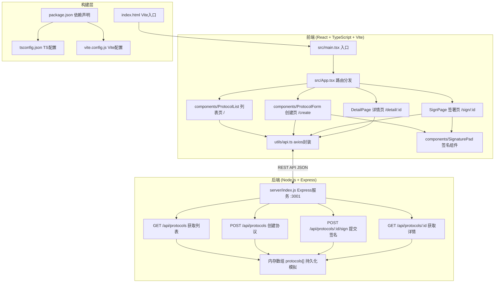
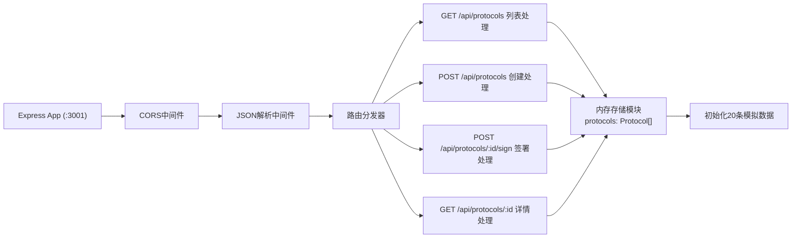
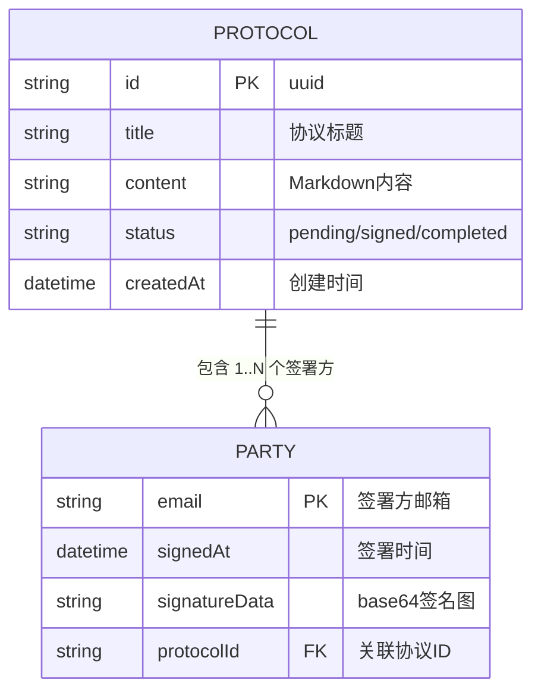

## 1. 架构设计



**调用关系与数据流**：
1. 用户操作 → React组件触发 → `api.ts`封装方法 → axios发送HTTP请求
2. Express路由 → 处理req → 读写内存数组 → 返回JSON响应
3. 响应回到`api.ts` → 类型校验 + 错误处理 → 返回组件 → 更新state → 重渲染
4. 签名数据流向：SignaturePad canvas → toDataURL(base64) → 父组件state → POST sign接口 → 后端存入parties[i].signatureData

---

## 2. 技术说明

- **前端框架**：React@18 + TypeScript@5（严格模式）+ React Router@6
- **构建工具**：Vite@5 + @vitejs/plugin-react@4，目标ES2020
- **HTTP客户端**：axios@1，统一请求/响应拦截，错误弹窗
- **后端框架**：Express@4 + cors@2，监听3001端口
- **ID生成**：uuid@9 生成协议唯一ID
- **签名实现**：原生Canvas 2D API，mousedown/move/up + touch事件
- **PDF导出**：html2pdf.js（html2canvas + jsPDF封装）
- **样式方案**：原生CSS + CSS Modules，使用CSS变量统一主题色
- **数据库**：Node.js内存数组`protocols: Protocol[]`，服务重启清空（符合需求）
- **Vite代理**：开发环境`/api` → `http://localhost:3001`，避免跨域

---

## 3. 路由定义

### 前端路由 (React Router)

| 路由路径 | 页面组件 | 用途 |
|----------|----------|------|
| `/` | ProtocolList | 首页：协议卡片列表 + 状态筛选 |
| `/create` | ProtocolForm | 创建协议：表单 + 预览区 |
| `/sign/:id` | SignPage | 签署协议：阅读内容 + 签名提交 |
| `/detail/:id` | DetailPage | 协议详情：内容 + 签署状态 + 导出PDF |
| `*` | 重定向至 `/` | 404降级处理 |

### 后端API路由 (Express)

| 方法 | 路由 | 用途 | 请求体 | 响应 |
|------|------|------|--------|------|
| GET | `/api/protocols` | 获取全部协议列表 | 无 | `Protocol[]` |
| POST | `/api/protocols` | 创建新协议 | `{ title, content, parties: string[] }` | `Protocol`（含id、createdAt、status） |
| GET | `/api/protocols/:id` | 获取单条协议详情 | 无 | `Protocol` |
| POST | `/api/protocols/:id/sign` | 提交签署 | `{ email, signatureData, signedAt }` | `Protocol`（更新后） |

---

## 4. API类型定义

```typescript
// 签署方信息
interface Party {
  email: string;          // 签署方邮箱（唯一标识）
  signedAt: string | null;// 签署时间 ISO8601，未签为null
  signatureData: string | null; // 签名base64 PNG，未签为null
}

// 协议完整结构
interface Protocol {
  id: string;             // uuid v4
  title: string;          // 协议标题
  content: string;        // 协议内容（Markdown原始文本）
  parties: Party[];       // 签署方数组
  status: 'pending' | 'signed' | 'completed';
  createdAt: string;      // 创建时间 ISO8601
}

// 创建协议请求
interface CreateProtocolRequest {
  title: string;
  content: string;
  parties: string[];      // 仅需邮箱数组，后端构造Party
}

// 签署请求
interface SignRequest {
  email: string;
  signatureData: string;  // base64 data:image/png;base64,...
  signedAt: string;       // 前端生成的ISO8601时间戳
}
```

**状态机**：
- `pending` → 创建后初始状态，所有签署方均未签署
- `signed` → 至少1位已签署但未全部完成
- `completed` → parties数组中每一项的signedAt均非null

---

## 5. 后端服务架构



**文件位置**：`server/index.js`（单文件架构，需求未要求分层）

**核心处理逻辑**：
- **创建协议**：校验必填 → uuid()生成id → parties映射为`{email, signedAt:null, signatureData:null}` → push到数组 → 返回完整对象
- **签署协议**：通过id查找 → 在parties中匹配email → 更新signedAt和signatureData → 扫描parties判断是否全部签署 → 更新status → 返回
- **状态判定**：`parties.every(p => p.signedAt !== null) ? 'completed' : parties.some(p => p.signedAt !== null) ? 'signed' : 'pending'`

---

## 6. 数据模型

### 6.1 ER关系图



### 6.2 模拟初始数据（内存）

服务启动时向`protocols`数组push 20条模拟协议数据：
- 标题：`项目保密协议 #N`、`任务委托书 #N`、`合作确认书 #N` 三类均匀分布
- 内容：3~5段标准Markdown占位文本（含标题、列表、段落）
- parties：2~3个签署方，随机分布已签/未签状态
- status：pending约30%、signed约40%、completed约30%
- createdAt：最近30天随机日期

---

## 7. 启动方式与脚本

| 命令 | 说明 |
|------|------|
| `npm run dev` | **同时启动**：Vite开发服务器(:5173) + Express后端(:3001) |
| 实现方式 | 使用`concurrently`或`npm-run-all`并行启动，或自定义Node脚本 |

**Vite配置**（vite.config.js）：
- 启用`@vitejs/plugin-react`
- `server.proxy['/api']` → `http://localhost:3001`，`changeOrigin: true`
