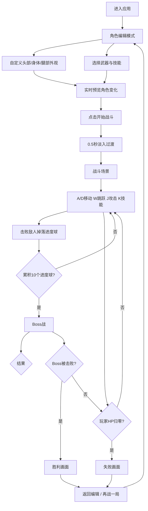

## 1. 产品概述

像素角色自定义与战斗模拟是一款基于浏览器的2D横版像素风格动作游戏应用，玩家可在编辑器中自由配色和搭配装备，随后进入自动生成的战斗场景，通过按键切换武器和释放技能击败随机出现的敌人，提升代入感与策略性。

- 目标用户：喜爱像素风动作游戏、追求角色个性化与战斗策略的休闲玩家
- 核心价值：角色深度自定义 + 实时战斗策略切换，兼顾创造性与竞技性

## 2. 核心功能

### 2.1 用户角色

| 角色 | 说明 |
|------|------|
| 玩家 | 单一角色，无需注册，直接进入编辑和战斗 |

### 2.2 功能模块

1. **角色编辑页面**：像素角色预览画布 + 头部/身体/腿部分类控件 + 武器与技能配置栏
2. **战斗场景页面**：800x600 Canvas战斗区域 + 敌人AI + 子弹系统 + 状态UI
3. **结果页面**：胜利/失败画面 + 重玩与返回编辑按钮

### 2.3 页面详情

| 页面名称 | 模块名称 | 功能描述 |
|----------|----------|----------|
| 角色编辑页面 | 角色预览画布 | 160x160px像素角色实时预览，8x8像素块为单位，20x20格，响应延迟<50ms |
| 角色编辑页面 | 头部控件 | 帽子颜色色板选择、5种发型下拉选择 |
| 角色编辑页面 | 身体控件 | 上衣颜色色板选择、4种护甲样式下拉选择 |
| 角色编辑页面 | 腿部控件 | 裤子颜色色板选择、4种鞋子样式下拉选择 |
| 角色编辑页面 | 武器选择栏 | 剑/弓/法杖3种主武器横条选择，带像素图标 |
| 角色编辑页面 | 技能选择栏 | 火球术/治疗波/闪现3种技能横条选择，带图标 |
| 角色编辑页面 | 开始战斗按钮 | 点击后0.5秒淡入过渡进入战斗场景 |
| 战斗场景页面 | 战斗Canvas | 800x600px，深紫色#2d1b4e背景，石板纹理地面 |
| 战斗场景页面 | 玩家控制 | A/D左右移动（3px/帧）、W跳跃（力量10px）、J攻击、K释放技能 |
| 战斗场景页面 | 武器系统 | 剑=近战扇形判定、弓=飞行箭矢、法杖=追踪火球 |
| 战斗场景页面 | 技能系统 | 火球术/治疗波/闪现，3秒冷却，释放时全屏特效动画 |
| 战斗场景页面 | 敌人系统 | 5种像素怪物，每3秒生成1个，最多3个同时存在，追踪玩家 |
| 战斗场景页面 | 进度球系统 | 敌人死亡掉落金色进度球，累积10个触发Boss战 |
| 战斗场景页面 | Boss战 | 巨大敌人，HP200，攻击15，发射弹幕 |
| 战斗场景页面 | 状态HUD | 血量条/能量条/武器图标/技能冷却圈，固定顶部半透明底色 |
| 战斗场景页面 | 战斗特效 | 命中白帧闪烁、受伤红色边框闪烁、击杀+10飘字 |
| 结果页面 | 胜利画面 | 金色光芒背景，"胜利！"缩放入场，最终得分 |
| 结果页面 | 失败画面 | 灰色调，"失败"倾斜掉落动画 |
| 结果页面 | 操作按钮 | "返回编辑"和"再战一局"圆角12px按钮 |

## 3. 核心流程

玩家进入应用后首先进入角色编辑模式，在左侧预览画布实时查看角色外观变化，右侧通过色板和下拉列表自定义头部/身体/腿部外观，下方选择武器和技能。编辑完成后点击"开始战斗"，经过0.5秒淡入过渡进入战斗场景。战斗中通过键盘控制角色移动、攻击和释放技能，击败敌人获取进度球，累积10个触发Boss战。击败Boss或血量归零后显示对应结果画面，可选择返回编辑或再战一局。

## 4. 用户界面设计

### 4.1 设计风格

- 主背景色：#1a1a2e（深色科幻）
- 辅背景色：#16213e
- 强调色：#e94560（红色高亮）、#0f3460（深蓝强调）
- 按钮样式：圆角12px，悬停亮度+20%
- 字体：像素风格字体（如Press Start 2P）+ 辅助UI字体
- 布局：编辑页左右分栏1:2，战斗页全屏Canvas
- 图标：像素风格图标

### 4.2 页面设计概览

| 页面名称 | 模块名称 | UI元素 |
|----------|----------|--------|
| 角色编辑页面 | 左侧预览区 | 160x160px Canvas居中，深色背景，像素角色实时渲染 |
| 角色编辑页面 | 右侧控件区 | 卡片式分组（圆角8px，半透明#1a1a2eb3），色板+下拉列表，0.2s ease切换动画 |
| 角色编辑页面 | 武器技能栏 | 底部横条栏，3个武器/技能选项水平排列，选中高亮 |
| 角色编辑页面 | 开始战斗按钮 | 居中大按钮，#e94560色，悬停亮度+20% |
| 战斗场景页面 | 战斗Canvas | 全屏，深紫#2d1b4e背景，石板纹理地面 |
| 战斗场景页面 | 状态HUD | 顶部固定，半透明黑色#000000aa底色，血量绿条/能量蓝条/武器图标/冷却圈 |
| 战斗场景页面 | 受伤效果 | 屏幕边缘红色闪烁，0.3秒半透明+0.5秒渐隐 |
| 结果页面 | 胜利画面 | 金色光芒背景，"胜利！"0.5秒缩放入场，最终得分 |
| 结果页面 | 失败画面 | 灰色调，"失败"0.5秒倾斜掉落动画 |
| 结果页面 | 操作按钮 | 两个圆角12px按钮，悬停亮度+20% |

### 4.3 响应式设计

- 桌面优先设计（>=1024px）：正常显示
- <768px：编辑页改为上下布局（预览在上，控件在下），缩小字号
- 战斗Canvas保持800x600比例，小屏幕等比缩放

### 4.4 2D场景指导

- 像素风格渲染，8x8像素块为基础单位
- 角色精灵20x20格（160x160px），使用Canvas逐像素绘制
- 敌人精灵同样采用像素风格，5种不同外观
- 战斗背景使用深紫色调#2d1b4e，地面石板纹理
- 特效采用像素粒子风格，保持整体视觉一致性
- 60fps目标帧率，子弹峰值50个时FPS不低于55
