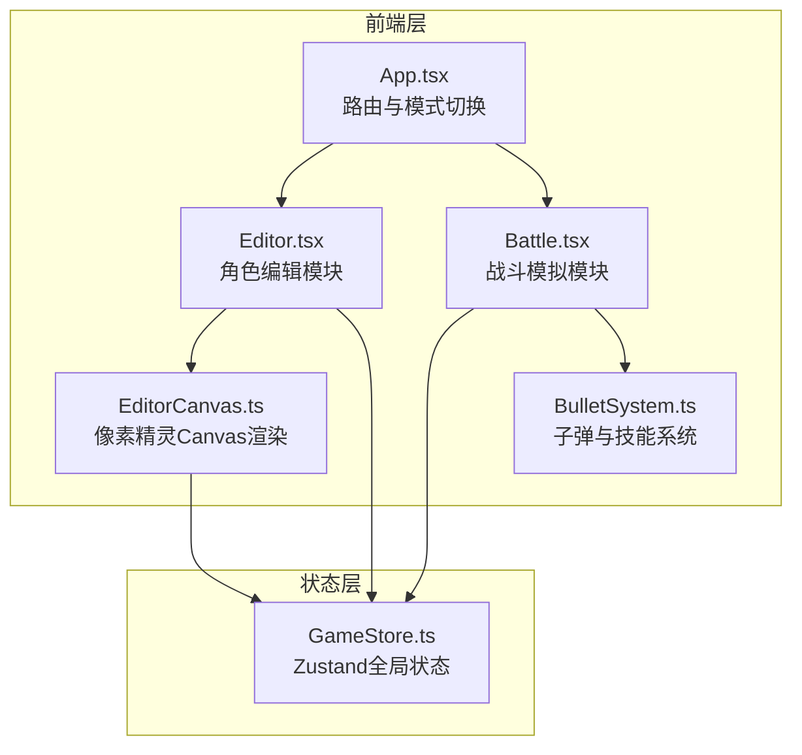

## 1. 架构设计



**数据流向**：
- Editor → GameStore：用户编辑配色/装备/武器/技能时，调用GameStore的set接口更新状态
- GameStore → EditorCanvas：EditorCanvas从GameStore读取角色数据，实时渲染像素精灵预览
- GameStore → Battle：战斗模块从GameStore读取角色属性（颜色、装备、武器、技能），初始化战斗角色
- Battle → BulletSystem：Battle调用BulletSystem创建子弹/技能特效，BulletSystem输出命中事件给Battle
- Battle → GameStore：战斗中实时更新血量、能量、得分等战斗状态

## 2. 技术说明

- 前端：React@18 + TypeScript + Vite + HTML5 Canvas
- 状态管理：Zustand
- 初始化工具：Vite
- 后端：无
- 数据库：无

## 3. 路由定义

| 路由 | 用途 |
|------|------|
| / | 应用主入口，根据GameStore中的gamePhase状态切换编辑/战斗/结果视图 |

本应用为单页面应用，不使用路由库，通过GameStore中的`gamePhase`字段（`editor` | `battle` | `victory` | `defeat`）控制视图切换。

## 4. API定义

无后端API，所有逻辑在前端完成。

## 5. 文件结构与调用关系

```
├── package.json
├── vite.config.js
├── tsconfig.json
├── index.html
└── src/
    ├── main.tsx                    # 应用入口，渲染App
    ├── App.tsx                     # 根组件，根据gamePhase切换视图
    ├── styles/
    │   └── global.css              # 全局样式与CSS变量
    ├── editor/
    │   ├── Editor.tsx              # 角色编辑模块（调用GameStore写入，调用EditorCanvas渲染）
    │   └── EditorCanvas.ts         # 像素精灵Canvas渲染（从GameStore读取数据）
    ├── battle/
    │   ├── Battle.tsx              # 战斗模拟模块（从GameStore读取角色数据，调用BulletSystem）
    │   └── BulletSystem.ts         # 子弹与技能系统（输出命中事件给Battle）
    └── store/
        └── GameStore.ts            # 全局状态管理（Zustand），供所有模块读写
```

**模块调用关系**：
- `App.tsx` → `Editor.tsx` / `Battle.tsx`：根据游戏阶段渲染对应模块
- `Editor.tsx` → `GameStore.ts`：用户操作时调用set方法更新角色定制数据
- `Editor.tsx` → `EditorCanvas.ts`：将Canvas ref传入EditorCanvas进行渲染
- `EditorCanvas.ts` → `GameStore.ts`：从store读取角色数据渲染像素精灵
- `Battle.tsx` → `GameStore.ts`：读取角色属性初始化战斗，实时更新战斗状态
- `Battle.tsx` → `BulletSystem.ts`：创建/管理子弹和技能特效，接收命中事件
- `BulletSystem.ts`：独立管理所有飞行道具的运动和碰撞检测

## 6. 数据模型

### 6.1 GameStore状态定义

```typescript
interface CharacterConfig {
  head: {
    hatColor: string;
    hairStyle: number;
  };
  body: {
    shirtColor: string;
    armorStyle: number;
  };
  legs: {
    pantsColor: string;
    shoeStyle: number;
  };
  weapon: 'sword' | 'bow' | 'staff';
  skill: 'fireball' | 'heal' | 'blink';
}

interface BattleState {
  playerHP: number;
  playerMaxHP: number;
  playerEnergy: number;
  playerMaxEnergy: number;
  score: number;
  progressOrbs: number;
  playerX: number;
  playerY: number;
  skillCooldown: number;
}

type GamePhase = 'editor' | 'battle' | 'victory' | 'defeat';

interface GameStore {
  gamePhase: GamePhase;
  character: CharacterConfig;
  battle: BattleState;
  setGamePhase: (phase: GamePhase) => void;
  updateCharacter: (partial: Partial<CharacterConfig>) => void;
  updateBattle: (partial: Partial<BattleState>) => void;
  resetBattle: () => void;
}
```

### 6.2 战斗实体数据

```typescript
interface Enemy {
  id: number;
  type: number;
  x: number;
  y: number;
  hp: number;
  maxHp: number;
  attack: number;
  speed: number;
  width: number;
  height: number;
  lastAttackTime: number;
  isBoss: boolean;
  flashTimer: number;
}

interface Bullet {
  id: number;
  x: number;
  y: number;
  vx: number;
  vy: number;
  type: 'arrow' | 'fireball' | 'enemy_bullet' | 'skill_effect';
  damage: number;
  radius: number;
  tracking?: boolean;
  targetId?: number;
  lifetime: number;
}

interface ProgressOrb {
  id: number;
  x: number;
  y: number;
  remainingTime: number;
}

interface FloatingText {
  id: number;
  x: number;
  y: number;
  text: string;
  opacity: number;
  vy: number;
}
```
