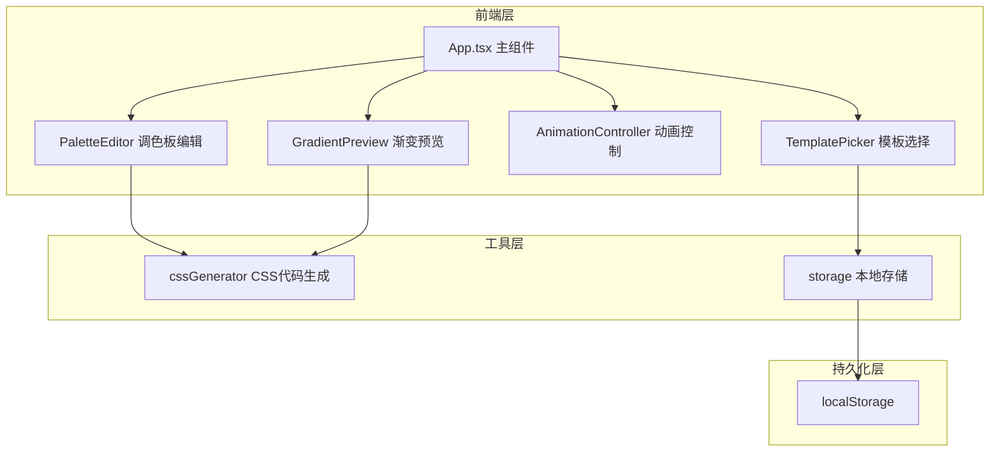

## 1. 架构设计



## 2. 技术说明

- 前端：React@18 + TypeScript + Vite
- 状态管理：Zustand（轻量级全局状态管理）
- 样式方案：CSS Modules + CSS Variables（深色主题）
- 代码高亮：highlight.js（monokai主题）
- 初始化工具：vite-init（react-ts模板）
- 后端：无
- 数据库：无（使用localStorage持久化）

## 3. 路由定义

| 路由 | 用途 |
|------|------|
| / | 单页面应用，包含所有功能模块 |

## 4. 数据模型

### 4.1 核心类型定义

```typescript
interface ColorStop {
  id: string;
  color: string;
  position: number;
}

type GradientType = 'linear' | 'radial';

interface GradientScheme {
  id: string;
  name: string;
  colorStops: ColorStop[];
  gradientType: GradientType;
  angle: number;
}

interface AnimationParams {
  duration: number;
  delay: number;
  easing: 'ease' | 'ease-in' | 'ease-out' | 'linear' | 'cubic-bezier';
  cubicBezierValue?: string;
}

interface SavedScheme extends GradientScheme {
  animationParams: AnimationParams;
  createdAt: number;
}
```

### 4.2 状态管理（Zustand Store）

```typescript
interface GradientStore {
  currentScheme: GradientScheme;
  animationParams: AnimationParams;
  isPlaying: boolean;
  savedSchemes: SavedScheme[];
  setCurrentScheme: (scheme: GradientScheme) => void;
  setAnimationParams: (params: AnimationParams) => void;
  setIsPlaying: (playing: boolean) => void;
  saveScheme: (scheme: SavedScheme) => void;
  deleteScheme: (id: string) => void;
  loadSavedSchemes: () => void;
}
```

## 5. 文件结构

```
├── package.json
├── vite.config.ts
├── tsconfig.json
├── index.html
├── src/
│   ├── App.tsx                    # 主组件，全局布局和状态协调
│   ├── App.module.css
│   ├── main.tsx                   # 入口文件
│   ├── store/
│   │   └── gradientStore.ts       # Zustand全局状态
│   ├── components/
│   │   ├── PaletteEditor.tsx      # 调色板编辑组件
│   │   ├── PaletteEditor.module.css
│   │   ├── GradientPreview.tsx    # 渐变预览和动画组件
│   │   ├── GradientPreview.module.css
│   │   ├── AnimationController.tsx # 动画参数控制
│   │   ├── AnimationController.module.css
│   │   ├── TemplatePicker.tsx     # 预设模板选择
│   │   ├── TemplatePicker.module.css
│   │   ├── ExportModal.tsx        # CSS代码导出模态窗口
│   │   ├── ExportModal.module.css
│   │   ├── FavoritesGrid.tsx      # 收藏夹网格
│   │   └── FavoritesGrid.module.css
│   ├── utils/
│   │   ├── cssGenerator.ts        # CSS代码生成工具
│   │   └── storage.ts             # localStorage封装
│   └── types/
│       └── index.ts               # 全局类型定义
```

## 6. 性能要求

- 动画播放FPS ≥ 55（使用requestAnimationFrame + CSS transform优化）
- 所有交互操作响应时间 ≤ 50ms
- CSS will-change优化动画性能
- 拖拽排序使用pointer事件避免延迟
