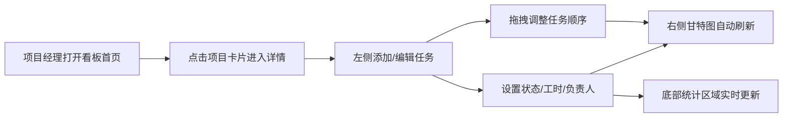

## 1. 产品概述

项目工时估算与资源看板是一款面向项目经理和团队成员的纯前端工具，帮助项目经理根据任务清单快速估算工时，自动生成可视化的资源分配甘特图，团队成员可查看自己的任务和负荷情况。

- **核心价值**：简化工时估算流程，直观展示团队资源分配，提升项目管理效率
- **目标用户**：项目经理、团队成员
- **使用场景**：项目规划阶段的任务分解与工时估算、项目执行中的资源可视化

## 2. 核心功能

### 2.1 功能模块

1. **项目看板首页**：以卡片形式展示所有项目概览，支持点击进入详情
2. **项目详情页**：左侧任务列表，右侧资源甘特图
3. **任务管理**：任务CRUD、状态标记、工时输入、拖拽排序
4. **工时统计**：总工时/已完成/剩余工时实时计算，环形进度条展示
5. **甘特图可视化**：Canvas绘制，X轴日期、Y轴成员、任务条悬停详情

### 2.2 页面详情

| 页面名称 | 模块名称 | 功能描述 |
|-----------|-------------|---------------------|
| 项目看板首页 | 项目卡片列表 | 展示项目名称、任务总数/已完成数，渐变卡片设计，悬停动效，点击跳转详情 |
| 项目详情页 | 任务列表区 | 任务复选框（状态）、任务名称、预估工时输入框、拖拽排序手柄 |
| 项目详情页 | 工时统计区 | 总预估工时、已完成工时、剩余工时、环形完成度进度条 |
| 项目详情页 | 资源甘特图 | Canvas绘制，日期X轴、成员Y轴、彩色任务条、悬停气泡详情 |
| 项目详情页 | 返回导航 | 返回到项目看板首页的入口 |

## 3. 核心流程

项目经理从看板首页进入项目详情，添加任务并设置预估工时和负责人，系统自动渲染甘特图并统计工时。团队成员可查看各自的任务负荷。

## 4. 用户界面设计

### 4.1 设计风格

- **主题配色**：温和蓝紫配色，主色#3b82f6，渐变#e0f2fe到#ede9fe
- **按钮风格**：圆角12px实心蓝色，hover变深蓝#2563eb，0.2s ease-out过渡
- **字体**：无衬线现代字体，标题18px粗体#1f2937，正文常规色
- **布局风格**：桌面左右双列布局，移动端单列自适应
- **动画缓动**：所有动画统一使用 ease-out 曲线

### 4.2 页面设计概览

| 页面名称 | 模块名称 | UI元素 |
|-----------|-------------|-------------|
| 首页看板 | 项目卡片 | 300x160px，圆角16px，浅蓝→浅紫渐变，18px粗体项目名，绿色标签条，悬停上移5px+阴影 |
| 详情页 | 任务输入框 | 圆角6px，聚焦边框#3b82f6，0.2s过渡，聚焦轻微阴影 |
| 详情页 | 甘特图 | Canvas绘制，任务条圆角4px，柔和色系（#fde68a/#a7f3d0/#bfdbfe等），悬停气泡 |
| 详情页 | 环形进度条 | 直径60px，弧线渐变#22c55e→#16a34a，背景#e5e7eb，0.5s ease-out动画 |

### 4.3 响应式

- 桌面优先设计，768px以下断点切换为单列布局
- 项目卡片宽度在移动端自适应100%
- 甘特图在小屏幕下横向滚动查看

### 4.4 性能指标

- 看板切换响应时间：≤150ms
- 甘特图渲染（≤30条任务）：≤200ms
- 拖拽操作流畅，无明显卡顿
