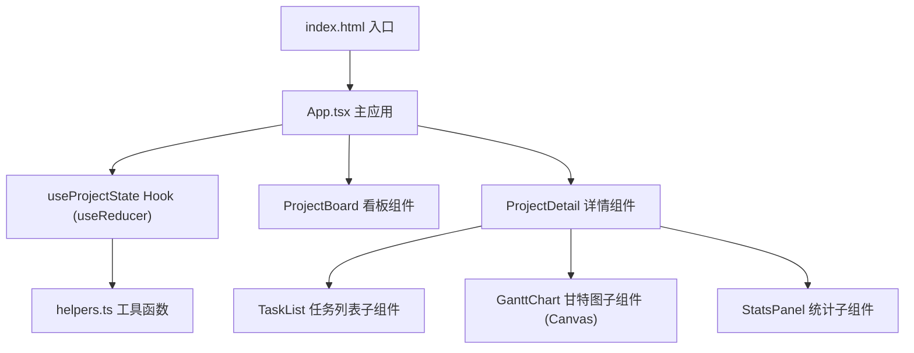
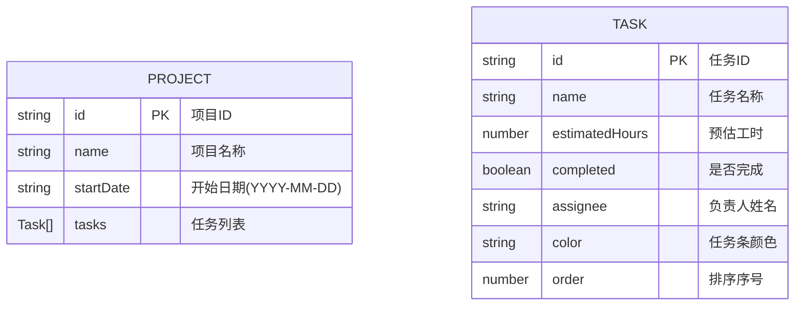

## 1. 架构设计

纯前端React应用，采用组件化架构，使用useReducer进行全局状态管理。



## 2. 技术说明

- **前端框架**：React 18 + TypeScript
- **构建工具**：Vite 5
- **状态管理**：useState + useReducer（自定义Hook封装）
- **样式方案**：原生CSS + CSS Modules（内联style配合React）
- **可视化**：HTML5 Canvas API绘制甘特图
- **路由**：无react-router，使用useState模拟页面路由
- **后端**：无（纯前端，数据内存管理）

## 3. 页面路由（模拟）

| 逻辑路由 | 触发条件 | 渲染组件 |
|-------|---------|---------|
| / (首页) | 初始状态或返回操作 | ProjectBoard |
| /project/:id | 点击项目卡片 | ProjectDetail |

## 4. 数据模型

### 4.1 数据结构定义



### 4.2 TypeScript类型定义

```typescript
interface Task {
  id: string;
  name: string;
  estimatedHours: number;
  completed: boolean;
  assignee: string;
  color: string;
  order: number;
}

interface Project {
  id: string;
  name: string;
  startDate: string;
  tasks: Task[];
}

interface ProjectState {
  projects: Project[];
  currentProjectId: string | null;
}
```

## 5. 文件结构

```
auto32/
├── package.json
├── vite.config.js
├── tsconfig.json
├── index.html
└── src/
    ├── App.tsx                    # 主应用，路由分发+全局状态
    ├── components/
    │   ├── ProjectBoard.tsx       # 项目看板列表
    │   └── ProjectDetail.tsx      # 项目详情（任务列表+甘特图+统计）
    ├── hooks/
    │   └── useProjectState.ts     # useReducer封装的状态Hook
    └── utils/
        └── helpers.ts             # 工具函数
```

## 6. 关键技术点

- **Canvas甘特图**：X轴日期刻度按天绘制，Y轴成员姓名，任务条按负责人映射到对应行，鼠标坐标检测实现悬停气泡
- **拖拽排序**：HTML5 Drag and Drop API实现任务拖拽，dragover/ondrop事件处理重排
- **环形进度条**：SVG arc渐变路径，stroke-dasharray动画
- **性能优化**：任务列表使用useMemo计算统计数据，Canvas重绘节流
