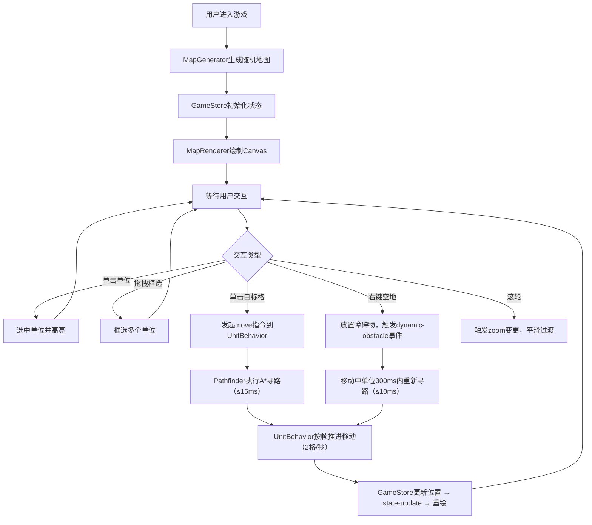

## 1. 产品概述
星际资源争夺策略游戏原型 - 一款基于浏览器的即时战略(RTS)小游戏原型，演示可随机生成的多边形区域地图、基于A*算法的单位寻路与动态障碍物碰撞规避系统。
- 核心目的：验证模块化架构下的地图生成与寻路AI系统，为后续扩展新地图样式和AI行为奠定基础
- 目标用户：游戏开发团队（技术验证）、策略游戏玩家（Demo演示）

## 2. 核心功能

### 2.1 用户角色
| 角色 | 注册方式 | 核心权限 |
|------|---------|---------|
| 玩家 | 无需注册，浏览器直接访问 | 完整游戏操作权限（选择单位、移动、放置障碍物等） |

### 2.2 功能模块
1. **地图系统**：20x20网格随机生成，三种地形（平原/山地/水域），动态视觉效果
2. **单位系统**：单位选择、移动、编队、状态管理
3. **寻路AI系统**：A*算法寻路、动态障碍物重算、编队路径规划
4. **交互系统**：单击选择、框选、右键放置障碍物、滚轮缩放
5. **UI界面**：状态面板、小地图、帧率显示、选中单位信息

### 2.3 页面详情
| 页面名称 | 模块名称 | 功能描述 |
|---------|---------|---------|
| 主游戏界面 | 状态栏 | 顶部显示帧率（左）和选中单位数量（右），高度40px |
| 主游戏界面 | 主地图Canvas | 左侧占85%宽度，100vh高度，支持鼠标交互、滚轮缩放 |
| 主游戏界面 | 信息面板 | 右侧半透明深色面板，显示选中单位信息：名称、生命值条、状态 |
| 主游戏界面 | 小地图 | 右下角160x160px，俯视显示地图和单位位置（闪烁红点） |

## 3. 核心流程

### 3.1 主流程描述
用户打开页面 → 系统随机生成20x20地图并放置初始单位 → 用户通过鼠标交互：
- 单击单位选中（绿色选中圆圈）→ 点击目标格子 → 单位沿A*最短路径移动
- 拖拽框选多个单位 → 点击目标 → 编队队列移动（保持相对偏移和间距）
- 右键空地 → 放置红色六边形障碍物 → 移动中单位自动重算路径规避
- 滚轮缩放 → 主地图平滑缩放（0.5x-2x，200ms过渡）

### 3.2 核心交互流程图

## 4. 用户界面设计

### 4.1 设计风格
- **主色调**：深空蓝 `#0a0a2e`（背景）、半透明深蓝面板 `#1a1a2ecc`
- **功能色**：平原绿 `#7cbd7c`、山地棕 `#8b5e3c`、水域蓝 `#4a90e2`
- **强调色**：单位蓝 `#4488ff`、选中绿 `#00ff0060`、障碍红 `#ff4444`
- **字体**：科幻感无衬线字体（优先使用系统Segoe UI/Roboto，备选sans-serif）
- **布局风格**：左侧Canvas主区域 + 右侧悬浮信息面板 + 右下角小地图
- **动画**：所有交互0.15s ease-out过渡，障碍放置0.2s闪光动画，缩放200ms平滑

### 4.2 页面设计概览
| 页面名称 | 模块名称 | UI元素 |
|---------|---------|--------|
| 主游戏界面 | 状态栏 | 深蓝背景`#1a1a2e`、白色12px帧率文字、选中数量指示 |
| 主游戏界面 | 主地图 | 48px格子、浅灰`#e0e0e0`网格线、地形色填充、虚线路径`#ffffff60` |
| 主游戏界面 | 单位 | 蓝色圆形(半径10px)、底部绿色选中圈(15px)、生命值条 |
| 主游戏界面 | 障碍物 | 红色六边形(边长12px)、放置时透明度0.8→0.2闪光动画 |
| 主游戏界面 | 框选矩形 | 半透明蓝`#4488ff30`边框填充 |
| 主游戏界面 | 信息面板 | 圆角12px、260px宽、渐变生命条`#22c55e` |
| 主游戏界面 | 小地图 | 160x160px、俯视缩略、闪烁红点`#ff0000`表示单位 |

### 4.3 响应式设计
- **大屏（1920x1080+）**：左侧Canvas占85%宽度，右侧悬浮260px信息面板
- **小屏（1024x768及以下）**：右侧面板变为底部悬浮栏，高度120px、宽度100%
- **触摸适配**：触摸长按模拟右键放置障碍物，双指缩放替代滚轮

## 5. 性能与约束指标
| 指标 | 约束值 |
|------|--------|
| 主循环帧率 | 55-60 FPS |
| 地图尺寸 | 20x20 网格 |
| 单次A*寻路耗时 | ≤ 15ms（初次），≤ 10ms（重算） |
| 动态障碍响应 | ≤ 300ms内重新规划 |
| 单位移动速度 | 2格/秒，帧移动≤2px |
| 单位上限 | 同时存在50个 |
| 缩放范围 | 0.5x - 2x |
| 缩放过渡 | 200ms平滑 |
| 交互过渡 | 0.15s ease-out |
