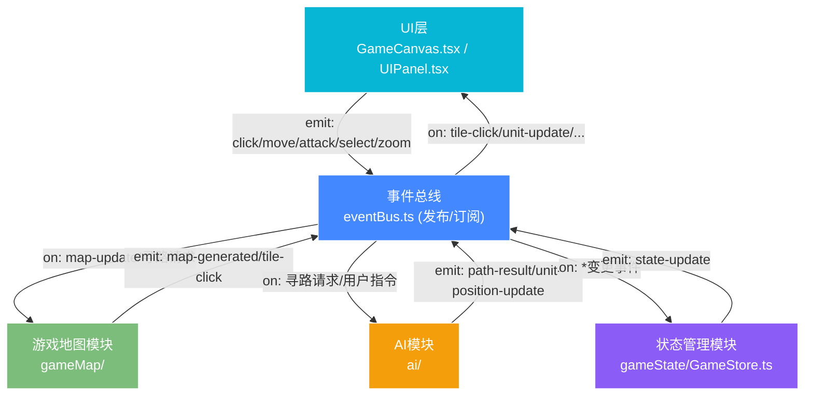

## 1. 架构设计

### 1.1 整体架构图（模块化 + 事件驱动）


### 1.2 模块职责与调用关系
| 模块/文件 | 核心职责 | 入站事件（接收） | 出站事件（发布） |
|----------|---------|----------------|----------------|
| `eventBus.ts` | 全局发布订阅中心，唯一通信通道 | - | -（所有事件中转站） |
| `gameMap/types.ts` | MapTile/Region/Biome接口定义 | - | - |
| `gameMap/MapGenerator.ts` | 种子化随机地图生成 | `map:generate` | `map:generated` |
| `gameMap/MapRenderer.ts` | Canvas地图绘制 | `map:generated`, `state:update` | `tile:click` |
| `ai/Pathfinder.ts` | A*算法寻路 | `path:request` | `path:result` |
| `ai/UnitBehavior.ts` | 单位状态机+移动推进 | `unit:command`, `obstacle:added` | `unit:position-update` |
| `gameState/GameStore.ts` | 状态容器+变更通知 | `map:generated`, `unit:position-update`, `selection:*` | `state:update` |
| `components/GameCanvas.tsx` | Canvas挂载+鼠标交互 | `state:update` | `selection:*`, `move:command`, `obstacle:add`, `zoom:*` |
| `components/UIPanel.tsx` | 信息面板+小地图渲染 | `state:update` | `action:*` |
| `main.tsx` | React挂载+模块初始化 | - | `map:generate` |

---

## 2. 技术描述
- **前端框架**：React@18 + TypeScript@5（严格模式，目标ES2020）
- **构建工具**：Vite@5 + @vitejs/plugin-react@4
- **渲染引擎**：HTML5 Canvas 2D Context
- **状态管理**：自研轻量级GameStore（非zustand，符合事件驱动需求）
- **通信模式**：发布订阅事件总线（Pub/Sub），所有模块解耦
- **CSS方案**：原生CSS + CSS变量（无Tailwind，性能优先级）

---

## 3. 核心数据模型

### 3.1 类型定义（types.ts）
```typescript
// 地形枚举
type Biome = 'plain' | 'mountain' | 'water';

// 地图格子
interface MapTile {
  x: number;           // 网格X坐标 (0-19)
  y: number;           // 网格Y坐标 (0-19)
  biome: Biome;        // 地形类型
  walkable: boolean;   // 是否可通行
  elevation?: number[]; // 山地高度顶点（用于绘制高度线）
  obstacle: boolean;   // 是否有动态障碍物
}

// 区域（多边形区域）
interface Region {
  id: string;
  tiles: Array<{x:number; y:number}>;
  biome: Biome;
}

// 单位状态
type UnitState = 'idle' | 'moving' | 'attacking';

// 游戏单位
interface Unit {
  id: string;
  name: string;
  x: number;           // 像素坐标
  y: number;           // 像素坐标
  gridX: number;       // 网格X
  gridY: number;       // 网格Y
  hp: number;
  maxHp: number;
  speed: number;       // 格/秒
  state: UnitState;
  path: Array<{x:number; y:number}>;  // 像素级路径点
  pathIndex: number;   // 当前路径索引
  selected: boolean;
  formationOffset?: { dx: number; dy: number }; // 编队偏移
}

// 障碍物
interface Obstacle {
  id: string;
  gridX: number;
  gridY: number;
  createdAt: number;   // 时间戳，用于闪光动画
}

// 全局游戏状态
interface GameState {
  tiles: MapTile[][];
  units: Unit[];
  obstacles: Obstacle[];
  selectedUnitIds: string[];
  zoom: number;
  fps: number;
}
```

### 3.2 事件总线事件类型定义
```typescript
interface EventMap {
  // 地图相关
  'map:generate': { seed: number; width: number; height: number };
  'map:generated': { tiles: MapTile[][]; regions: Region[] };
  'tile:click': { gridX: number; gridY: number; button: number };

  // 寻路相关
  'path:request': { unitId: string; startX: number; startY: number; endX: number; endY: number };
  'path:result': { unitId: string; path: Array<{x:number; y:number}> };

  // 单位指令
  'unit:command': { unitIds: string[]; type: 'move' | 'attack'; targetGridX: number; targetGridY: number };
  'unit:position-update': { unitId: string; x: number; y: number; gridX: number; gridY: number };
  'unit:state-change': { unitId: string; state: UnitState };

  // 选择相关
  'selection:single': { unitId: string };
  'selection:multiple': { unitIds: string[] };
  'selection:clear': void;
  'selection:box': { x1: number; y1: number; x2: number; y2: number };

  // 障碍物
  'obstacle:add': { gridX: number; gridY: number };
  'obstacle:added': { obstacle: Obstacle };

  // 缩放
  'zoom:change': { zoom: number };

  // 状态广播
  'state:update': { state: GameState };
}
```

---

## 4. 目录结构
```
auto33/
├── package.json
├── vite.config.js
├── tsconfig.json
├── index.html
└── src/
    ├── main.tsx                       # 应用入口
    ├── index.css                      # 全局样式
    ├── eventBus.ts                    # 事件总线（所有模块通信）
    ├── modules/
    │   ├── gameMap/
    │   │   ├── types.ts               # MapTile/Region/Biome接口
    │   │   ├── MapGenerator.ts        # 种子化随机地图生成
    │   │   └── MapRenderer.ts         # Canvas地图绘制
    │   ├── ai/
    │   │   ├── Pathfinder.ts          # A*算法实现
    │   │   └── UnitBehavior.ts        # 单位状态机+帧推进
    │   └── gameState/
    │       └── GameStore.ts           # 状态容器
    └── components/
        ├── GameCanvas.tsx             # 主Canvas组件
        └── UIPanel.tsx                # 侧边信息面板+小地图
```

---

## 5. A*算法设计（Pathfinder.ts）

### 5.1 算法参数
- **网格尺寸**：20x20 = 400节点
- **启发函数**：曼哈顿距离 h = |dx| + |dy|（4向移动）/ 切比雪夫距离（8向移动）
- **移动代价**：平原=1，山地/水域=Infinity（不可通行），障碍=Infinity
- **开放集**：基于二叉堆的优先队列（理论），实际使用数组+splice优化（≤400节点足够快）
- **关闭集**：Set<`${x},${y}`>

### 5.2 性能保障
1. 寻路前预计算障碍网格快照
2. 起点/终点相同直接返回空路径
3. 终点不可通行时返回最近可通行邻居
4. 路径平滑：直线可达的相邻点合并，减少路径点数
5. 20x20网格最坏情况遍历400节点，耗时<10ms

---

## 6. 游戏主循环设计
```
requestAnimationFrame 驱动（60FPS目标）
├── 1. 计算deltaTime（上帧到本帧时间差）
├── 2. 更新阶段（UnitBehavior）
│   └── 遍历所有 moving 状态单位
│       ├── 沿路径按 speed*deltaTime 推进
│       ├── 每帧移动像素 ≤ 2px（保证平滑）
│       ├── 到达路径终点 → state=idle
│       └── 触发 unit:position-update
├── 3. GameStore 聚合所有变更
├── 4. 发布 state:update
└── 5. MapRenderer 重绘 Canvas
    ├── 绘制背景（深空蓝）
    ├── 绘制地图格子（地形+网格线）
    ├── 绘制水域波浪动画
    ├── 绘制山地高度线
    ├── 绘制障碍物（带闪光动画）
    ├── 绘制虚线路径
    ├── 绘制单位（蓝色圆形+选中圈+HP条）
    └── 绘制框选矩形
```

---

## 7. 编队移动算法（多单位偏移）
1. 用户框选 N 个单位后，记录各单位相对"编队中心"的 `{dx, dy}` 偏移
2. 用户点击目标格子 T 时：
   - 计算编队中心目标像素坐标 = `(T.x*48+24, T.y*48+24)`
   - 各单位目标 = 中心目标 + 各自 `(dx, dy)` 偏移
   - 对各单位目标进行网格碰撞检测（若与障碍/山地/水域冲突，沿半径方向搜索最近可通行点）
3. 移动中：每帧检查单位间距 < 15px 时，沿法线方向推开，避免重叠
