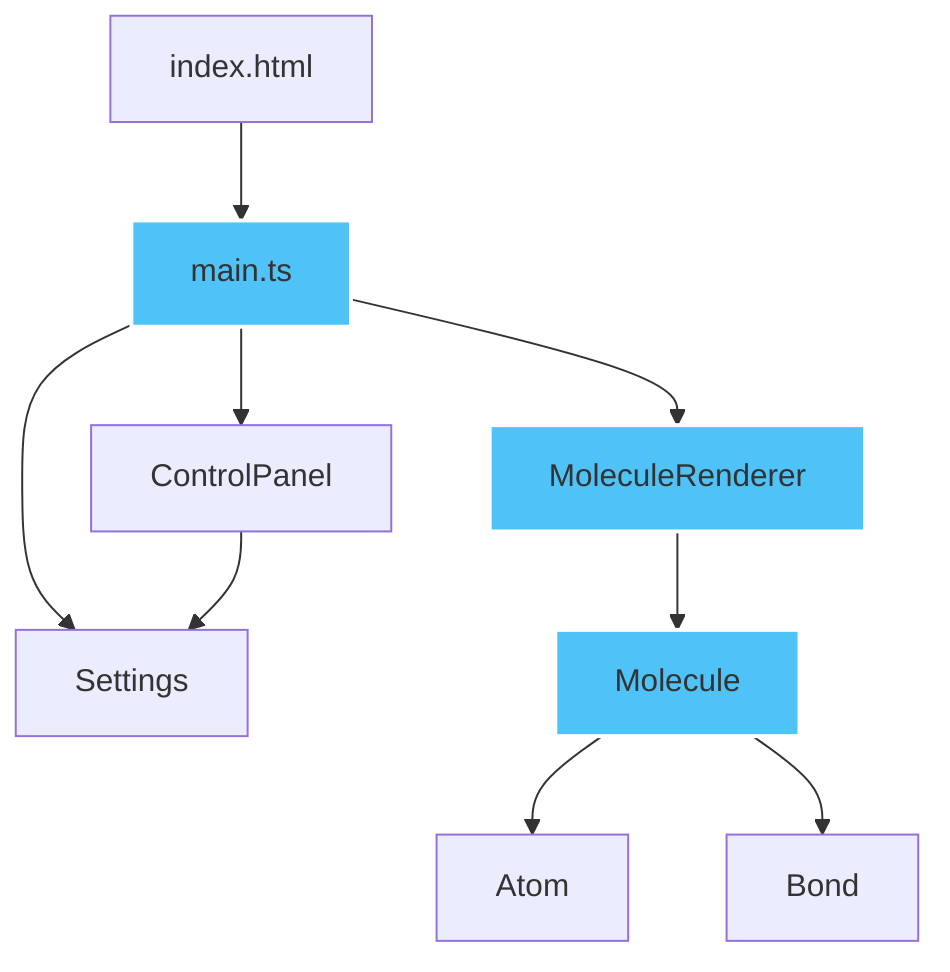

# 3D分子结构查看器 - 技术架构文档

---

## 1. 技术选型决策

### 1.1 核心技术栈

| 技术 | 选型理由 |
|------|----------|
| **TypeScript** | 强类型系统提升代码可维护性，编译期错误捕获，符合严格模式要求 |
| **Three.js** | WebGL封装完善，生态成熟，内置OrbitControls、后期处理等所需功能 |
| **Vite** | 极速冷启动，HMR热更新，原生ESM支持，开发体验优秀 |
| **dat.gui** | 轻量级UI控制面板，快速构建交互控件 |
| **stats.js** | 性能监控，实时FPS显示，便于性能优化 |
| **@types/three** | Three.js的TypeScript类型定义，确保类型安全 |

### 1.2 关键依赖版本（建议）
```json
{
  "three": "^0.160.0",
  "typescript": "^5.3.0",
  "vite": "^5.0.0",
  "@types/three": "^0.160.0",
  "dat.gui": "^0.7.9",
  "stats.js": "^0.17.0"
}
```

---

## 2. 系统架构设计

### 2.1 整体架构图



### 2.2 模块职责划分

| 模块 | 职责 | 输入 | 输出 |
|------|------|------|------|
| **main.ts** | 应用入口，场景初始化，动画循环，事件绑定 | 无 | Three.js场景、渲染器、控制器 |
| **Molecule.ts** | 分子数据模型，原子/键定义，预设分子生成 | 分子类型参数 | Molecule实例（含Atom[]和Bond[]） |
| **MoleculeRenderer.ts** | 3D渲染逻辑，几何创建，材质配置，后期处理 | Molecule数据 + Settings配置 | Three.js Object3D组 |
| **ControlPanel.ts** | UI交互控件，状态管理，用户输入处理 | 用户操作 | 控件状态事件 |
| **Settings.ts** | 设置管理，配置聚合，状态同步 | ControlPanel状态 | 渲染配置对象 |

### 2.3 数据流设计

```
用户操作 → ControlPanel → Settings → MoleculeRenderer → Three.js Scene
                                                        ↓
                                                  CSS2DRenderer
                                                        ↓
                                                  屏幕渲染
```

---

## 3. 目录结构设计

```
auto34/
├── package.json
├── vite.config.js
├── tsconfig.json
├── index.html
└── src/
    ├── main.ts
    ├── chem/
    │   ├── Molecule.ts
    │   └── MoleculeRenderer.ts
    └── ui/
        ├── ControlPanel.ts
        └── Settings.ts
```

---

## 4. 核心数据结构设计

### 4.1 Atom（原子）

```typescript
interface Atom {
  element: string;      // 元素符号: H, O, C
  position: THREE.Vector3;  // 三维位置
  radius: number;       // 原子半径
  color: number;        // 颜色值 (十六进制)
}
```

### 4.2 Bond（化学键）

```typescript
interface Bond {
  atomIndex1: number;   // 连接的第一个原子索引
  atomIndex2: number;   // 连接的第二个原子索引
  type: 'single' | 'double' | 'triple';  // 键类型
}
```

### 4.3 Molecule（分子）

```typescript
class Molecule {
  name: string;
  atoms: Atom[];
  bonds: Bond[];
  
  static createWater(): Molecule;
  static createMethane(): Molecule;
  static createBenzene(): Molecule;
}
```

### 4.4 RenderSettings（渲染配置）

```typescript
interface RenderSettings {
  showLabels: boolean;
  showAngles: boolean;
  moleculeType: 'water' | 'methane' | 'benzene';
  bloomIntensity: number;
  bloomRadius: number;
  bloomThreshold: number;
}
```

---

## 5. 关键技术实现方案

### 5.1 分子坐标计算

#### 水分子 (H₂O)
- 氧原子位于原点 (0, 0, 0)
- 两个氢原子在X-Y平面内，键角104.5°
- O-H键长约0.96Å

```typescript
// 氢原子位置计算
const angle = (104.5 / 2) * Math.PI / 180;
const bondLength = 0.96;
const h1 = new Vector3(
  Math.sin(angle) * bondLength,
  Math.cos(angle) * bondLength,
  0
);
const h2 = new Vector3(
  -Math.sin(angle) * bondLength,
  Math.cos(angle) * bondLength,
  0
);
```

#### 甲烷 (CH₄)
- 正四面体结构，碳原子在中心
- C-H键长约1.09Å
- H-C-H键角约109.5°

#### 苯环 (C₆H₆)
- 平面正六边形结构
- C-C键长约1.39Å
- C-H键长约1.09Å

### 5.2 渲染优化方案

#### InstancedMesh 使用策略
- 同种元素的原子共享几何体和材质，使用InstancedMesh批量渲染
- 化学键按类型分组，使用InstancedMesh渲染

#### 几何体优化
- SphereGeometry 使用合理的分段数 (widthSegments=16, heightSegments=16)
- CylinderGeometry 使用 (radialSegments=8)
- 所有几何体使用BufferGeometry

### 5.3 后期处理管线

```typescript
// EffectComposer 配置
const composer = new EffectComposer(renderer);
composer.addPass(new RenderPass(scene, camera));
composer.addPass(new UnrealBloomPass(
  new Vector2(window.innerWidth, window.innerHeight),
  0.3,  // intensity
  0.5,  // radius
  0.1   // threshold
));
```

### 5.4 交互实现

#### 射线检测与悬停高亮
```typescript
const raycaster = new THREE.Raycaster();
const mouse = new THREE.Vector2();

function onMouseMove(event) {
  mouse.x = (event.clientX / window.innerWidth) * 2 - 1;
  mouse.y = -(event.clientY / window.innerHeight) * 2 + 1;
  raycaster.setFromCamera(mouse, camera);
  const intersects = raycaster.intersectObjects(atoms);
  // 高亮处理...
}
```

### 5.5 平滑过渡动画

使用TWEEN.js或自定义补间实现透明度动画：
```typescript
function fadeOut(object, duration = 500) {
  const startOpacity = object.material.opacity;
  const startTime = Date.now();
  
  function animate() {
    const elapsed = Date.now() - startTime;
    const progress = Math.min(elapsed / duration, 1);
    object.material.opacity = startOpacity * (1 - progress);
    if (progress < 1) requestAnimationFrame(animate);
  }
  animate();
}
```

---

## 6. 性能优化策略

### 6.1 渲染性能
- 使用InstancedMesh减少draw call
- 几何体分段数平衡质量与性能
- 开启抗锯齿（sampleLevel=2）
- 合理设置相机near/far裁剪面

### 6.2 内存管理
- 模型切换时正确 dispose 旧几何体和材质
- 移除事件监听器防止内存泄漏
- 复用Geometry和Material实例

### 6.3 动画优化
- 使用requestAnimationFrame
- 避免在渲染循环中创建新对象
- 阻尼效果使用deltaTime计算

---

## 7. 关键算法

### 7.1 键角计算
```typescript
function calculateBondAngle(
  center: Vector3,
  p1: Vector3,
  p2: Vector3
): number {
  const v1 = p1.clone().sub(center).normalize();
  const v2 = p2.clone().sub(center).normalize();
  const dot = v1.dot(v2);
  return Math.acos(Math.max(-1, Math.min(1, dot))) * 180 / Math.PI;
}
```

### 7.2 圆柱键的朝向定位
```typescript
function createBondCylinder(from: Vector3, to: Vector3): Mesh {
  const direction = to.clone().sub(from);
  const length = direction.length();
  const geometry = new CylinderGeometry(0.1, 0.1, length, 8);
  const mesh = new Mesh(geometry, material);
  
  // 定位圆柱体中点
  mesh.position.copy(from.clone().add(to).multiplyScalar(0.5));
  
  // 设置朝向：圆柱体默认沿Y轴，需要旋转到direction方向
  mesh.quaternion.setFromUnitVectors(
    new Vector3(0, 1, 0),
    direction.clone().normalize()
  );
  
  return mesh;
}
```

---

## 8. 配置文件规范

### 8.1 tsconfig.json
```json
{
  "compilerOptions": {
    "target": "ES2020",
    "module": "ESNext",
    "strict": true,
    "moduleResolution": "Bundler",
    "esModuleInterop": true,
    "skipLibCheck": true,
    "forceConsistentCasingInFileNames": true
  }
}
```

### 8.2 vite.config.js
```javascript
export default {
  server: { port: 5173 },
  build: { target: 'es2020' }
}
```

---

## 9. 测试策略

### 9.1 功能测试
- 分子模型切换验证
- 原子位置准确性验证（键角计算）
- 标签显示/隐藏功能
- 键角标注显示/隐藏功能
- 重置视角功能

### 9.2 性能测试
- 60FPS帧率测试
- 100原子/150键场景压力测试
- 内存泄漏检测

### 9.3 视觉测试
- 原子颜色验证
- 泛光效果验证
- 过渡动画流畅度

---

## 10. 风险与应对

| 风险 | 影响 | 应对方案 |
|------|------|----------|
| Three.js版本兼容性问题 | API变更导致编译错误 | 锁定具体版本号，使用配套@types/three |
| 性能不达标（<60FPS） | 用户体验差 | 减少几何体分段，增加InstancedMesh使用，优化后期处理参数 |
| 标签遮挡问题 | 文字被原子遮挡 | CSS2DRenderer单独渲染，设置合理z-index |
| 移动端适配问题 | 移动端显示异常 | 响应式画布尺寸，触摸事件支持 |
