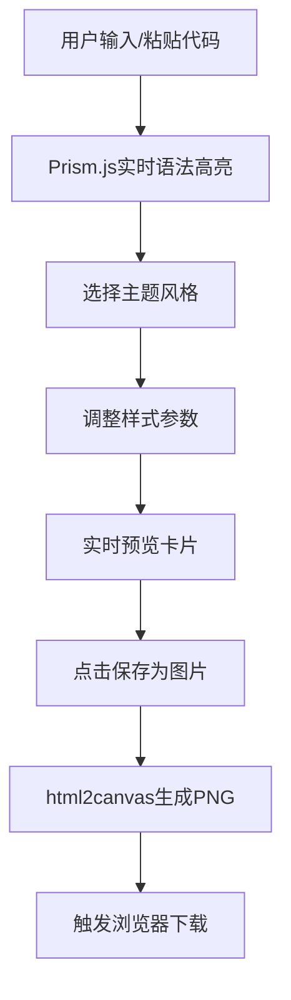

## 1. 产品概述

代码片段视觉分享器是一款面向开发者的在线工具，帮助用户快速将代码转换为精美的视觉卡片，便于在社交媒体、技术博客或文档中分享。通过简洁的界面和丰富的自定义选项，开发者可以在30秒内生成专业级别的代码分享图片。

- 核心价值：解决开发者分享代码时美观度不足、格式错乱的痛点
- 目标用户：前端/后端开发者、技术博主、开源贡献者、编程教育者

## 2. 核心功能

### 2.1 功能模块

1. **代码编辑区**：支持手动输入或粘贴代码，实时语法高亮预览
2. **主题选择区**：提供三种预设主题（暗夜星辰、暖阳余晖、冰霜极简）
3. **样式工具栏**：缩进行号开关、字体大小调节、圆角调节
4. **预览卡片区**：实时预览生成的卡片效果
5. **导出功能**：一键保存为PNG图片

### 2.2 页面详情

| 页面名称 | 模块名称 | 功能描述 |
|-----------|-------------|---------------------|
| 主页 | 代码编辑器 | textarea输入，宽60%，背景#1e1e1e，Fira Code 14px字体 |
| 主页 | 语法高亮区 | Prism.js实现，支持HTML/CSS/JS，与编辑器同步滚动 |
| 主页 | 主题选择区 | 三种主题卡片，点击切换带0.3s ease过渡动画 |
| 主页 | 工具栏 | 行号开关、字体滑块(12-20px)、圆角滑块(8-32px) |
| 主页 | 预览卡片 | 640px宽，含自定义标题、代码区、语言标签、水印 |
| 主页 | 导出按钮 | 蓝色渐变，html2canvas截取PNG下载 |

## 3. 核心流程

用户在代码编辑器中输入或粘贴代码 → 系统实时进行语法高亮渲染 → 用户选择主题风格 → 调整样式参数（行号、字体、圆角）→ 实时预览卡片效果 → 点击保存为图片 → 自动下载PNG文件

## 4. 用户界面设计

### 4.1 设计风格

- **主色调**：暗色背景 #0f172a，卡片区 #1e293b
- **强调色**：蓝色渐变 #3b82f6 → #2563eb
- **按钮样式**：圆角12px，悬停亮度+10%，扁平化设计
- **字体**：编辑器使用 Fira Code 等宽字体
- **布局风格**：左右两栏（桌面端），上下布局（移动端），最大宽度1200px居中
- **动画过渡**：所有交互0.25s ease-out，主题切换0.3s ease背景淡入
- **滚动条**：暗色圆角细条样式统一

### 4.2 页面设计概述

| 页面名称 | 模块名称 | UI Elements |
|-----------|-------------|-------------|
| 主页 | 代码编辑器 | 60%宽度，#1e1e1e深灰背景，Fira Code 14px，扁平化控件 |
| 主页 | 主题选择区 | 三张主题卡片，悬停效果，点击选中态 |
| 主页 | 工具栏 | 灰色底#374151圆角8px，滑块轨道6px圆角3px，拖拽阴影 |
| 主页 | 预览卡片 | 640px宽度，32px内边距，标题栏16px粗体，水印10px灰色 |
| 主页 | 导出按钮 | 蓝色渐变，圆角12px，悬停亮度提升 |

### 4.3 响应式

- **桌面端**（≥768px）：左右两栏布局，左栏60%编辑器，右栏40%样式选择
- **移动端**（<768px）：编辑器全宽，样式选择折叠为横向滚动条，触控优化
- 页面最大宽度1200px，自动居中
- 所有控件尺寸适配移动端触控操作

### 4.4 性能要求

- 代码粘贴到高亮渲染完成 ≤ 300ms
- 主题切换过渡动画流畅，无卡顿
- 图片导出分辨率适合社交媒体分享
