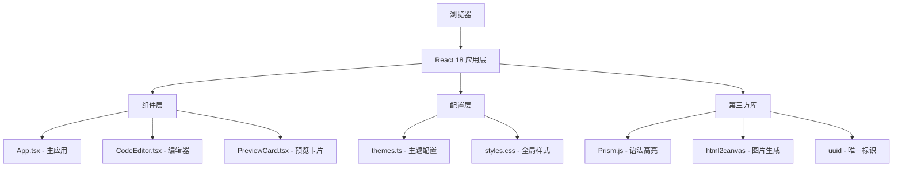

## 1. 架构设计

本项目采用纯前端单页应用架构，无需后端服务，所有功能在浏览器端完成。



## 2. 技术描述

- **前端框架**：React 18 + TypeScript 5 + Vite 5
- **构建工具**：Vite 5，使用 @vitejs/plugin-react
- **语法高亮**：Prism.js（支持HTML、CSS、JavaScript）
- **图片导出**：html2canvas
- **工具库**：uuid
- **语言**：TypeScript 严格模式，target ES2020

## 3. 项目结构

```
auto35/
├── package.json          # 项目依赖和脚本
├── tsconfig.json         # TypeScript配置（严格模式）
├── vite.config.js        # Vite配置
├── index.html            # 入口HTML（加载PrismJS）
└── src/
    ├── main.tsx          # React入口
    ├── App.tsx           # 主应用组件（状态管理）
    ├── CodeEditor.tsx    # 编辑器组件
    ├── PreviewCard.tsx   # 预览卡片组件
    ├── themes.ts         # 三种主题配置
    └── styles.css        # 全局样式
```

## 4. 路由定义

| 路由 | 用途 |
|-------|---------|
| / | 主页面，包含所有功能 |

本项目为单页应用，无需多路由配置。

## 5. 核心数据结构

### 5.1 主题配置类型

```typescript
interface Theme {
  name: string;
  displayName: string;
  background: string;
  cardBackground: string;
  textColor: string;
  keywordColor: string;
  commentColor: string;
  stringColor: string;
  functionColor: string;
  numberColor: string;
  operatorColor: string;
  tagColor: string;
  attrColor: string;
  fontFamily: string;
  titleColor: string;
  watermarkColor: string;
  labelBackground: string;
  labelColor: string;
}
```

### 5.2 应用状态类型

```typescript
interface AppState {
  code: string;
  theme: Theme;
  language: 'html' | 'css' | 'javascript';
  showLineNumbers: boolean;
  fontSize: number;
  borderRadius: number;
  cardTitle: string;
}
```

## 6. 性能优化策略

1. **语法高亮优化**：使用 requestAnimationFrame 分批更新，避免阻塞主线程
2. **同步滚动优化**：使用节流函数（throttle）减少滚动事件触发频率
3. **代码变更防抖**：输入防抖100ms，避免频繁重渲染
4. **CSS变量主题切换**：使用CSS变量实现主题切换，避免重绘整个DOM树
5. **图片导出优化**：html2canvas 使用 scale: 2 保证高清导出，同时限制最大尺寸
