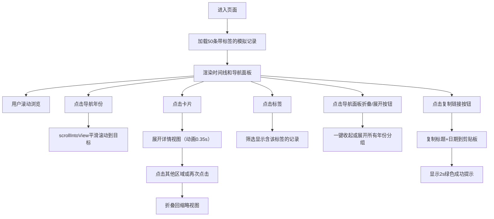

## 1. 产品概述
时间线回廊是一个可视化的记忆管理工具，帮助用户将零散的照片、笔记和网页链接按照时间顺序组织成交互式纵向时间线，便于回顾与分享个人成长历程。
- 目标用户：需要整理和回顾生活片段、工作成果、学习笔记的个人用户
- 产品价值：以清晰的时间维度可视化呈现碎片化信息，降低记忆回溯成本，提升内容组织的愉悦感

## 2. 核心特性

### 2.1 用户角色
| 角色 | 注册方式 | 核心权限 |
|------|----------|----------|
| 普通用户 | 无需注册（演示版） | 浏览时间线、展开卡片、使用导航跳转 |

### 2.2 功能模块
1. **时间线主页面**：深色头部、主线居中布局、卡片列表、悬浮导航面板
2. **记录卡片模块**：缩略视图、展开详情、折叠动画、悬停交互
3. **日期徽章模块**：圆形日期标记、与当前年份联动高亮
4. **详情视图模块**：全尺寸图片展示、详细描述文字
5. **年份导航模块**：悬浮导航面板、快速跳转、当前年份高亮、一键折叠/展开全部年份
6. **标签系统模块**：每条记录最多3个自定义标签、浅灰圆角样式、点击筛选时间线
7. **分享功能模块**：复制链接按钮、标题+日期复制到剪贴板、绿色成功提示

### 2.3 页面详情
| 页面名称 | 模块名称 | 功能描述 |
|----------|----------|----------|
| 时间线主页 | 深色头部 | 高度64px，纯黑背景#111827，白色标题文字 |
| 时间线主页 | 垂直主线 | 贯穿全页的2px深灰#6b7280竖线，居中显示 |
| 时间线主页 | 记录卡片 | 600px宽、圆角8px、白底浅灰边框，支持悬停变色和阴影过渡 |
| 时间线主页 | 日期徽章 | 直径32px圆形、深蓝#1e40af背景、12px白色日期字 |
| 时间线主页 | 展开详情 | 600x400px图片、14px描述文字、高度过渡动画0.35s |
| 时间线主页 | 年份导航面板 | 固定定位、深灰#1f2937背景、圆角16px、金色#f59e0b高亮当前年份、顶部折叠/展开全部按钮 |
| 时间线主页 | 标签系统 | 每条记录最多3个标签、浅灰#f3f4f6背景、深灰#374151文字、4px圆角、点击筛选时间线 |
| 时间线主页 | 复制链接按钮 | 卡片缩略图右下角、点击复制"标题 - 日期"格式文本、2s绿色成功提示 |

## 3. 核心流程
用户进入页面后，首先看到50条按时间倒序排列的记录卡片，左侧悬浮显示所有存在年份的导航面板。用户可以通过滚动浏览时间线，或者点击导航面板中的年份快速跳转到对应位置。点击任意卡片可以展开查看大图和详细说明，再次点击卡片或点击页面其他区域则折叠回缩略视图。用户可以点击标签筛选特定类别的记录，可以点击导航面板顶部的箭头按钮一键折叠或展开所有年份分组，还可以点击卡片右下角的复制链接按钮快速分享记录。

## 4. 用户界面设计

### 4.1 设计风格
- 主色调：深蓝#1e40af、深灰#1f2937/#111827、浅灰#f9fafb
- 强调色：金色#f59e0b、浅蓝#eff6ff
- 卡片样式：圆角8px、1px浅灰#e5e7eb边框、悬停浅蓝背景+阴影过渡
- 字体：系统字体栈、14px正文、12px小字、行高1.6
- 布局：桌面端主线居中卡片右侧排列、移动端卡片全宽+左边框指示
- 图标：无额外图标库，使用CSS绘制圆形徽章和线条

### 4.2 页面设计概述
| 页面名称 | 模块名称 | UI元素 |
|----------|----------|----------|
| 时间线主页 | 头部导航 | 高度64px / 背景#111827 / 白色文字 / 居中标题 |
| 时间线主页 | 时间线容器 | 浅灰#f9fafb背景 / 居中布局 / 相对定位 |
| 时间线主页 | 垂直主线 | 绝对定位 / 2px宽 / #6b7280 / 左边界对齐 |
| 时间线主页 | 单条记录 | 600px宽卡片 / 120px缩略高度 / 右侧定位 / 8px圆角 |
| 时间线主页 | 连接横线 | 1px宽 / #6b7280 / 卡片顶部与主线之间 |
| 时间线主页 | 日期徽章 | 32px圆形 / #1e40af / 12px白字 / 悬停scale(1.2) |
| 时间线主页 | 展开详情 | 600x400图片 / object-fit cover / 14px#374151文字 |
| 时间线主页 | 导航面板 | 固定定位top:60px / #1f2937 / 16px圆角 / 12px内边距 |
| 时间线主页 | 标签徽章 | 浅灰#f3f4f6背景 / 深灰#374151文字 / 12px字号 / 4px圆角 / 4px8px内边距 |
| 时间线主页 | 复制链接按钮 | 卡片右下角绝对定位 / 16x16px图标 / 悬停不透明度变化 / 点击2s绿色#10b981提示 |
| 时间线主页 | 折叠/展开按钮 | 导航面板顶部 / 小箭头图标 / 0.25s旋转过渡 / 点击切换所有年份分组状态 |

### 4.3 响应式
- 桌面端优先设计（≥768px）：主线居中+卡片右侧排列+连接线
- 移动端适配（<768px）：卡片宽度90%居中、主线和连接线隐藏、卡片左侧添加3px浅蓝竖边作为视觉指示
- 触摸优化：点击区域≥44x44px，确保移动端触控友好

### 4.4 动画规范
- 卡片悬停：0.25s ease-out，背景变浅蓝、阴影0 1px 3px → 0 4px 12px rgba(0,0,0,0.1)
- 徽章悬停：同步0.25s scale(1.2)放大
- 展开/折叠：0.35s ease-in-out高度过渡
- 导航跳转：scrollIntoView({behavior: 'smooth'})平滑滚动
