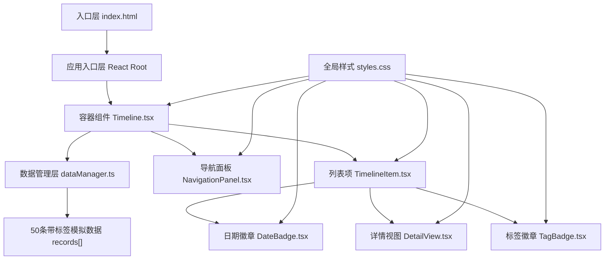
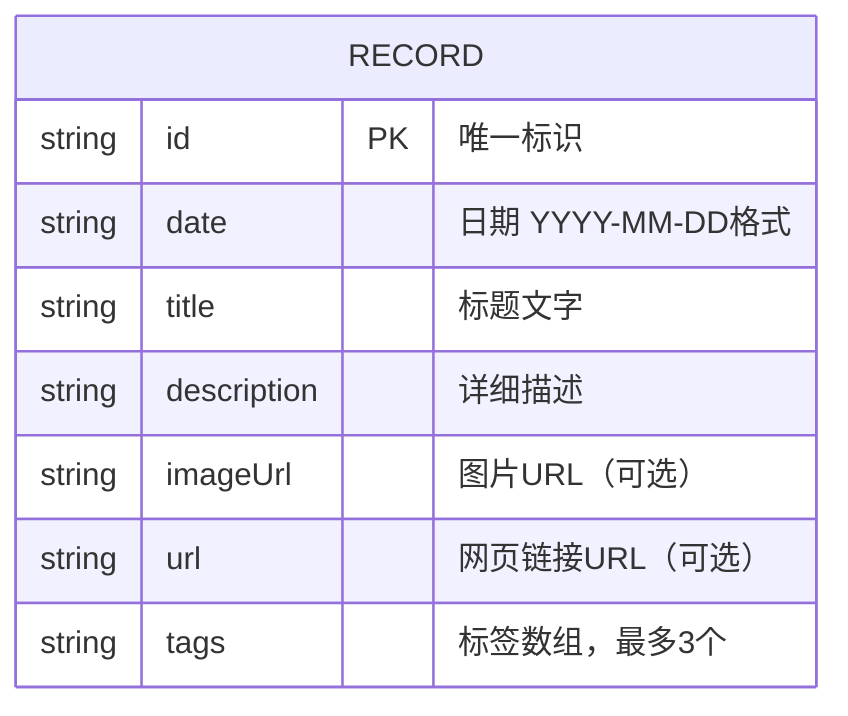

## 1. 架构设计



## 2. 技术说明
- 前端框架：React@18 + TypeScript@5 + Vite@5
- 构建工具：Vite + @vitejs/plugin-react
- 样式方案：原生CSS（CSS变量 + 媒体查询 + 过渡动画）
- 状态管理：React useState/useEffect 本地组件状态，无需额外状态库
- 类型系统：TypeScript 严格模式 strict: true
- 后端：无后端，纯前端演示项目，内置50条模拟数据

## 3. 路由定义
| 路由 | 用途 |
|------|------|
| / | 时间线主页面（单页应用，无多路由） |

## 4. 数据模型

### 4.1 数据模型定义


### 4.2 TypeScript类型定义
```typescript
interface TimelineRecord {
  id: string;
  date: string;       // YYYY-MM-DD
  title: string;
  description: string;
  imageUrl?: string;
  url?: string;
  tags: string[];     // 最多3个自定义标签
}

interface YearGroup {
  year: number;
  records: TimelineRecord[];
  collapsed: boolean; // 年份分组是否折叠
}
```

## 5. 组件层级结构
```
App
└── Timeline (src/Timeline.tsx)
    ├── NavigationPanel (src/NavigationPanel.tsx)
    │   ├── 折叠/展开全部按钮 (箭头图标)
    │   └── 年份标签列表 (点击触发scrollIntoView)
    └── 垂直主线 (CSS绝对定位)
    └── 年份分组容器[]
        ├── 年份标题 (支持分组折叠)
        └── TimelineItem[] (src/TimelineItem.tsx)
            ├── DateBadge (src/DateBadge.tsx) - 日期徽章
            ├── TagBadge[] (src/TagBadge.tsx) - 标签徽章（点击筛选）
            ├── 缩略视图区域 - 标题+图片缩略
            ├── 复制链接按钮 (右下角，点击复制标题+日期)
            ├── 连接线 (CSS)
            └── DetailView (src/DetailView.tsx) - 展开详情
                ├── 全尺寸图片 (600x400, object-fit cover)
                ├── 标签区域 (最多3个)
                └── 描述文字
```

## 6. 性能优化策略
- **渲染性能**：单条记录组件保持轻量，DOM层级控制在5层以内，目标单条渲染<50ms
- **初始加载**：50条记录首屏渲染目标<2s，使用纯CSS动画避免JS阻塞
- **图片优化**：使用object-fit cover避免重排，缩略与展开使用同一张图片
- **事件委托**：展开/折叠使用React合成事件，避免每个卡片注册原生监听器
- **scrollIntoView**：原生API实现平滑滚动，比JS计算动画更高效
- **CSS过渡**：高度变化使用transform+max-height优化，避免频繁重排
- **标签筛选**：筛选逻辑使用数组原生filter方法，避免额外库开销
- **剪贴板操作**：使用navigator.clipboard API，避免传统execCommand的性能问题
- **复制反馈**：使用CSS类切换显示成功提示，避免频繁DOM操作

## 7. 新增功能API定义
### 7.1 dataManager新增方法
```typescript
// 按标签筛选记录
filterByTag(records: TimelineRecord[], tag: string): TimelineRecord[];
// 获取所有不重复标签
getAllTags(records: TimelineRecord[]): string[];
```

### 7.2 新增组件Props
```typescript
// TagBadge组件
interface TagBadgeProps {
  tag: string;
  isActive: boolean;
  onClick: (tag: string) => void;
}

// NavigationPanel新增Props
interface NavigationPanelProps {
  years: number[];
  activeYear: number | null;
  allCollapsed: boolean;
  onYearClick: (year: number) => void;
  onToggleAll: () => void;
}

// TimelineItem新增Props
interface TimelineItemProps {
  record: TimelineRecord;
  activeTag: string | null;
  onTagClick: (tag: string) => void;
}
```

## 8. 文件结构
```
e:\solo\SoloAutoDemo\tasks\auto38\
├── .trae/documents/
│   ├── PRD.md
│   └── TechnicalArchitecture.md
├── index.html
├── package.json
├── tsconfig.json
├── vite.config.js
└── src/
    ├── styles.css
    ├── dataManager.ts
    ├── Timeline.tsx
    ├── TimelineItem.tsx
    ├── DateBadge.tsx
    ├── TagBadge.tsx
    ├── DetailView.tsx
    └── NavigationPanel.tsx
```
