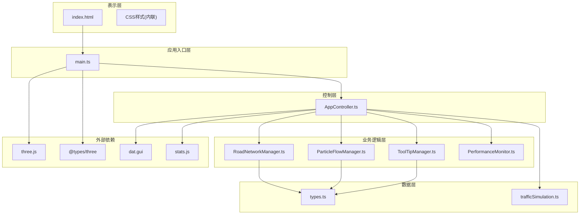
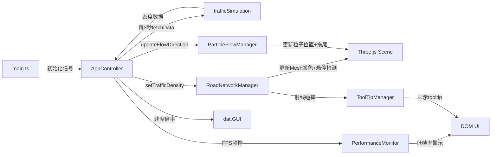

## 1. 架构设计



---

## 2. 技术描述

- **前端框架**：TypeScript + Three.js + Vite
- **构建工具**：Vite 5.x
- **语言**：TypeScript 5.x (严格模式，目标ES2020)
- **3D渲染引擎**：Three.js 0.160.x
- **UI组件**：dat.GUI (控制面板)、stats.js (性能监控)
- **后端**：无后端，使用内置仿真数据模型

### 2.1 核心技术选型理由
- **TypeScript**：提供类型安全，确保大型3D应用的代码可维护性
- **Three.js**：成熟的WebGL封装库，性能优秀，API友好
- **Vite**：极速开发体验，热更新快，构建效率高
- **dat.GUI**：轻量级控制面板，适合调试和参数调整
- **stats.js**：专业的性能监控工具

---

## 3. 模块数据流向



### 3.1 文件调用关系
| 文件 | 依赖模块 | 输出 |
|------|---------|------|
| main.ts | three, AppController, types | 渲染器、场景、相机、控制器实例 |
| AppController.ts | RoadNetworkManager, ParticleFlowManager, ToolTipManager, PerformanceMonitor, trafficSimulation, dat.gui, stats.js | 主循环、数据调度、LOD管理 |
| RoadNetworkManager.ts | three, types | 道路网格Mesh、热力图着色、悬停高亮、LOD切换 |
| ParticleFlowManager.ts | three, types | 粒子系统、拖尾效果、速度控制 |
| ToolTipManager.ts | types | DOM tooltip元素、鼠标跟随 |
| PerformanceMonitor.ts | stats.js, types | FPS监控、三角形数统计、低帧率警示 |
| trafficSimulation.ts | types | 车流密度仿真数据生成器 |
| types.ts | 无 | 全局类型定义、常量配置 |

---

## 4. 数据模型

### 4.1 类型定义

```typescript
// 路段类型
interface RoadSegment {
  id: string;
  type: 'horizontal' | 'vertical';
  start: Vector2;
  end: Vector2;
  width: number;
  length: number;
  lanes: number;
  trafficDensity: number;
  mesh: Mesh | null;
  particles: Particle[];
}

// 路口类型
interface Intersection {
  id: string;
  position: Vector2;
  size: number;
  connectedRoads: string[];
  mesh: Mesh | null;
}

// 粒子类型
interface Particle {
  id: number;
  roadId: string;
  position: Vector3;
  direction: 1 | -1;
  speed: number;
  progress: number;
  trail: Vector3[];
  active: boolean;
}

// 车流数据
interface TrafficData {
  timestamp: number;
  roadDensities: Map<string, number>;
  flowDirections: Map<string, 1 | -1>;
}

// 热力色阶配置
const HEATMAP_COLORS = {
  LOW: 0x22c55e,   // 绿色 - 畅通
  MEDIUM: 0xeab308, // 黄色 - 缓行
  HIGH: 0xef4444    // 红色 - 拥堵
};

const DENSITY_RANGE = {
  MIN: 0,
  MAX: 200
};
```

### 4.2 常量配置

| 常量名称 | 值 | 说明 |
|---------|----|------|
| GRID_SIZE | 5 | 网格维度(5x5) |
| ROAD_WIDTH | 4 | 道路宽度(单位) |
| ROAD_LENGTH | 20 | 道路长度(单位) |
| INTERSECTION_SIZE | 8 | 路口尺寸(单位) |
| TOTAL_PARTICLES | 2000 | 粒子总数 |
| PARTICLE_SIZE | 3 | 粒子大小(px) |
| TRAIL_LENGTH | 6 | 拖尾帧数 |
| DATA_UPDATE_INTERVAL | 3000 | 数据更新间隔(ms) |
| LOD_DISTANCE_NEAR | 40 | 近距LOD阈值 |
| LOD_DISTANCE_MID | 80 | 中距LOD阈值 |
| LOD_PATH_DISTANCE | 30 | 路径显示阈值 |
| CAMERA_MIN_DISTANCE | 20 | 相机最小距离 |
| CAMERA_MAX_DISTANCE | 120 | 相机最大距离 |
| LOW_FPS_THRESHOLD | 30 | 低帧率阈值 |

---

## 5. 性能优化策略

### 5.1 渲染优化
- **InstancedMesh**：使用实例化网格渲染大量相似几何体
- **BufferGeometry**：使用缓冲几何体减少内存占用
- **Frustum Culling**：视锥体剔除，只渲染可见物体
- **LOD系统**：根据视距动态切换渲染精度

### 5.2 粒子系统优化
- **Points**：使用Three.js Points对象批量渲染粒子
- **BufferAttribute**：动态更新粒子位置缓冲区
- **对象池**：粒子对象复用，避免频繁GC

### 5.3 数据更新优化
- **节流更新**：数据每3秒更新一次，避免频繁重绘
- **增量更新**：只更新变化的数据，不做全量重绘

### 5.4 性能预算
- 三角形面数：≤15,000
- 粒子数量：≤2,500
- 渲染批次：≤80
- 目标帧率：≥45 FPS
